# AWS Transform MGN(application Migration Service):
used to lift-and-shift (rehost) physical, virtual, or cloud servers to Amazon EC2 with minimal downtime. AWS MGN can migrate servers across different Availability Zones, across different AWS Regions, or from completely outside of AWS (like on-premises data centers) into AWS.

## Why use MGN instead of a standard snapshot copy?
A. AWS MGN + Transformation gives you two major advantages:
1. **Zero-Downtime Replication:** The source instance stays online and active while data copies over.
2. **Automated Adaptation:** The "Transform" feature automatically updates network drivers, changes OS configurations, and updates IP settings so the server actually works natively in the new region's network environment without manual troubleshooting.

## creating MGN:
Note: 
1. you need to create MGN where you want to migrate your servers to. For example, if you want to migrate your servers from mumbai(ap-south-1) to Nvirginia(us-east-1) you need to create MGN in Nvirginia us-east-1.

2. take the high Ram servers because to install the agent in the source server it requires a 500MB of /tmp space.

1. goto the AWS Transform MGN console click on "Get Started" and click on setup a service(it will create roles and other resources required for MGN)

2. on left pane click on source servers and click on "Add server" select linux (we are migrating linux server from mumbai(ap-south-1) to Nvirginia(us-east-1)) as the source server type(have 2 types linux or windows) --> in Select your replication preferences( have 2 options we can replicate all disks attached to server or we can select specific disks to replicate) --> create an IAM user with this policy attached "AWSApplicationMigrationAgentInstallationPolicy" and provide the access key and secret key of this IAM user --> copy the command in *Download the installer using this command:* and in other section and run it on the source server (mumbai(ap-south-1)) to install the MGN agent on the source server. then click Back you will see the source server. 
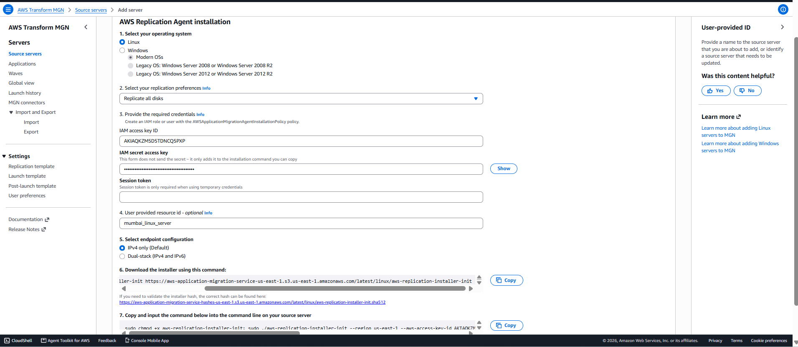
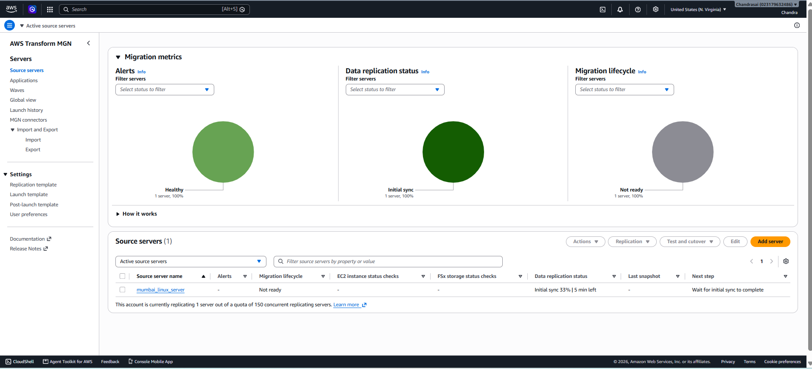

3. click the server goto launch settings you can see the instance type is c5.large by default(in this instance we are migrating the source instance is created in nvirginia(us-east-1)) it will cost we change this instance type by going to ec2 console(Nvirginia) and click on launch templates you can see the lauch template created by MGN service click on it and click on modify template and change the instance type to t3.medium and click on save changes then change the template version. then go back to MGN console and click on refresh you will see the instance type is changed to t3.medium.
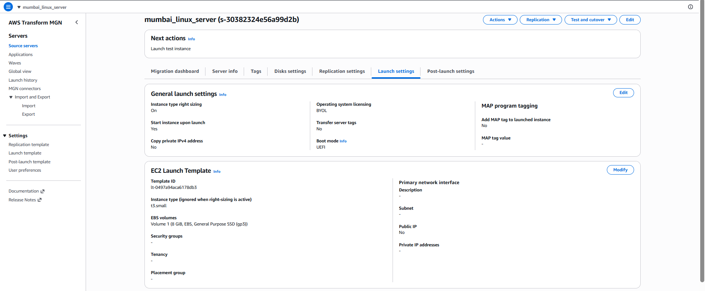

4. then you will see initial replication in migration dashboard it will take some time. after compeleting you can see the instance launched in Nvirginia(us-east-1). the server you are seeing in ec2 dashboard is replication server(collect the data from source server and write it to EBS disk).

```text
[Mumbai Local Server]
├── Drive C: (OS) ───┐
├── Drive D: (App) ──┼──> (Encrypted Network Stream) ───> [AWS Replication Server]
└── Drive E: (Data) ─┘                                              │
                                                                    │
                                                                    └── Writes blocks directly to:
                                                                        ├── EBS Disk C
                                                                        ├── EBS Disk D
                                                                        └── EBS Disk E
```

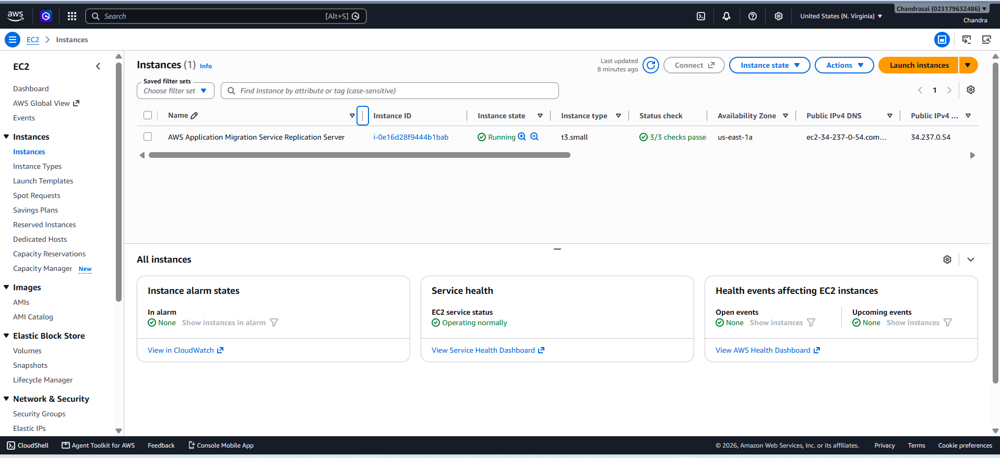

5. then click on launch test instance it will launch the test instance in Nvirginia(us-east-1).
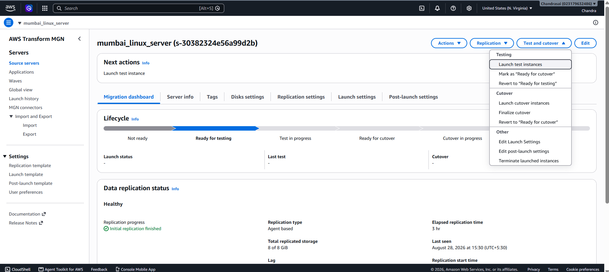
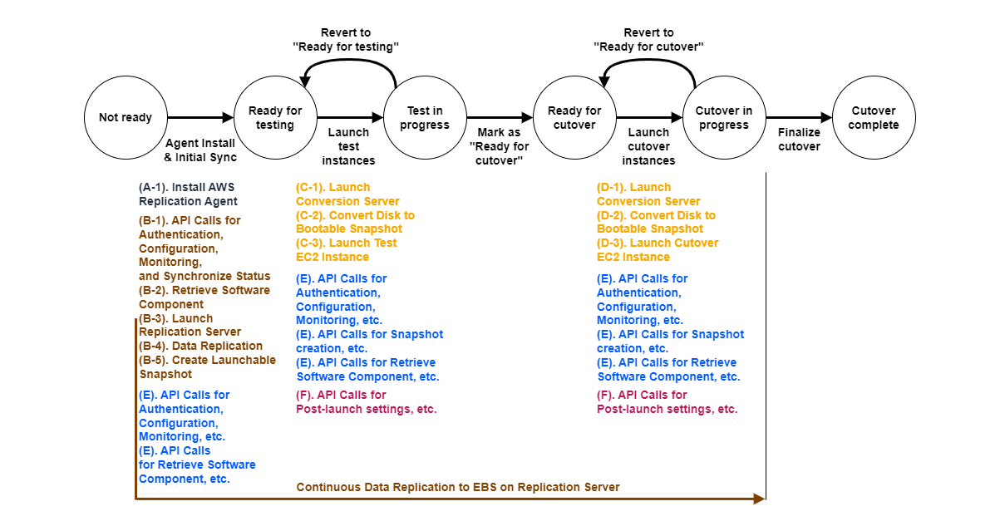

6. to test the testing application you can use the public ip ot get the public ip we need to enable the public ip in launch template click on create new version in advanced network configuraton click on auto-assign public ip enable and click on save changes then change the template version. then go back to MGN console and click on refresh you will see the public ip is assigned to the test instance. then you can use this public ip to test the application.
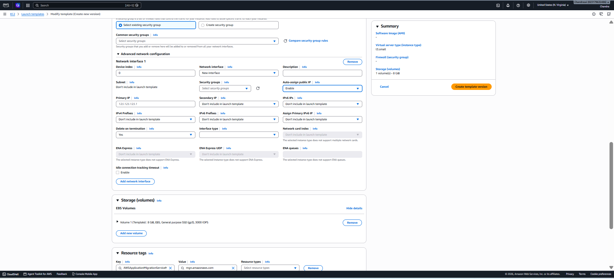

7. after that using the public ip you can test the application(like we normall use httpd service to test the app using public  ip and httpd protocol) it it's successful then click on mark as ready for cutover then click on launch cutover it will launch the production instance in Nvirginia(us-east-1) and you can use the public ip to test the application.
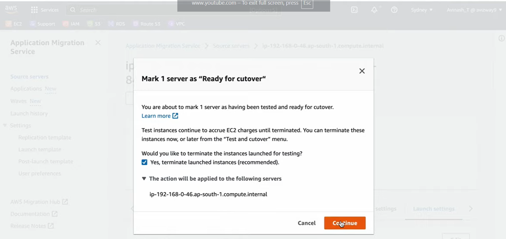

8. after testing succesfully click on finalize cutover it will remove intermediate resources.

Migration Lifecycle States:

Not Ready: The source server has the replication agent installed, MGN automatically creates low-cost staging EBS volumes in your AWS Staging Area.  The agent reads the source server disks at the block level and replicates the data over TCP port 443 into the staging volumes. The state remains "Not Ready" until 100% of the initial disk data is copied.

Ready for Testing: The initial sync is finished and continuous replication(copies only changed data blocks (deltas) in near-real-time) is active, meaning you can now launch a test instance(MGN validates your Launch Template settings (subnet, security groups, instance type) to ensure it can spin up an EC2 instance).

Test in Progress: A test instance is actively launching or running in your AWS environment for verification.
    Snapshotting: MGN takes a point-in-time snapshot of your staging EBS volumes.
    
    Conversion: An AWS MGN conversion server modifies the snapshot drivers (e.g., installs AWS PV/ENA network drivers) so the OS can boot natively on AWS hardware.
    
    Launch: MGN creates a Test EC2 Instance in your target subnet using these converted volumes.

    Data Flow: The source server continues replicating data to the staging volumes in the background without interruption.

Ready for Cutover: Testing is complete and successful, and the server is ready for the final cutover phase. You log into the test instance, verify the application works, and manually click "Mark as ready for cutover" in the AWS console. MGN automatically terminates the Test EC2 instance and deletes its temporary volumes to save costs.

Cutover in Progress: A cutover instance is currently launching to finalize the migration.
    Final Delta Sync: The source application is usually stopped here to prevent new data writes. MGN flushes the very last remaining data blocks from the source to AWS.
    
    Final Snapshot & Conversion: MGN takes a final snapshot and runs the OS conversion process on the absolute newest data state.
    
    Production Launch: MGN launches the Final Production EC2 Instance in your target subnet.

Cutover Complete: All data has been successfully migrated to the production instance on AWS.

Migration Finalized: The production instance is fully live on AWS and handles your business traffic.


Disconnected / Stopped: The server connection to the service has dropped or replication has been manually stopped

    Data Disconnect: The replication agent stops tracking changes, and MGN prepares to stop billing you for the staging area resources.

    Final Archive: You manually "Archive" the server in MGN, which deletes the replication metadata and tears down the staging area resources.


```text


[ 1. SOURCE SERVER ]               [ 2. AWS STAGING AREA ]            [ 3. AWS TARGET ENVIRONMENT ]
         │                                    │                                     │
         │ (Install MGN Agent)                │                                     │
         ▼                                    ▼                                     │
 ┌────────────────┐                  ┌─────────────────┐                            │
 │ Block-Level    │                  │ Creates Low-Cost│                            │
 │ Disk Reading   ├─────────────────►│ EBS Staging Vols│                            │
 └────────────────┘                  └────────┬────────┘                            │
                                              │                                     │
 ┌────────────────────────────────────────────▼─────────────────────────────────────┐
 │ 🔴 STATE 1: NOT READY (Initial Block-by-Block Sync - 0% to 100% Data Copy)      │
 └────────────────────────────────────────────┬─────────────────────────────────────┘
                                              │
                                     (100% Sync Complete)
                                              │
                                              ▼
 ┌────────────────┐                  ┌─────────────────┐                            │
 │ OS Writes New  │                  │ continuous Delta(changed data)│                            │
 │ Data Changes   ├─────────────────►│ Replication Stream                            │
 └────────────────┘                  └────────┬────────┘                            │
                                              │                                     │
 ┌────────────────────────────────────────────▼─────────────────────────────────────┐
 │ 🟡 STATE 2: READY FOR TESTING (Near-Real-Time Delta Replication Active)          │
 └────────────────────────────────────────────┬─────────────────────────────────────┘
                                              │
                                      (User Clicks "Test")
                                              │
                                              ▼
                                     ┌─────────────────┐                            │
                                     │ Takes EBS       │                            │
                                     │ Point-in-Time   │                            │
                                     │ Snapshot        │                            │
                                     └────────┬────────┘                            │
                                              │                                     │
                                              ▼                                     │
                                     ┌─────────────────┐                            │
                                     │ Conversion Server│                            │
                                     │ Injects AWS     │                            │
                                     │ PV/ENA Drivers  │                            │
                                     └────────┬────────┘                            │
                                              │                                     │
                                              ├────────────────────────────────────►│ ┌────────────────┐
                                              │                                     │ │ Launches       │
                                              │                                     │ │ Test EC2       │
                                              │                                     │ │ Instance       │
                                              │                                     │ └───────┬────────┘
                                              │                                               │
 ┌────────────────────────────────────────────▼───────────────────────────────────────────────▼─────┐
 │ 🔵 STATE 3: TEST IN PROGRESS (Validate Networking, Apps, & Functionality)                          │
 └────────────────────────────────────────────┬─────────────────────────────────────────────────────┘
                                              │
                                     (Is Test Successful?)
                                      ├─── NO  ──► [Reconfigure Launch Template] ──► (Back to Ready for Testing)
                                      └─── YES ──► (User Marks "Ready for Cutover")
                                              │
                                              ▼
                                     ┌─────────────────┐                            │
                                     │ Destroys Test   │                            │
                                     │ EC2 & Temporary │                            │
                                     │ Test Volumes    │                            │
                                     └─────────────────┘                            │
 ┌──────────────────────────────────────────────────────────────────────────────────────────────────┐
 │ 🟢 STATE 4: READY FOR CUTOVER (Awaiting Final Window to Go Live)                                 │
 └────────────────────────────────────────────┬─────────────────────────────────────────────────────┘
                                              │
                                    (User Clicks "Cutover")
                                              │
                                              ▼
 ┌────────────────┐                           │                                     │
 │ Freeze Source  │                           │                                     │
 │ App Traffic    │                           │                                     │
 └───────┬────────┘                           │                                     │
         │ (Final Data Flush)                 │                                     │
         └───────────────────────────────────►│                                     │
                                              ▼                                     │
                                     ┌─────────────────┐                            │
                                     │ Final Snapshot  │                            │
                                     │ & OS Driver     │                            │
                                     │ Conversion      │                            │
                                     └────────┬────────┘                            │
                                              │                                     │
                                              ├────────────────────────────────────►│ ┌────────────────┐
                                              │                                     │ │ Launches Live  │
                                              │                                     │ │ Production EC2 │
                                              │                                     │ │ Instance       │
                                              │                                     │ └───────┬────────┘
                                              │                                               │
 ┌────────────────────────────────────────────▼───────────────────────────────────────────────▼─────┐
 │ 🟣 STATE 5: CUTOVER IN PROGRESS -> CUTOVER COMPLETE (Production Traffic Switched to AWS)        │
 └────────────────────────────────────────────┬─────────────────────────────────────────────────────┘
                                              │
                                    (User Clicks "Archive")
                                              │
                                              ▼
                                     ┌─────────────────┐                            │
                                     │ Deletes Staging │                            │
                                     │ Areas & Vols to │                            │
                                     │ Stop AWS Billing│                            │
                                     └─────────────────┘                            │
 ┌──────────────────────────────────────────────────────────────────────────────────────────────────┐
 │ ⚫ STATE 6: ARCHIVED (Migration Complete - Agent Disconnected Safely)                            │
 └──────────────────────────────────────────────────────────────────────────────────────────────────┘

```


## Errors:
1. if you see the below error it will occur because we didn't setup the MGN service see the step 1 of creating MGN section.
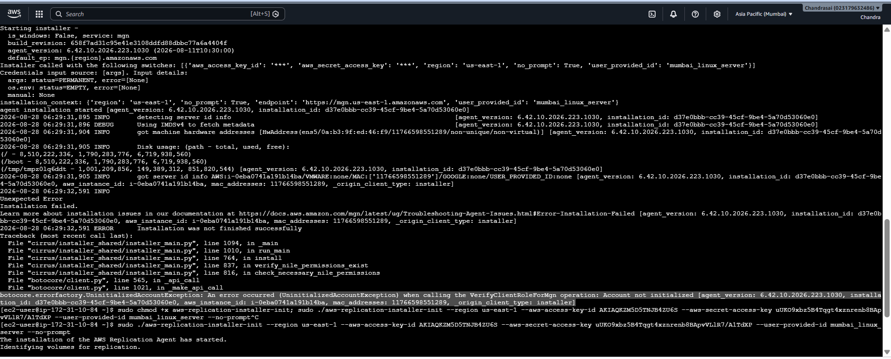

2. if you start the luanch test instance and getting back to ready for testing stage because in luanch settings luanch template is automatically picking c5.large(because right sizing is enabled) but it's not in free tier if you provide high cpu and memory instance also it will pick the c5.large instance. so we need to turn off the right sizing in luanch settings goto kaunch seetings click on edit button disable the right sizing and click on save changes.
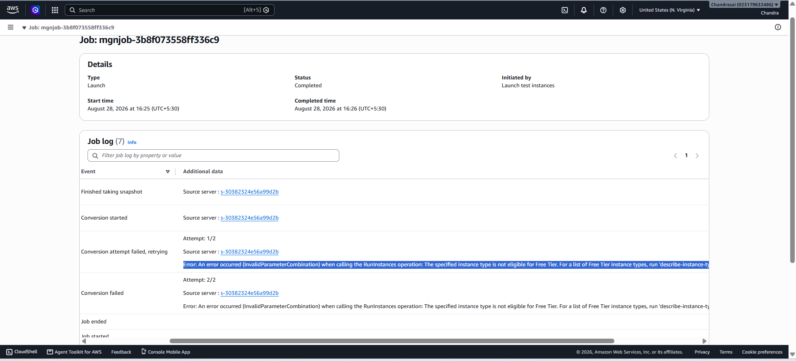
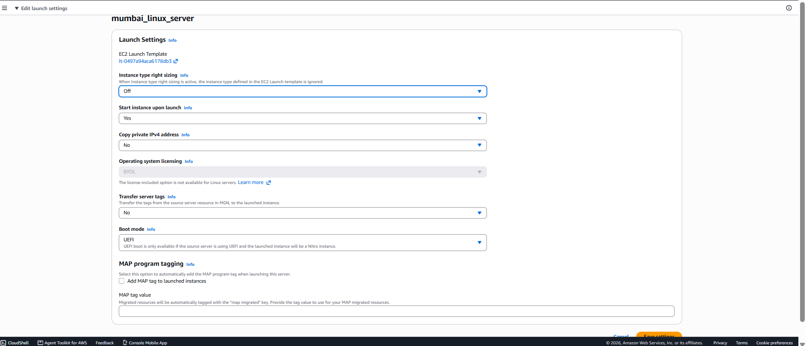