# RDS
using this website we can identify if our data is breached or not: https://haveibeenpwned.com/

**Note:** Single AZ provides 99.5% availability and Multi-AZ provides 99.95% availability.

**pre-requisite for RDS:** create DB subnet with at least 2 subnets.

we can't connect to DB engine we can connect Database using DB client like MySQL workbench, DBeaver, Navicat, etc.

1. Amazon Aurora (Mysql Compatable Edition & PostgreSQL Compatable)
2. MySql : 3306			: Mysql Workbench / dbeaver
3. MS Sql : 1433		: SSMS (Sql server management studio)
4. MariaDB				: workbench
5. PostgreSQL : 5432	: pgadmin / dbeaver
6. Oracle DB : 1521		: sql developer / Toad
7. IBM DB2				: ibm enterprise tool

We dont get any chance to login to underlying OS, where DB is installed and running.

## creating RDS Database:
1. create DB subnet goto RDS -> Subnet groups -> Create DB subnet group -> give name and description -> select VPC and --> select availability zones --> add the 2 DB subnets created in VPC learning session. --> click create.
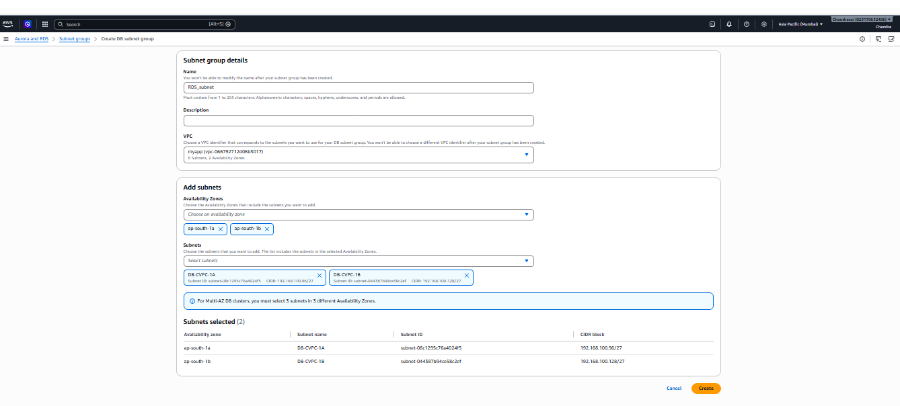

2. create SG for Database in myapp VPC(Mysql uses 3306 port) and route the traffic to SG of App servers(in demo we are connecting to WEB SG).
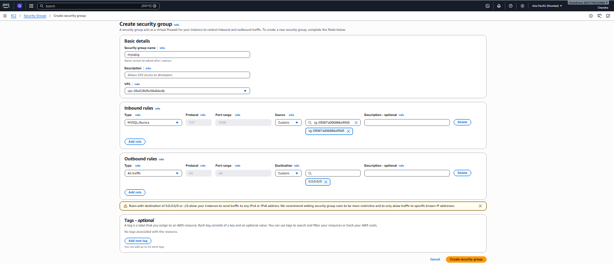

3. creating DB goto RDS on leftpane click on databases -> Create database select full configuration -> select engine type (Mysql) --> select DB creation method full configuration --> select templates --> in Availability and durability section select deployment type (like single-AZ(available in free tier) or Multi-AZ) --> in credential settings section give username and password select self managed for testing(for prod we use secret manager) --> select the instance type --> select the storage type and size(storage defined here is only uses for DB not for OS) in additional configuration section enable storage autoscaling(it will automatically increase the storage size) --> in connectivity section select *Don’t connect to an EC2 compute resource*(if we go with other option it will create new security groups) select the myapp VPC and select the DB subnet group created in step 1 & select the "no" in public access section --> select the SG created in step 2(mysqlsg) --> select the AZ(DB instance will be created in this AZ) in additional configuration we can see port number is 3306(we can change port number but not recommended) --> in monitoring section enable enhanced monitoring in log exports section select audit, error, slowquery logs(we mostly use these 3 logs) --> in additional configuration section give the initial database name(it will automatically create a database in DB engine) for demo purpose(disable the encryption, backup, maintenance) --> click create database.
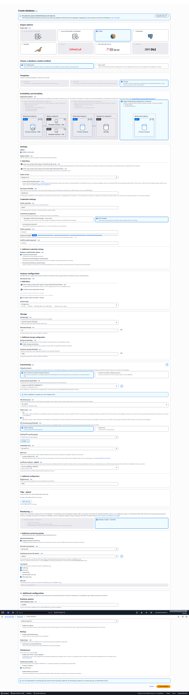


4. After DB created, we can see the endpoint of DB in connectivity section, copy the endpoint  and create a CNAME in route53 to point to DB endpoint.

database-1.chyaigmg00ss.ap-south-1.rds.amazonaws.com	--> pruthvilearnaws.shop(we follow this approach in organisations)
admin
Pruthvi123
---

When DB created, We dont get IP Address, We get a DNS name.

Also, DNS name is hard to remember, So, We can add an CNAME in route53.(by any chance if DB is down it will come with new endpoint it's difficult to update the DNS name in all the applications, so we can add a CNAME in route53 and point to DB endpoint, so if DB is down and it comes with new endpoint we can update the CNAME in route53 and all the applications will work without any changes.)


---

**Note:** if your jump server is Linux, install mysql client tool to connect to DB.

dnf install mariadb105 -y

mysql -h pruthvilearnaws.shop -u admin -P 3306 -p

## connecting with cloud shell
1. in mysqlsg add the self referring SG(means create inbound rule with source as mysqlsg itself) then we can connect to DB other wise we will get timeout error.
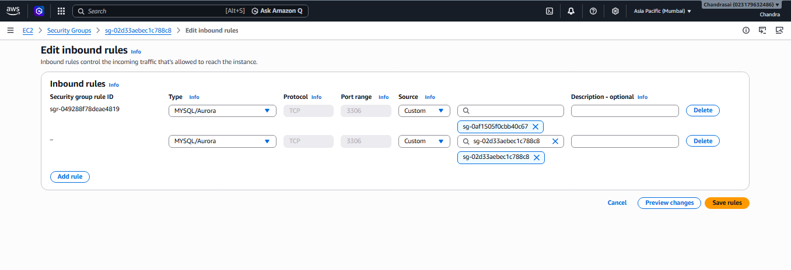

2. goto RDS -> databases -> select the DB created -> goto connectivity & security section select cloud shell and click on launch cloud shell, it will open the cloud shell copy the command and paste it on terminal and enter password.(if you get timeout error check the SG for self referring inbound rule is created or not.)
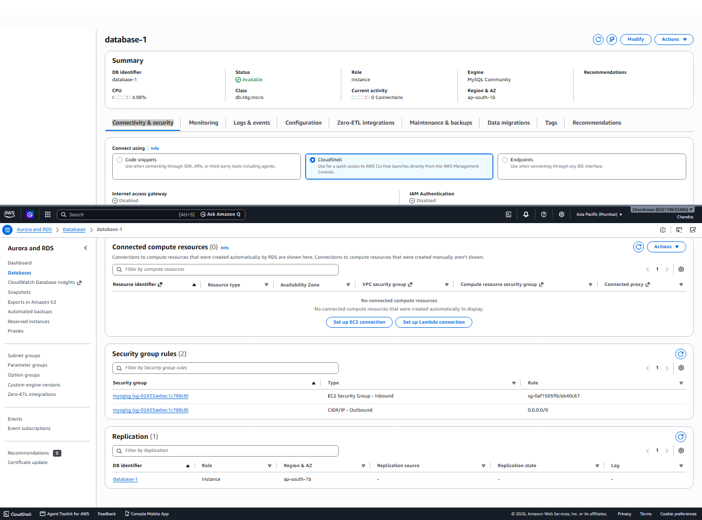


some sql commands


SHOW DATABASES;
CREATE DATABASE mydb;
USE mydb;

SHOW TABLES;

CREATE TABLE users (
	id INT AUTO_INCREMENT PRIMARY KEY,
	name VARCHAR(100),
	age INT
);

DESC users;

INSERT INTO users (name, age) VALUES ('Avinash' , 35);
INSERT INTO users (name, age) VALUES ('Anudeep' , 33);
INSERT INTO users (name, age) VALUES ('Aravind' , 31);
INSERT INTO users (name, age) VALUES ('Vikas' , 26);

INSERT INTO users (name, age) VALUES ('Vikas2' , 24);

SELECT * FROM users;
SELECT * FROM users LIMIT 1;
SELECT name FROM users WHERE age > 33;

UPDATE users SET age = 30 WHERE name = 'Aravind';

DELETE FROM users WHERE name = 'Avinash';

DROP DATABASE mydb;


DROP TABLE <Table_Name> or DROP TABLE IF EXISTS <Table_Name>
TRUNCATE TABLE <Table_Name> 		--> To delete all the data from a table

## Multi-AZ RDS Database:
in Multi-AZ we have 2 replica's in 2 AZ's if one AZ goes down the other AZ will take over and we can connect to DB without any downtime.(we can't see and we can't directly connect to DB Back up)

## Creating Read Replica:
we will use read replica for reading the data only so we will go with less powerful DB engines. 

**Note:** in free tier account we can't create read replica's.

we will not get data transfer charges for read replica if it is in same region as primary DB, but if it is in different region we will get data transfer charges.(it's applicalble for almost every AWS service)

1. Goto RDS -> databases -> select the DB created -> click on actions -> create read replica --> give the name for read replica --> select the instance type --> select the region where we want to create read replica --> in storage section select the storage type and size --> 
in availability section select the single AZ(it's read replica we won't use Multi-AZ) --> in connectivity section select ipv4 disable public access, select the AZ select the existing SG(mysqlsg) --> enable password authentication --> in mointoring section if you want to monitor the read replica enable enhanced monitoring(otherwise disable it) --> click create read replica.


Note: if you promote the Read replica it will become a standalone DB and it will not be in sync with primary DB, so we can use it for writing the data also.(goto RDS -> databases -> select the read replica created -> click on actions -> click on Promote.)
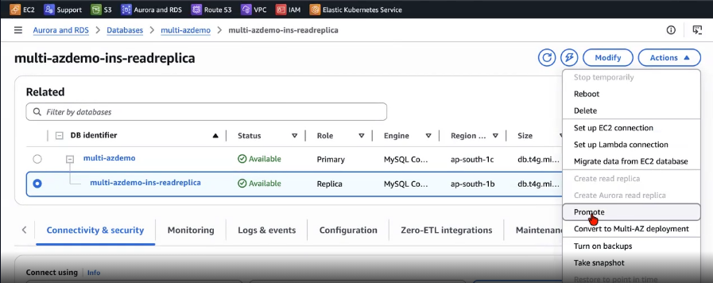

Note: we can't stop RDS DB permanently, we can only stop it for 7 days, after that it will automatically start. using event bridge and lambda we can stop the RDS DB for more than 7 days.(using lambda we will check the status of RDS DB if it is running we will stop it using event bridge we will create a cron job to run this lambda function every 7 days.)

## AWS Aurora:
Amazon Aurora is built by aws by taking the MySQL and PostgreSQL open source DB as reference(like how redhat built redhat linux by taking linux as reference) it's has 5 times better performance than MySQL and 3 times better performance than PostgreSQL. we have serverless option where we will not manage the server AWS will manage the server.

if we select the Aurora mysql we have ACU(Aurora Capacity Unit)  instead of memory(in GB's) 1 ACU = 2 GB memory.

Aurora: Up to 128 TB of autoscaling SSD storage

Other DBs: Supports database size up to 64 TiB.

**Note:** if we select the Multi-AZ option we will get the *Read replica write forwording* option if any request comes with write operation it will forward the request to primary DB and if any request comes with read operation it will forward the request to read replica.
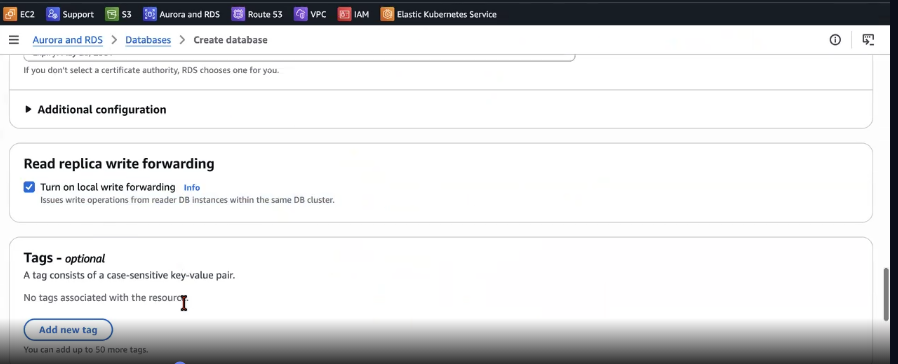

Note: in Aurora we can create 15 read replica's if primary DB fails the read replica will be promoted as primary DB(while creating we have *failure priority*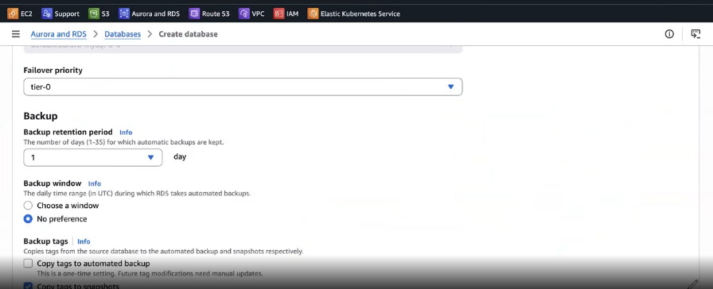](image.png) option it has tier0-15 priority which has lowest priority will be promoted as primary DB(like tier-0 will be promoted as primary DB)).


## parameter group in RDS:
we can't edit the mysql.conf(default conf file for MySQL available in /etc/mysql/conf.d it contains DB server settings, performance settings etc.) file in RDS because we don't have access to the underlying OS(DBengine). so using parameter groups we can change the default settings of DB engine.(we can change the settings like max_connections, wait_timeout, innodb_buffer_pool_size etc. these are available in mysql.conf file)

Note: while creating by deafult a parameter group automatically created but we can't edit the default parameter group, so we have to create a new parameter group and attach it to DB engine.

1. goto RDS on left pane click on parameter groups -> create parameter group -> give name and description -> select the DB engine type(like Aurora Mysql)  and parameter family group(like aurora-mysql8.0) --> select the type(like DB parameter group or DB cluster parameter group you can know about this type while creating DB(in Addtional configuration section)) --> click create parameter group.
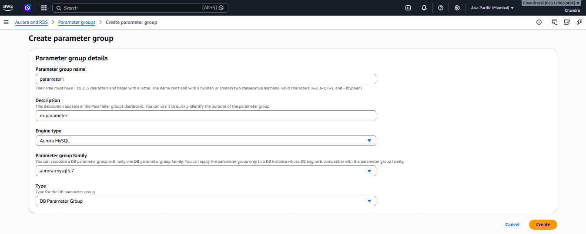

## option group in RDS:
using this we can add additional features to DB engine like connecting AWS services(S3 etc.) or auditing the mysql DB or security features like configuring TDE or kerberos authentication etc. we can add these features to DB engine using option group.

## Backtrack option in Aurora:
in Aurora we have backtrack option where we can go back in time and restore the DB to that point of time. we can go back upto 72 hours. we can enable this option while creating the Aurora DB engine.

Note: if you want to upgrade the DB with zero downtime, for example, we want to upgrade the instance version of the writer DB, select the writer DB in actions, click on failover, it will promote the read replica as the writer DB and the writer DB will become the read replica, and we can upgrade the instance version of the read replica without any downtime then we will upgrade the instance version of the writer DB and failover again to make the writer DB as primary DB and read replica as secondary DB. we can do this for any maintenance activity like patching, upgrading etc.

Note: if you give the cluster reader endpoint if any write operation we perform it will forwards the request to writer DB we can insert from reader DB(to get that select the clusetr under connectivity section you can see cluster reader and writer end points) of we select the reader DB instead of cluster you will get the Reader endpoint instead of reader cluster endpoint, so if we perform any write operation it will give error because reader DB is read only.
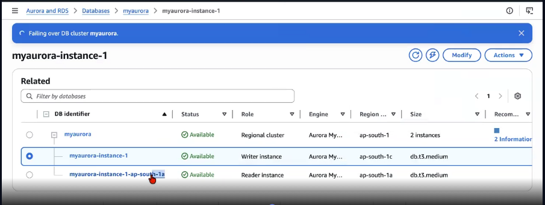

in the above image if we select the myaurora cluster we will get the cluster reader & writer endpoints, if we select the myaurora-instance-1-ap-south-1a we will get the reader endpoint instead of the cluster reader endpoint.

## DynamoDB:
DynamoDB is a NoSQL database service provided by AWS. It is designed for high performance, scalability, and cost-effectiveness.

we have 2 types of data bases

OLAP : Online Analytical Processing : Data will be semi/no organised.. : JSON : DynamoDB

OLTP : Online Transactional processing : Data will be well organised.. : Table : RDS

DynamoDB : Serverless : 

**Single Digit million second latency at any scale of data.. 
**Caching option/Solution for DynamoDB : DynamoDB AX/Accelerator


Table : It holds Items.
Item : A single row/record. it have its own attributes.
Attributes : The column of that item. One item can have multiple attributes.
PrimaryKey : With this only, DynamoDB finds our data. it has 2 types

	1. Partition KeyOnly : Single Key

	2. Composite Key : Partition key + Sort key

Read/Write Capacity : (similar ACU in Aurora)
--> Provisioned Mode : We can get a fixed number of requests.
--> On-Demand Mode : For unpredictable worklopads.. Pay-as-you-go..

### creating DynamoDB Table:
1. Goto DynamoDB -> Tables -> Create table -> give the table name and primary key(Partition key and sort key(optional))  --> table settings click on customize settings --> in table class select standard(if you access data frequently) or DynamoDB standard IA(if you access data infrequently) --> in read/write capacity mode select provisioned in read and write capacity we have the autoscaling option if we enable it will automatically scale the read/write capacity based on the traffic if we disable we have to give the read/write capacity manually and then go with default values in warm through put, encryption and other sections --> click create table.
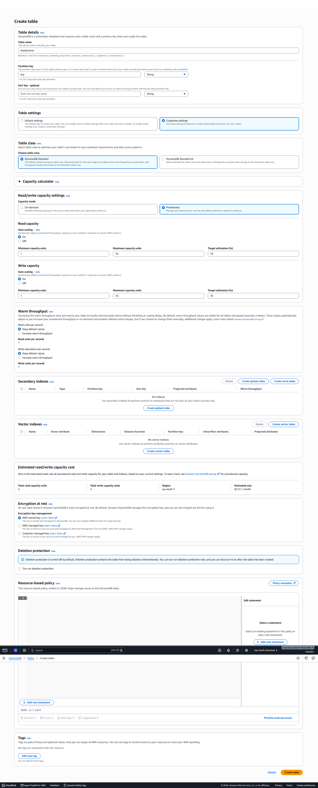

2. create items on left pane click on explore items --> select the table created --> click on create item --> give the values for attributes --> click save.
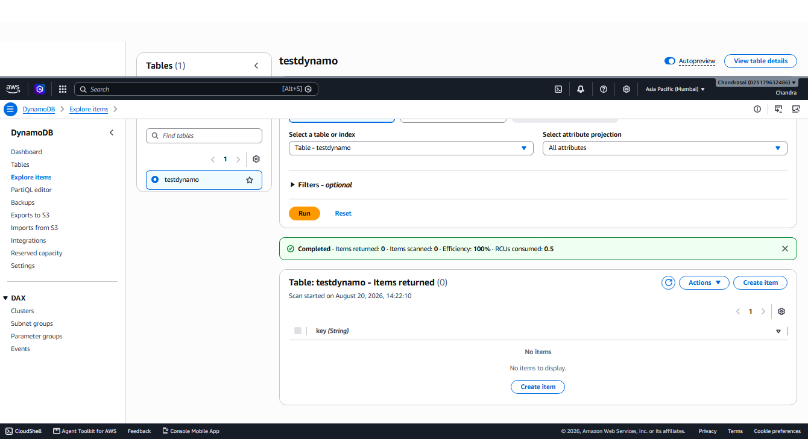
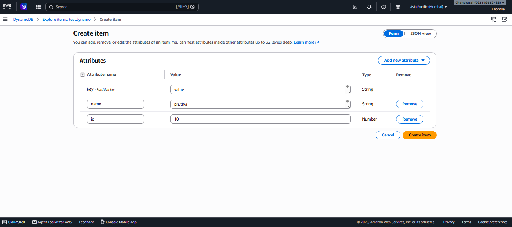

we have other option PartiQL editor where we can write SQL queries to perform operations on DynamoDB table. we can add items, update items, delete items, query items, scan items using queries in PartiQL editor.
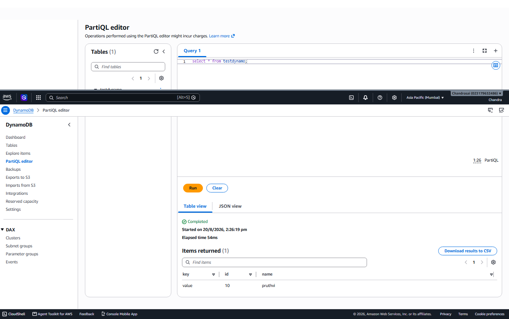

## Elasticache:
Elasticache is a fully managed in-memory data store and cache service provided by AWS(mostly used for RDS). It supports two open-source in-memory caching engines: valkey(fork from redis) and Memcached. It is designed to improve the performance of web applications by allowing you to retrieve information from fast, managed, in-memory caches, instead of relying entirely on slower disk-based databases.

AWS developed the valkey because redis is not open source anymore, so AWS developed the valkey which is a fork of redis and it is open source. valkey is fully compatible with redis, so we can use the same commands in valkey as we use in redis.

### creating valkey Elasticcache: 
1. create a security group for valkey cache open port 6379 for valkey cache and route the traffic to VPC CIDR(192.168.100.0/24)
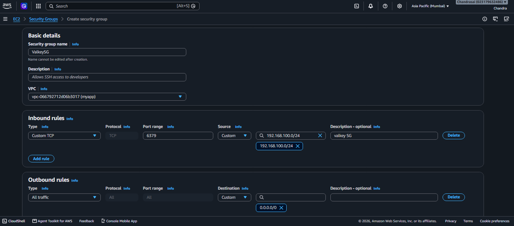

2. goto elasticache console on leftpane click on valkey cache --> click on create on configuration tab select valkey engine type(also have memcached and Redis OSS) and go with other default options --> in settings give name and description and select the engine version --> click on customize settings --> in network section select the myapp VPC and select the DB subnet group created in VPC learning session --> in security section  in access control section if you want we can enable access control for valkey cache, click on customize security in selected security group section click on manage select the SG we created for valkey cache --> if required enable backup and also we can set usage limits as well --> click create.
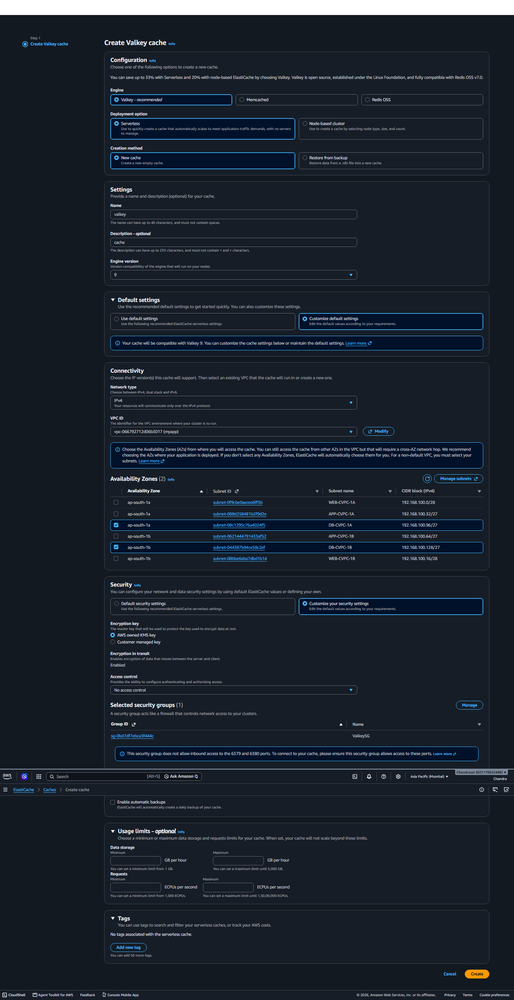

copy the endpoint of valkey cache: testingvalkeycache-ec9or7.serverless.aps1.cache.amazonaws.com:6379

start the jumpserver and execute the below commands

```sh
sudo yum install -y python3-pip mariadb105 redis6
pip3 install flask pymysql redis

export DB_HOST="database-1.chyaigmg00ss.ap-south-1.rds.amazonaws.com"
export DB_PORT="3306"
export DB_USER="admin"
export DB_PASSWORD="Pruthvi123"
export DB_NAME="productdb"
export REDIS_HOST="testingvalkeycache-ec9or7.serverless.aps1.cache.amazonaws.com:6379"
export REDIS_PORT="6379"
export CACHE_TTL="60"

cachetest-qoikij.serverless.aps1.cache.amazonaws.com

create schema.sql

mysql -h $DB_HOST -u $DB_USER -p"$DB_PASSWORD" < schema.sql

python3 app.py
```


## AWS Redshift : 

Data warehouse : 

OLTP : RDS : Customer --> order
OLAP : Redshift 

--> Redshift uses Columnar Storage		(Regular database: row-by-row)
--> MPP : Massively Parallel processing (Data stores across the nodes)
--> Default Data Compression : 

Leader Node : The "manager". It receives the SQL query, create an execution plan, and distributes wqorkto the computer nodes. It doesn't store user data. 
Compute Node : The "Worker". It received instructions from leader node and executes the query in parallel on theit portion of the data and send result back to the leader node. 

RA3 : RMS Redshift managed storage.. 


WLM : Auto-WLM : We can define queues with priorities.
MVs : Materialised Views : Pre-compute and store the results of complex queries. 

==========
## AWS DMS(Database Migration Service) :
1. Homogeneous Migration : 
migrating same to Same DB engines like mysql to mysql, postgresql to postgresql etc is called Homogeneous Migration. we can use DMS to migrate the data from on-prem or existing AWS RDS DB engine to AWS RDS DB engine.

On-Prem / AWS Existing DB Engine (mysql) --> AWS RDS DB Engine (mysql)

mysql --> DMS --> mysql


2. Heterogenious Migration : 
Migrating different DB engines like mysql to postgresql, postgresql to mysql etc is called Heterogeneous Migration. we can use DMS + SCT to migrate the data from on-prem or existing AWS RDS DB engine to AWS RDS DB engine.
On-Prem / AWS Existing DB Engine (mysql/Mongo/Redshift) --> AWS RDS DB Engine (mysql/postgresql)

postgresql --> DMS + SCT --> mysql

## Creating DMS Migration :
1. create a DMS cludter goto DMS console on leftpane click on migrate or replicate then click on provisioned instances --> click on create replication instance --> give the name and description --> select the instance class and storage type and size and also select the single AZ or multi AZ --> in connectivity section select the VPC enable public access if required in advanced settings section select AZ's, Security group, KMS key if you want to encrypt the data --> you want to maintenance window select the day, time and duration go with default options --> click create replication instance
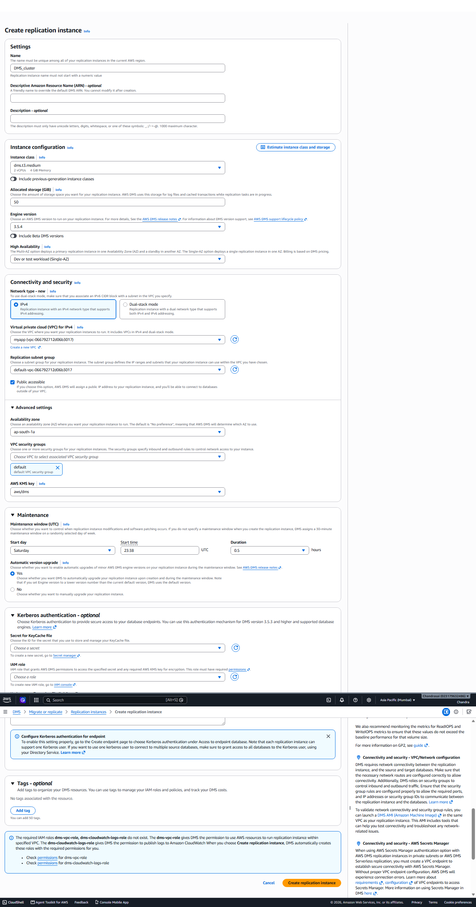

2. Create Source Endpoint : goto DMS console on leftpane click on endpoints under migrate or replicate section --> click on create endpoint --> select the endpoint type as source --> give the name and description --> if your database in RDS select the RDS instance and database name --> in endpoint configuration settings select the DB engine(source) select the access method to endpoint(source DB) we have different methods secret manager, manual, IAM Authentication if you want turn on SSL certificate go with default settings --> click create endpoint
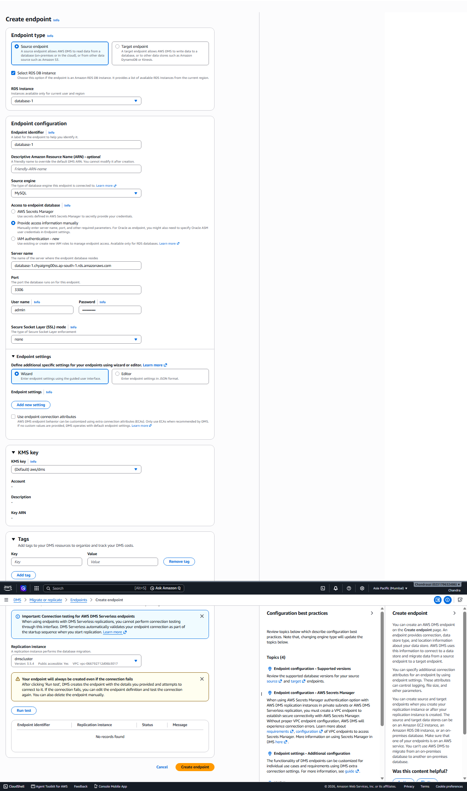

3. in same way create Target endpoint. if it is mysql select mysql engine if not select the required engine and give the target DB details.

4. we test the connectivity between endpoints & DMS cluster before creating the migration task. select the endpoint --> click on test connection select the replication instance and click on run test. if it shows success we can proceed to create migration task.
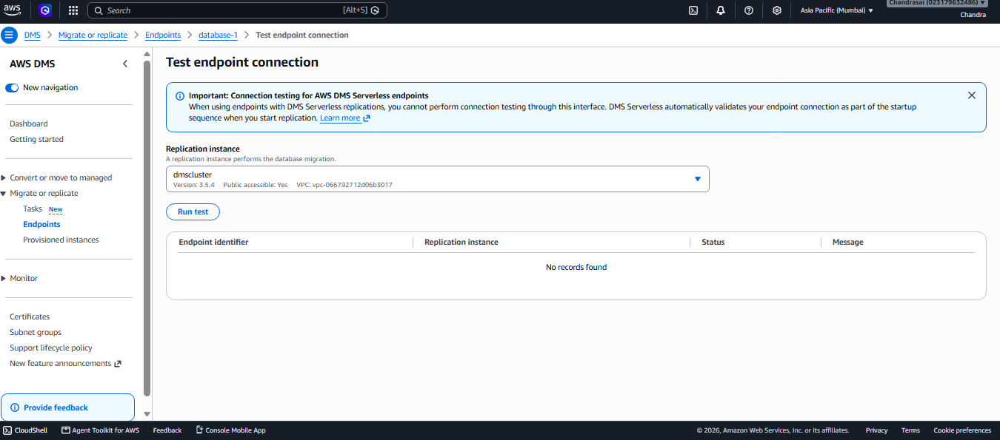

5. then create task  goto DMS console on leftpane click on tasks under migrate or replicate section --> click on create task --> give the name and description --> select the source and target endpoints --> choose the task mode(provisioned or serverless) --> select the replication instance --> in Task type(migration strategy) section we have 3 options Migrate only, Migrate and replicate, Replicate only --> in table mappings section we can select the tables we want to migrate --> in Log settings section we can turn on cloud watch logs --> explore the other features click create task.
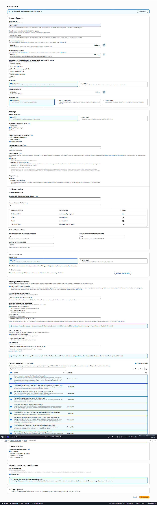

Step 1 : Create a DMS CLuster
Step 2 : Create a Source Endpoint
Step 3 : Create a Target Endpoint

Step 4 : Configure the migration task
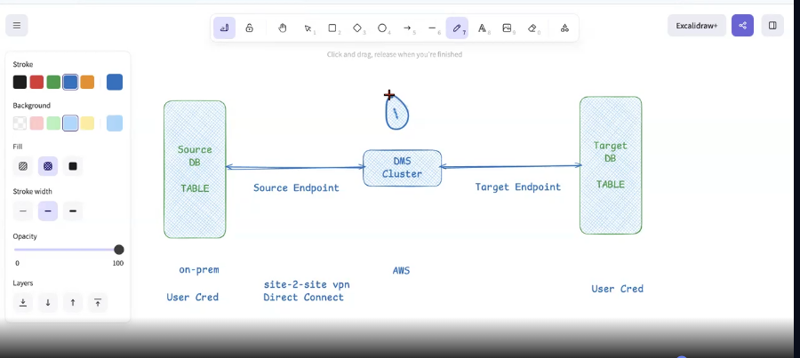


Migrate only: Migrate data from source to target once (Full load)

Migrate and replicate : Migrate data from source to target once and continue to replicate changes (Full load and CDC)

Replicate only : Replicate data from source to target now or at a specified milestone (CDC only)

CDC --> means Change Data Capture


