# AWS

Snapshot : backup copy of an EBS volume. 

**Note:**EBS volumes are zone specific(we can't copy/attach ebs volumes from one zone to other zone if we want to attach we will create snapshots and create volume from that snapshot in desired zone) and ebs snapshots are region specific.

for region to region we will copy snapshot to desired region from that snapshot we will create volume.

we can copy snapshots form one account to another account. we can share snapshots everyone publicly as well using snapshot id.

Snapshots are point in time copies. (If you create a snapshot at 09:30, whatever the files you have in volume at 09:30, only those will be backedup).. 

AWS uses s3 as backend platform for snapshots.

--> Can we see what data we have inside the snapshot.?Ans; no..
--> AWS uses incremental backup mechanism (in backend).. We just need most recent copy to restore.. multiple copies not required..
--> If a volume is encrypted, and if we create a snapshot, snapshot also enabled with encryption defaultly.

--> If any snapshot if encrypted with "default encryption key", we cannot share it with other aws accounts.
--> If any snapshot if encrypted with "custom encryption key", we can share it with other aws accounts.. but we need to share the encryption key also.


------------


### DLM: Data Lifycle Manager:
Designed to automate the snapshot creation. Based on environment or org/proj requirement, we configure this. (RTO / RPO)

1. RTO (Recovery Time Objective)
Simple Meaning: Your downtime limit.
The Question: "How long can we afford to be offline?".
Focus: Recovery speed.
Example: If your RTO is 2 hours, you must have your systems back up and running within 2 hours of a crash to avoid serious business damage. 

2. RPO (Recovery Point Objective)
Simple Meaning: Your data loss limit.
The Question: "How much data can we afford to lose?".
Focus: Backup frequency.
Example: If your RPO is 1 hour, you must back up your data at least every hour. If the system crashes, you might lose the last 59 minutes of work, but you won't lose more than an hour

### Creating DLM in AWS

**Step-1:** Goto DLM or on EC2 console on leftpane under ebs store click on lifecycle manager select default or custom policy then in target resource tab it will show 2 options instance(creates snapshots for all the volumes attached to this instance) or volumes then we need to provide the tags of the instance/volume according to this we will select instance or volume. automatically a role, *policystatus --> select enabled*(if disable it will create snapshots till you enable it) then*Excludevolumes --> select if you want exclude volumes(root volume(/) or other volumes)* we are creatin volumes according to tags if we want igonore some volumes with we can mention them.

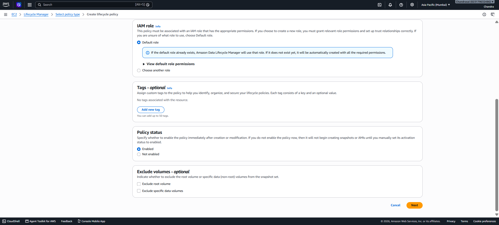
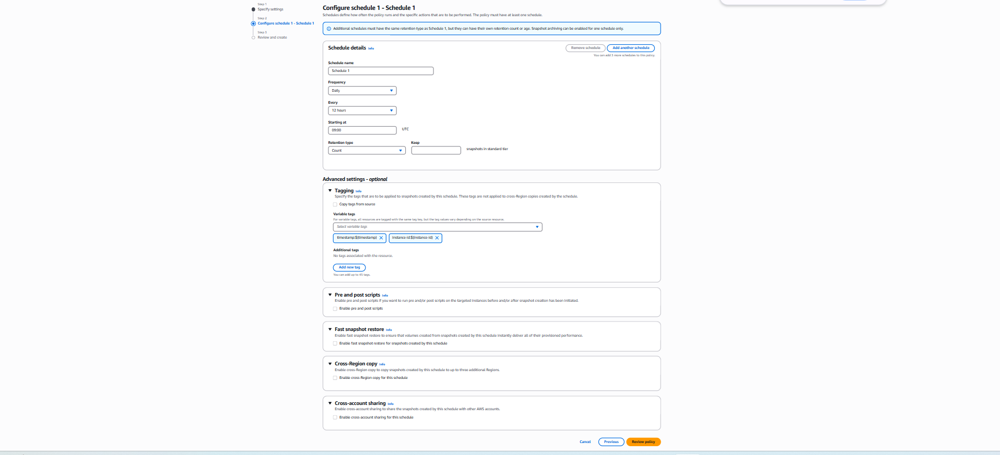

**Step-2:**in schedue details tab we schedue how frequently we need to create snapshots(like everyday or hours or weeks) *rentenion type* here is how many days or how many latest snapshots we can retain it has 2 options 
1. count -- last 5 or 10(or number we gave) latest snapshots we can specify number
2. Age -- if we select age we can  give how many weeks or days snapshots we can retian(if we give 2 last 2 weeks snapshots reatined) if it cross 1 week that snapshot automatically delted by AWS.

**Note:** we can add multiple schedules.

**Advanced Setting:**
1. *Tagging* we can give tags to created snapshots
2. *pre and post scripts* -- if you want to run any scripts in instance before creating snapshot.
3. *Fast snapshot restore*
4. *Cross-region* if we want to copy our snapshots to across the regions, we can set expire date for that s copied snapshot in another region(we copied snapshot to us-east-1 we set expire 2 days after 2 days it will automatically deleted).
5. *Cross-Account* if we want to share created snapshots to different accounts.


## Golden AMI:
**OS Hardening:** OS hardening is the process of securing a computer system by reducing its attack surface, closing security gaps, and removing unnecessary features. The main goal is to make the system safe from hackers and malicious attacks.

The *Center for Internet Security (CIS)* acts as the global standard setter for OS hardening by providing the specific blueprints, tools, and pre-secured systems needed to protect your computer. Instead of guessing which settings to change, IT professionals use CIS resources to safely lock down their operating systems

CIS benchmark list: https://www.cisecurity.org/cis-benchmarks

Base Instance --> httpd, custom web content, user add, password auth enable, tree, 2gb addl volume... --> Checklist --> Reboot and verify --> Sanity check --> Then create a GoldenAMI

**Note:** when we create a Golden AMI form a base instance in the backend AWS will create snapshots of a ebs volumes attached base instance and associates those sanpshots to Golden AMI when we create an instance with this golden AMI those snapshots will be used and instance will launched.

### Creating Golden AMI:
**Step-1:** select the *instance > actions > Images & templates > CreateImage* fill the deatils if we select the *reboot intance* if we are creating the ami on a running instance it will reboot that instance so data will be at rest for data consistency. then we ebs volume setttings.
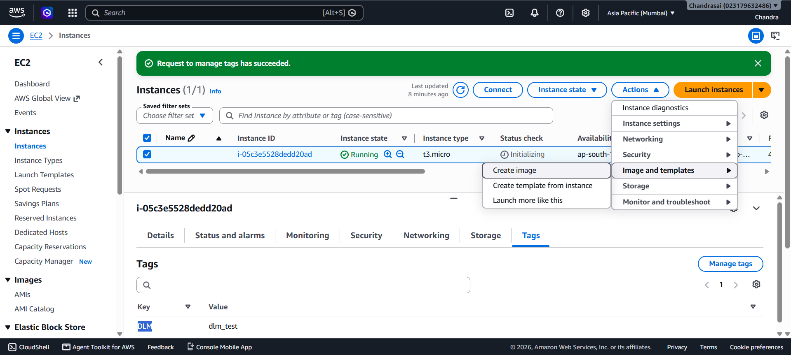
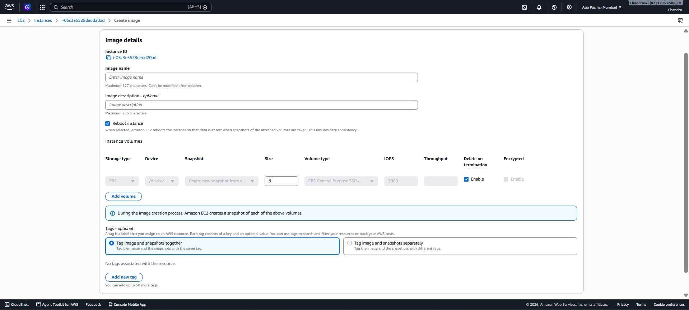

we can't delete the snapshots attached to ami's.

We have *EC2 image builder* to automate the above golden image creation process.EC2 Image Builder is a fully managed AWS service that automates the creation, management, and deployment of customized, secure, and up-to-date virtual machine and container images. 


13.200.251.170
13.201.13.166		--> Current IP

EIP : Elastic IP Address : We can allocate a dedicated IP Address to instance. 
In general, if we perform stop and start operqation Instance auto allocated public ip will change.


We always enbale these 2 options while launching instance to protect our resources from accidental deletion/stop operations on instance. we can also enable this from *Actions* tab as well 
Stop Protection : 
Termination Protection : 

Shutdown behaviour : What should happen to the ec2 instance when we initialise the shutdown at OS level. Default option is "Stop"..  


## Elastic file system(EFS):
EFS uses NFS, NFS port number is 2049. NFS uses 4.1 protocol.

NFS Supports linux OS only, THat means EFS supports only linux Instances.
For windows, We have another service "FSx", FSx works with SMB (Server Message Block) Protocol.

EFS has unlimited storage.
No Pre-provisioning required


**Step 1 :** Create a Security group for your ec2 instance

sg-01f2aff5e6ac57dc1 - Web-SG		(Opened port http/80 and ssh/22)


**Step 2:**  then create a SG for EFS. Port : 2049.. Always prefer Option 4

Where we need to open this port.?? 
Option 1 : Open for everyone (least Secured)		: 0.0.0.0/0
Option 2 : Open for 2 ec2 instance Private IPs		: web-1 pvt ip & web-2 pvt ip
Option 3 : Open for entire VPC network				: 172.31.0.0/16

Option 4(Recommended) : Open for EC2 instance Security group. (More Secured and AWS suggested best option) This is also called security group pipeline method.
Open port 2049 and set destination as "Web-SG" (Pipeline Mechanism).. (Data will be encrypted automatically)
 
Option 5 : Attach "Default SG" for your EFS and EC2 instances.. Both can communicate.

--------

#!/bin/bash
sudo dnf install httpd -y
sudo systemctl start httpd
sudo systemctl enable httpd

DocumentRootPath: /var/www/html/

1. Creating EFS: Go to EFS console --> Create file system --> Click on customize --> give name --> if you want oyour EFS to across the region select the region or only AZ select zonea and we have different options explore.
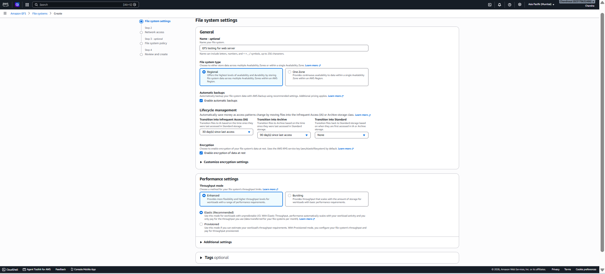

2. Remove the default SG and Add the SG we created for EFS. (Port 2049 opened) and click on create file system.
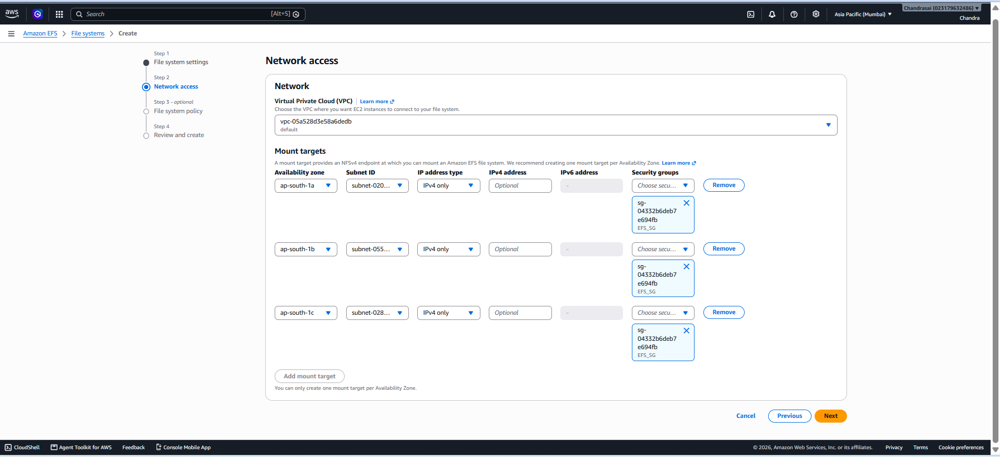

3. then we can add policies to our EFS. (like encryption, preventing accesss etc..)
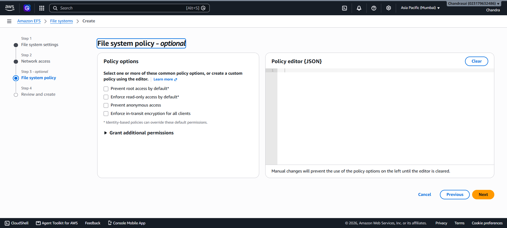
4. Review all the details and click on create file system. It will take 1-2 mins to create EFS.
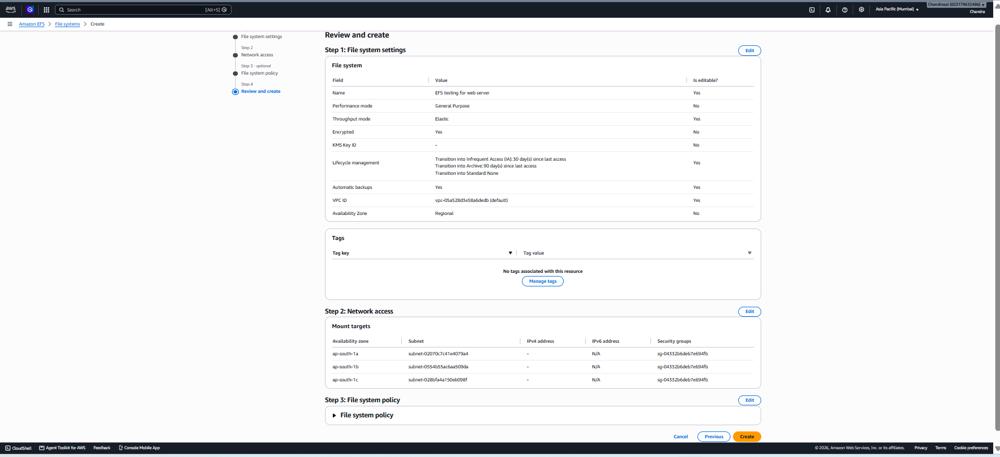
----
**step-3:** after creating EFS, we need to mount it to our ec2 instance. in EFS console click EFS file system and click on attach it will show 2 options mount with ip(it is limited to One AZ only) and DNS(recommended) We can mount it using NFS protocol.
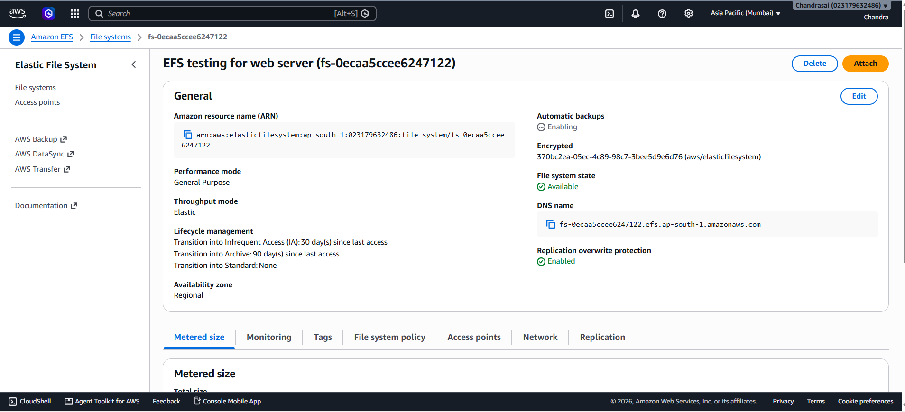


sudo mount -t nfs4 -o nfsvers=4.1,rsize=1048576,wsize=1048576,hard,timeo=600,retrans=2,noresvport fs-0d0e78183133de983.efs.ap-south-1.amazonaws.com:/ /mount-point

sudo mount -t nfs4 -o nfsvers=4.1,rsize=1048576,wsize=1048576,hard,timeo=600,retrans=2,noresvport fs-0d0e78183133de983.efs.ap-south-1.amazonaws.com:/ /var/www/html/


ec2 : NFS..??? SSH..?? HTTP..??
EFS : 2049.. 

Scaling : 

Vertical Scaling : Adding more resources/components (CPU/memory/ENI) to existing instance.. 

t3.micro		--> Not working as expected --> Cloudwatch --> t3.micro --> t3.small

--> We need to stop the ec2 instance to perform vertical scaling.


--> Change Request / CRQ --> CAB meeting (Change Advisory Board) (Prod --> 1 week / Non-prod --> 2 week)

Dev / QA / SIT --> We can do it (1 week observe)
UAT --> CAB --> 
PRD --> CAB --> UAT CRQ Number --> prod Approve (2 weeks gap)

e-crq --> Emergency crq 

Is this implemnted in lower env.?
Cost change
Downtime required
Client informed
change window / When you planning perform
Pre-Implementation
Actual implementation
Post-Implementation
Validations / Sanity Check
Rollback plan

Tasks list : db, support, db, aws..


## AWS Cloudwatch

Cloudwatch : Monitoring service.. Observability (o11y).. 
This is enabled for most of the aws services we use.. 


we have 2 types of monitorings.

1. Basic Monitoring : 5 min (by default)
2. Detailed monitoring : 1 Min(we need to enable this in monitoring section it will give metrics every 1 min.. it will cost us extra money..)

EC2 : We can monitor CPU, Disk and Network metrics.. We cannot monitor "memory/RAM" usage using default cloudwatch metrics.. 

We can install "CW Agent" inside ec2 instance and we can monitor memory and disk free space.. 

--> We can configure alarm based on the metrics and we can invoke services i.e; SNS (simple notification service) or we can take automated actions on the resources.. 

CPU >=90 for 300 seconds --> reboot
CPU <=20 for 300 seconds --> stop

To monitor memory usage or storage (free storage) or to get our application logs from ec2 to aws.. We need to install Cloudwatch agent.. 

**DL(Distribution List)**: it is a saved group of email addresses that can be used to send emails to multiple recipients at once.
in organisation we don't use specific email address but we have DL (Distribution list) we add this DL mail in SNS topic it will sent alarams and all the team members they will see that mail message.

### Cloudwatch Agent Installation:
To monitor memory usage or storage (free storage) or to get our application logs from ec2 to aws.. We need to install *Cloudwatch agent*. to install this agent we need SSM agent this SSM agent will install in cloudwatch agent in instance.

1. Create a role and required permissions(like CloudWatchAgentServerPolicy, ec2 policies etc.) attach that role to ec2 instance(select instance click on Actions --> Security --> Modify IAM role --> select the role we created and click on update IAM role) and attach the below policies to that role. wait sometime for role to take effect or you can reboot(better reboot to install ssm agent).

2. select ec2 instance goto mointoring tab clickon Configure Cloudwatch Agent if you SSM agent not installed reboot the instance.
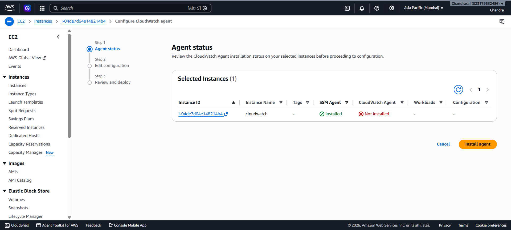.
3. then click install agent and then click on configure Cloudwatch agent you will lot options like memory, disk, cpu, network etc.. select the metrics you want to monitor and also we integrations we can get metrics from prometheus as well. if we select integration like JVM we can java application logs as well(in ur machine app logs are stored in /var/logs/app_name if we eable loggging and give that in integration tab it will those logs in cloudwatch)
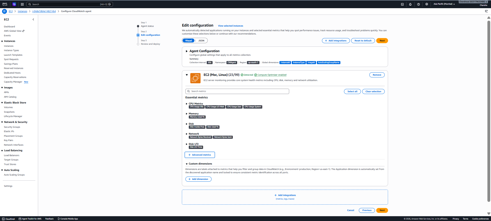

4. then click on next and review details and click on Deploy. then you monitor metrics in cloudwatch console or in instance monitoring tab.

**Note:** if we want to install cloudwatch agent in multiple instances we can use system manager to automate the process. we can create a document in system manager and we can run that document in multiple instances to install cloudwatch agent.

============

## EventBridge
Amazon EventBridge is a serverless event bus service that connects different application components using real-time data streams. using this we can do two things we can trigger EventDriven process and we can schedule the tasks.

#### EventDriven process: i want create a sns alert when an IAM user is created or deleteed.

EC2 Instance --> Stop / Reboot / terminate --> Alert (Production Support) 

IAM User created (iam.amazonaws.com) --> "Createuser", "DeleteUser"  --> SNS
(Cloudtrail)

For IAM realted activities, We can directly search, but Eventbrodge always checks for the events inside a management trail(it has stored all cloud trail logs in s3 bucket from this eventbridge check details and send the alerts).. 
Create a Management trail in Cloudtrail and perform the IAM releated activity.

**Note:** make sure you are creating management trail, sns topic and eventbridge rule in same region. 

1. creating management trail goto cloud trail console --> Trails --> Create trail --> give name then uncheck log validation and kms encryption click next in the events tab check the management events then click next review and click create trail. then create sns topic for alert and subscribe your email address to that topic. 
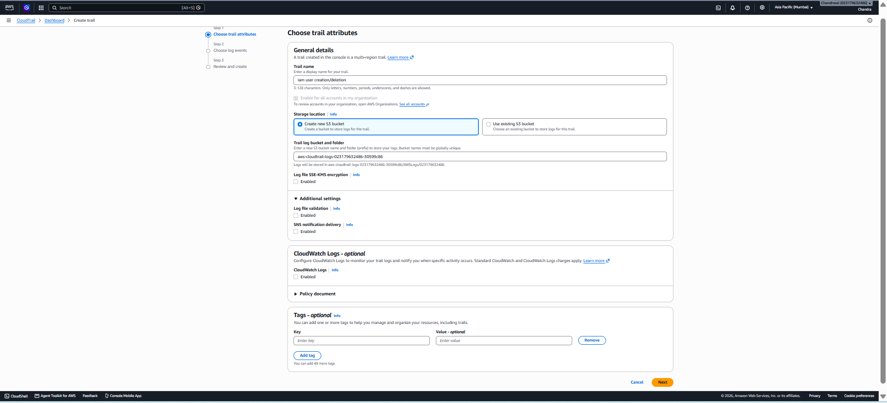
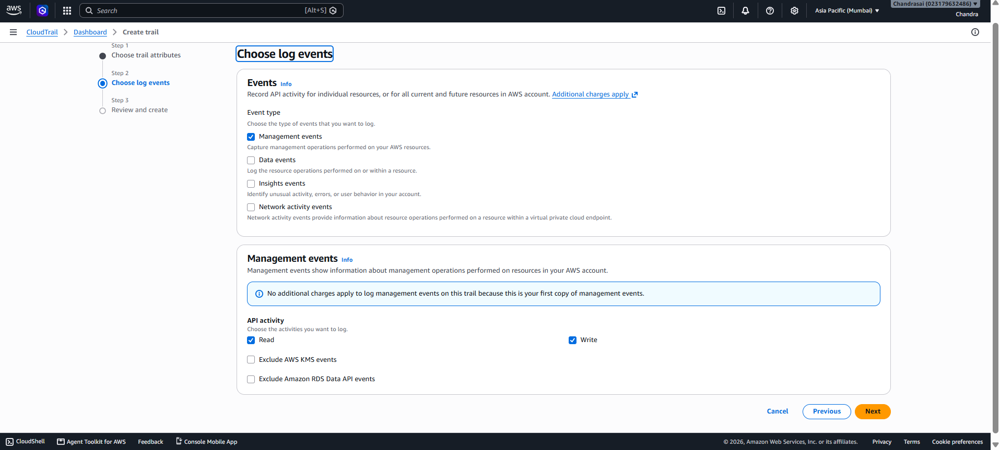
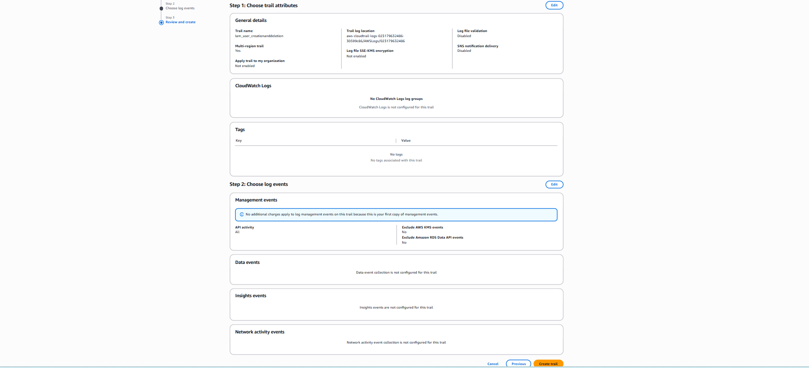

2. create Eventbridge rule goto Eventbridge console --> Rules(on leftpane) --> Create rule --> it show 2 options(enhanced and adavnced builder(we can drag and drop the services advanced one) choose advanced builder)give name and description --> clicknext --> in event pattern tab select use pattern form select *IAM* service then select AWS api call via cloudtrail in event type(we only want to trigger when iam user created or deleted) click on specific operation and select CreateUser and DeleteUser(it will be same as event type format in cloudtrail example in cloud we search eventtype "CreateUser" and "DeleteUser" it will same in specific operation section) 
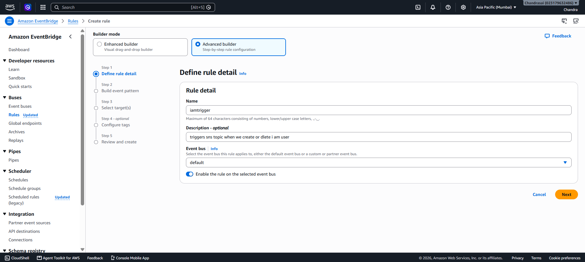


3. then click next in target tab select SNS topic and select the topic we created for alert and select create new role click on additional setting select input transformer in configure target input(we will get output in json format in mail it's not good to read so we will transform the output in human readable format here) click on configure input transformer select event on myown Give the json ouput showing in email in target input transformer tab in input path section give the below format.
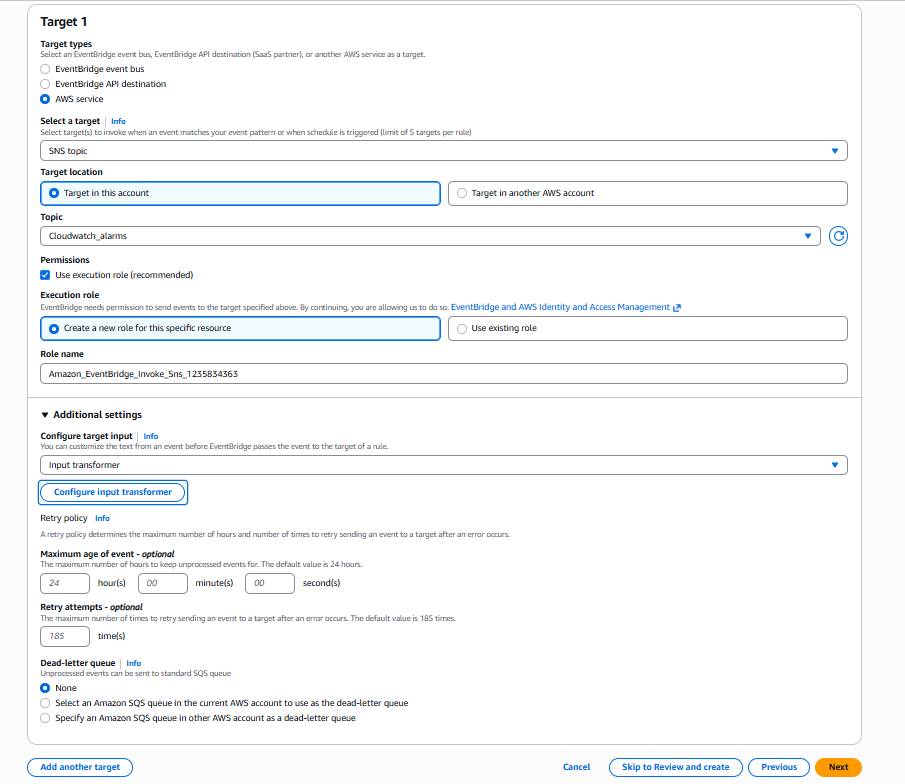
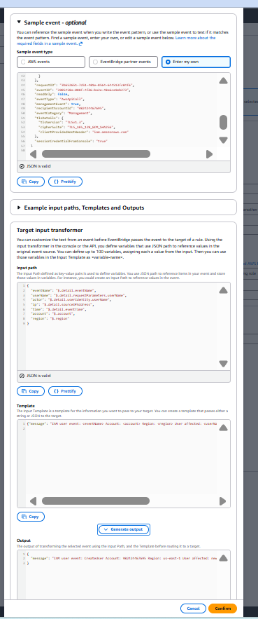
{
  "eventName": "$.detail.eventName",
  "userName": "$.detail.requestParameters.userName",
  "actor": "$.detail.userIdentity.userName",
  "ip": "$.detail.sourceIPAddress",
  "time": "$.detail.eventTime",
  "account": "$.account",
  "region": "$.region"
}

4. in template section give the below format. if click generate output it will show the ouput that is going to be sent in mail. we can change the output format as per our requirement.

{"message": "IAM user event: <eventName> Account: <account> Region: <region> User affected: <userName> Performed by: <actor> Source IP: <ip> Time (UTC): <time>"}
5. click next if you want add tags we can add then click next review the details and click create rule. 
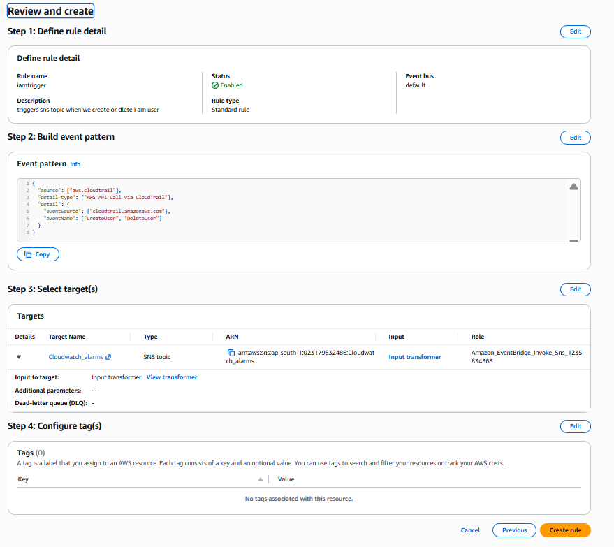

### EventBridge Scheduler:
EventBridge Scheduler is a fully managed service that allows you to schedule tasks and automate workflows in AWS.

1. goto EventBridge console --> Scheduler(on leftpane) click on schedules --> Create schedule --> give name and description --> select the schedule group(used to group the schedules) --> in schedule pattern one time schedule or recurring schedule(cron schedule) if select time in *flexible time window*(if you select 5 min your task schedule at 10 pm scheduler run randomly anywhere between 10:00 pm to 10:05 pm ex: 10:03) click next --> in target tab select all api's then select the service you want to trigger(like ec2,lambda,sns etc..) you selcted ec2 instance in *start instance* section give the instance id and click next.
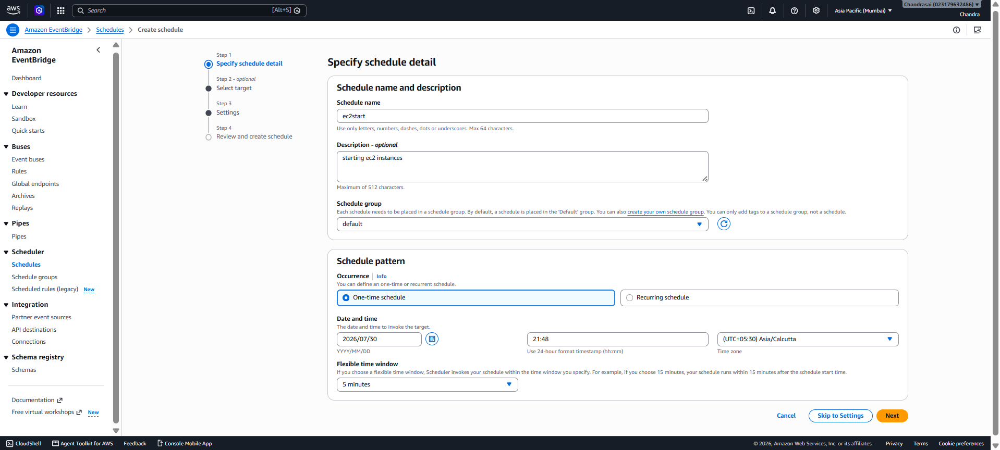
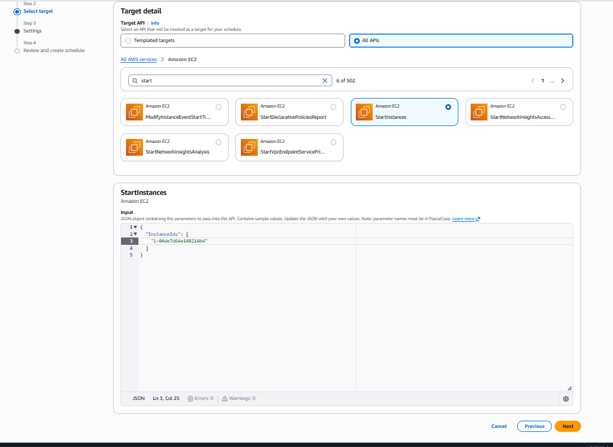

2. then in Action after schedule completion tab (if you want to delete the schedule after completion select delete otherwise put NONE) in premisions tab select create new role(if it will not allow, create anew  role with ec2 permissions in role trust policy remove the ec2 and add *scheduler*) click next review the details and click create schedule. it will start ec2 instance as per the schedule we created.
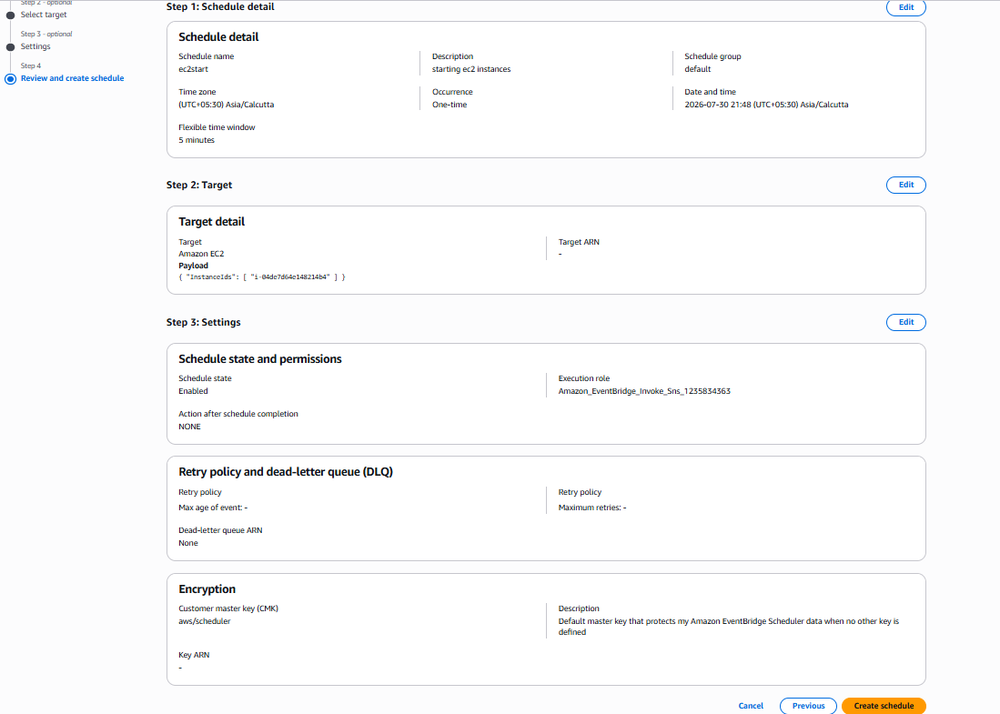

<font color="red">**Note:**</font> we can't create a role with service scheduler or eventbridge scheduler(like how we created for ec2 service we don't have eventbridge scheduler) that's why for work around we created a role for ec2 service with ec2 access in trust policy we replaced ec2 with scheduler now scheduler assume this role and start the instance.

## AWS CLI:


Any IAM user wil have 2 types of accesses.

AWS management console access : username, password and Sign-url --> browser
Programatic Access : Accesskey and SecretAccesskey	--> CLI

Programatic Access is not much secured.
Cred stores in Plain text format. it wont rotate.

c:/users/administaror/.aws --> config and credentials
~/.aws --> config and credentials

Navigate to "https://aws.amazon.com/cli", downlaod and install CLI

```sh
aws --version			--> TO identify installed aws cli version

aws configure
AccesskeyId : 
SecretAccesskey: 
DefualtRegion : ap-south-1
DefaultOutput : json/table


aws sts get-caller-identity			--> TO see / fetch currently configured user info

aws configure list					--> list the currently configure profile

aws configure list-profiles

aws iam list-users
aws ec2 describe-instances --region eu-north-1

--

aws configure --profile uat
aws configure --profile prd

aws s3 ls							--> List the buckets from deafult profile
aws s3 ls --profile <uat>			--> List the buckets from uat profile

aws s3 mb s3://aviz6-cli-test2

aws s3 ls --debug					--> generate logs with debug

aws servicename command arguments


aws iam create-user --user-name aviz6-cli

aws iam attach-user-policy --user-name aviz6-cli --policy-arn arn:aws:iam::aws:policy/IAMReadOnlyAccess


aws ec2 describe-instances --region ap-south-1

Search Instance by Name tag
aws ec2 describe-instances --filters "Name=tag:Name,Values=*Jenkins-Server*" --output table

Search for only running ec2 instance
aws ec2 describe-instances --filters "Name=instance-state-name,Values=running" --output table

Search using Private IP:
aws ec2 describe-instances --filters "Name=private-ip-address,Values=172.31.22.18" --output table


--

aws iam list-users --query "Users[*].[UserName, CreateDate]" --output table

aws ec2 describe-instances		--> PrivateIP

aws ec2 describe-instances --query 'Reservations[*].Instances[*].PrivateIpAddress' --output text

[*]	--> Select all elements
[0] --> First element


aws iam list-access-keys --username USERNAME  --query 


aws s3 sync c:/desktop/folder/ s3://avizway/lmsdata/
```
<font color="red">**Note:**</font> recently we got *aws login command* using this we can login to aws cli without accesskey and secretaccesskey. after typing aws login command it will ask region then it will show which account you are logged in browser.

## AWS Cross-account access
if Account-A want to access the s3 buckets in account-B.
1. create a role(for AWS account) select AWS account in use case tab select another account provide Account-A Account id and then in policies attach the s3 policies the create a role. then copy the link to switch role url(susing this url also we can able to login).
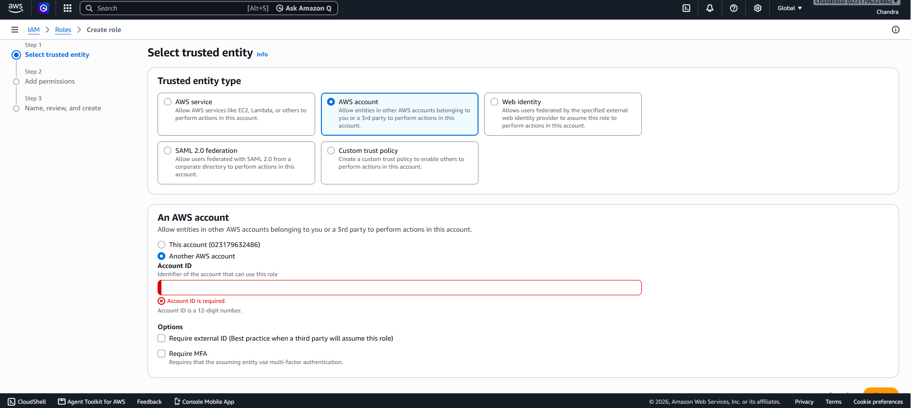
2. goto Account-A click on on your account and then click on switch role give the Account-B id and give iam role name created in account-B in rolename section.
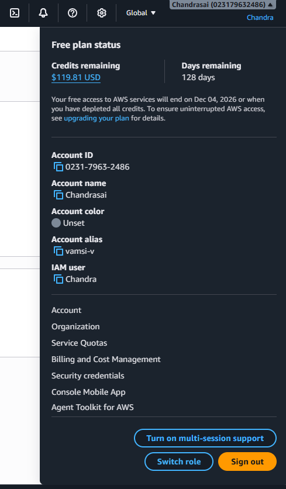
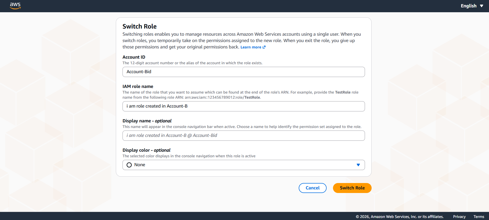

<font color="red">**Note:**</font> In role trust policy the service arn we mention that service able to assume that role. we can't attach multiple roles to a service but we can attach multiple policies to a role.

## AWS System manager:
AWS Systems Manager (SSM) is a secure AWS management service helps you automatically view, control, and operate your cloud and on-premises infrastructure at scale. it offers Node Management(session Manager, run command, Fleet Manager), Operations Management(Incident Manager, OpsCenter), Change Management(State Manager, Patch Manager), Application Management(parameter store) 

### System session manager(SSM):
AWS Systems Manager Session Manager is a fully managed AWS service that lets you securely manage and connect to your Amazon EC2 instances, on-premises servers, and virtual machines (VMs).

can we connect a an aws instance without opening port number 22?

yes using aws session manager, through console also we need to port 22 to connect.

1. Create a role and attach policy *AmazonSSMManagedInstanceCore*(without this policy ssm not able to connect our EC2 insatance) to the role then attach that role to ec2 instance. if it will show ping status offline like below image wait until the role takes effect.
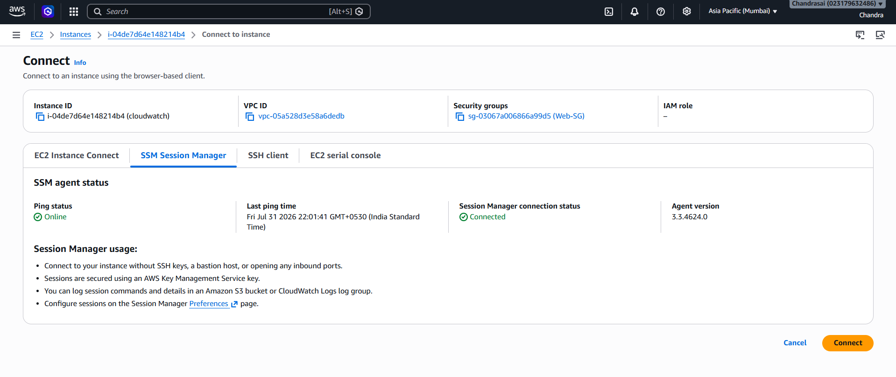

we can create this ssm console as well goto ssm console on left pane click on session manager click on start session give the reason and select the ec2 instance(we can select only one instance) then if you have the session document(a configuration file that defines the settings, behaviors, and security controls for your AWS Session Manager connections like Encryption, Logging(save session terminal history to Amazon S3 or Amazon CloudWatch Logs.)etc.) and then click on start session you will connect to ec2 instance.

### Run command:
it is used to run commands in ec2 instance.

Before going to run command attach necessary policies to the role like ssm full access etc.
1. goto system manger on left pane click on run command --> run command --> on command document section select *AWS-RunShellScript*(to run commands in shell) --> command parameters section give commands you want to run --> target selection section select ec2 instance(we can select multiple instances) --> ratecontrol section(we can control in how many targets we can run commands ata time(100 instances run cmds in 50 instance first then 50)error threshold it will stop execution if cmds fails in specified targets) --> output options sections(we can store cmds output in s3 or cloud watch logs) then we other options also explore the click run.
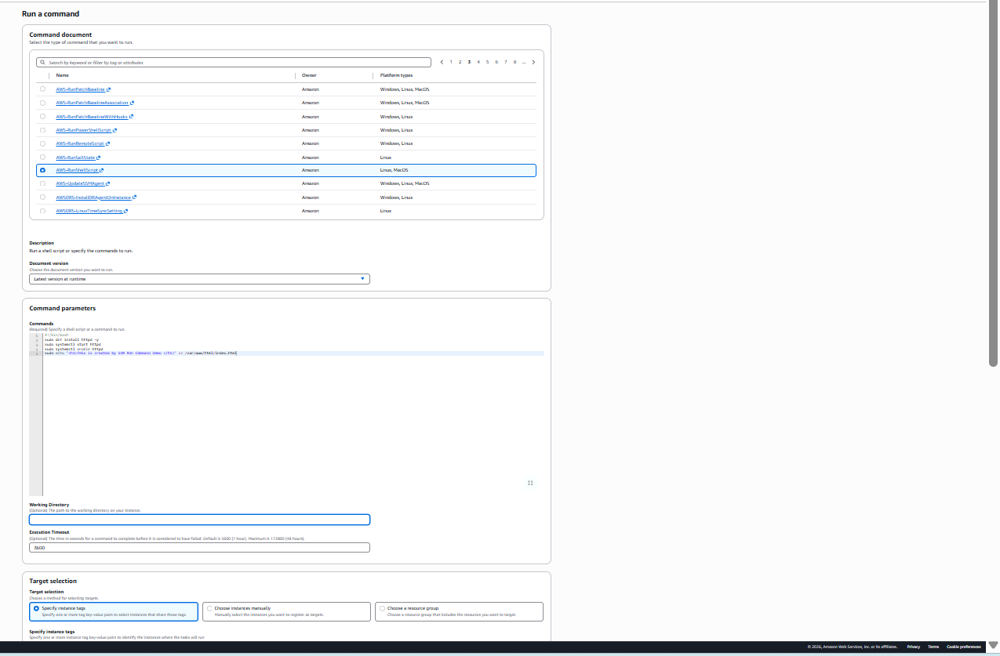
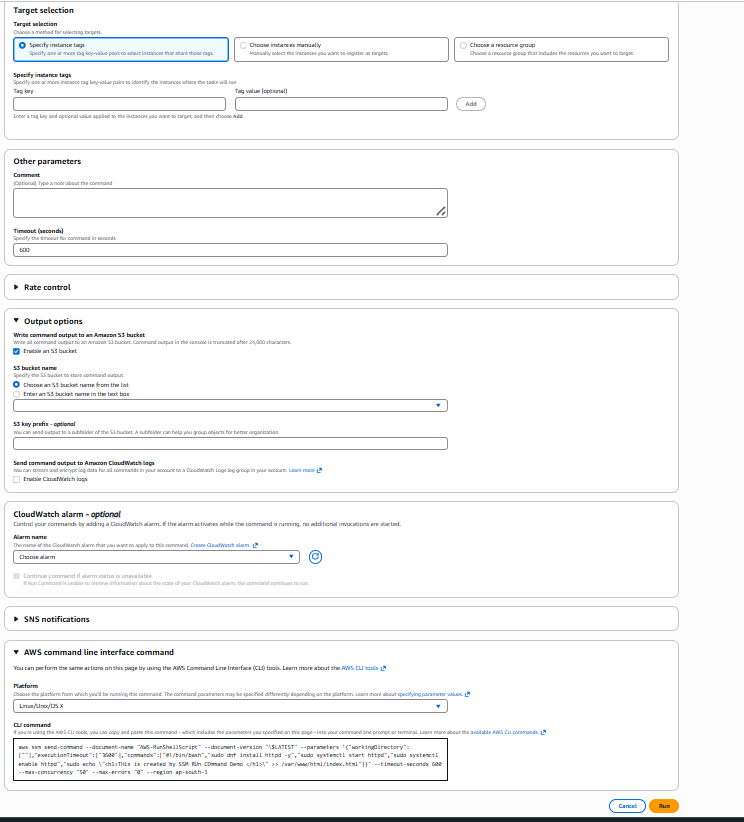

enabling httpd and creating index.html in ec2 instance.
```sh
#!/bin/bash
sudo dnf install httpd -y
sudo systemctl start httpd
sudo systemctl enable httpd
sudo echo "<h1>THis is created by SSM RUn COmmand Demo </h1>" >> /var/www/html/index.html
```

## AWS Security groups & Nacl's:

Security group : it's like a firewall, configured at instance level.
** We can add multiple SGs for one ec2 instance
** There is no option to DENY the traffic, Only allow is possible.
** Changes to the SG takes effect without any delays.

Inbound = Traffic coming INTO your ec2 instance : ssh: 22, http:80, https:443, mysql:3306, mssql:1433
Outbound = Traffic going OUT from your EC2 Instance : 0.0.0.0/0

Note: we can edit outbound traffic rules

Why we mostly open outbound for anywhere.?
--> To install anything, we get packages from internet.
--> To access webpages
--> To call external APIs
--> Send logs to cloudwatch
--> Access s3 from instance

stateful : SG are stateful. Whatever traffic allowed inside, that automatically allowed outside. We really no need to worry about oputbound rules (0.0.0.0/0). 

Stateless : We need to explicitly allow inbound and outbound traffic. VPC --> NACLs

---

USERDATA: we can pass commands only once, when instance launched for the first time.  These comamnds runs as "root" user.

the ouput of the userdata commands stored in this log file : /var/log/cloud-init-output.log

size should be less than 16KB.. 

Note: if scripit is greater than 16 kb Put the scripit inside an s3 bucket upload that file in userdata section.

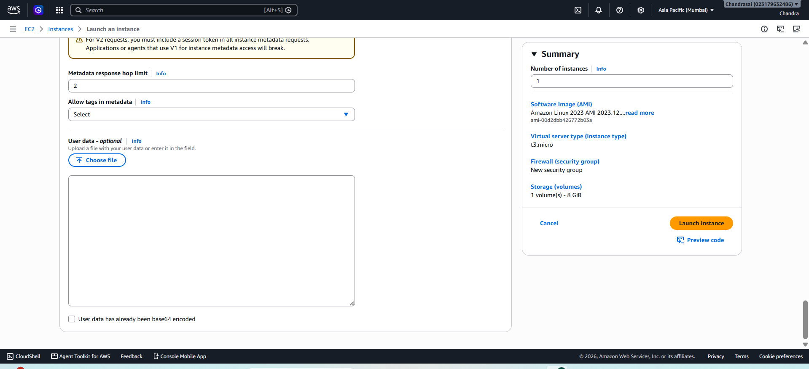
---

METADATA: We can use this option to get data about our ec2 instance  (When we are inside the OS) like public ip's, VPC's attached etc. it is useful when you don't have console access to ec2 instance you want to know instance public ip details vpc details we can use this metadata.

To access metadata, enable metadata option. we have 2 ways to ge the instance metadata

v1(optional)  : we can access info with metadata url. (less secured - Chances for SSRF attack (server side request forgery))
v2(required)  : It needs token to access metadata.

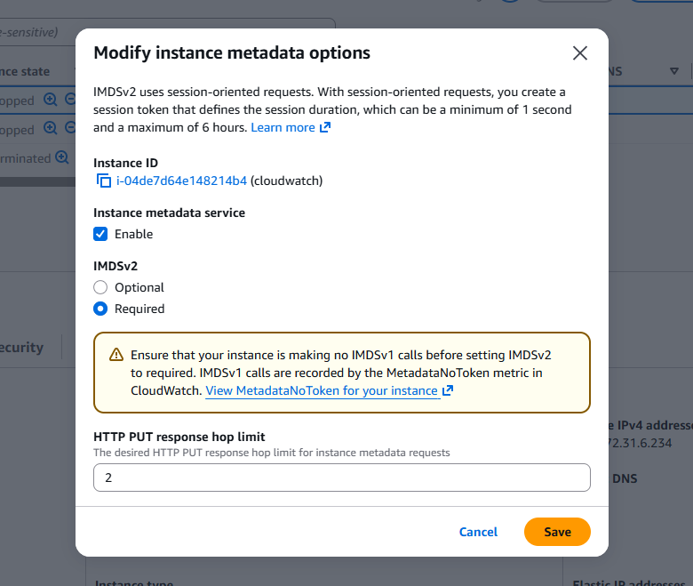

#### 1. accessing metadata in less secured method(optional):
using below url we will get metadata of a ec2 instnace run below curl command in ec2 instance it will give metadata of that instance.

curl http://169.254.169.254/latest/meta-data

output of /metadata path look like below
```sh
ami-id
ami-launch-index
ami-manifest-path
block-device-mapping/
events/
hostname
identity-credentials/
instance-action
instance-id
instance-life-cycle
instance-type
local-hostname
local-ipv4
mac
managed-ssh-keys/
metrics/
network/
placement/
profile
public-hostname
public-ipv4
public-keys/
reservation-id
security-groups
services/
```
if you want to know about vpc id attached to that instance we will get that in below path

curl http://169.254.169.254/latest/meta-data/network/interfaces/macs/02:34:5d:11:55:43/vpc-id


---
#### 1. Accessing metadata using token secured method(Required in EC2 console):
using below command generating and storing the token in "TOKEN" env variable

TOKEN=$(curl -X PUT "http://169.254.169.254/latest/api/token" -H "X-aws-ec2-metadata-token-ttl-seconds: 21600")

```sh
echo $TOKEN

output:
AQAEAHg2t2MnS6tL7oxrRIPUo6ava3_kBFBC7EA72txj-B_I1nOWWQ==
```

curl -H "X-aws-ec2-metadata-token: $TOKEN" http://169.254.169.254/latest/meta-data/

Note: for aws role we attached to instance also will get temporary tokens we can see that token using this command "aws sts get-caller-identity --debug"(question asked in aws certificate exam for clarity see the video-22(54 min))

---

 ## Spot instances:
SPOT Instances : We have to bid our price against aws pricing. 
Our quoted price is equal or higher than aws pricing, aws allocates the instance.

Due to demand instance prices increases, if price increase, AWS terminates our ec2 instance. it will send alert 2 mins before terminiation of spot instance.
Suggested to run less important workloads if suddenly instance terminated it affect the bussiness.

**Note:** 
1. if you take the spot instane for 1 year it will give 744 hours per month if we don't use instance in one month those month hours will not carry forward for next fresh 744 hours will come.
2. if you take 1 t3.large spot instance and running 2 t3.large they will cost separately because one we are launching as spot instance other we are launching as on-demand. if you want you add the 


1. goto ec2 console --> on left pane click on spot instnaces --> click on pricing history to check the price of spot instance(explore different options)
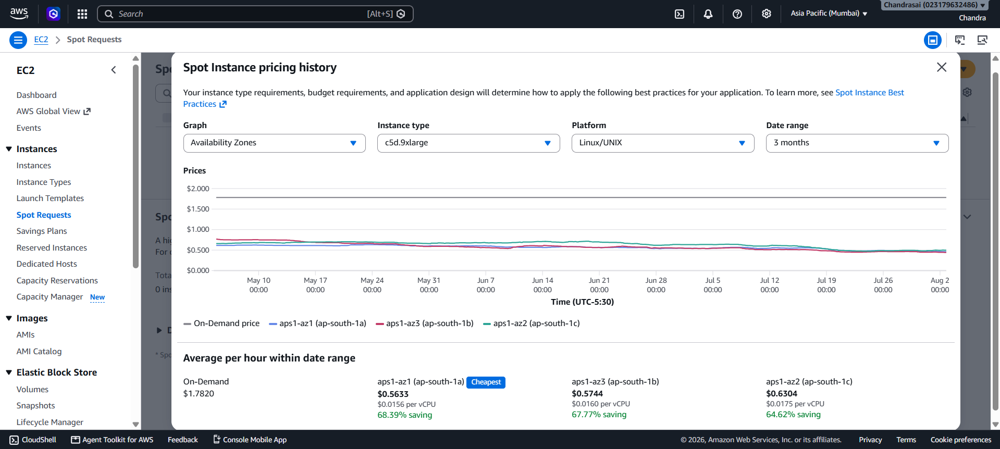

#### Spot instance creation:
1. goto ec2 console --> on left pane click on spot instnaces --> click on create spot fleet --> select the instance you want --> in addtional launch parameters we add additional requirements like ebs volumes, SG's , tenancy(means if our instance want to run only on dedicated physical server(in that physical server only our instance running) we select dedicated other wise we selsct shared), keypair etc. --> in additional request details untick *applydefaults* you will when you want sart and stop the instance and other details.
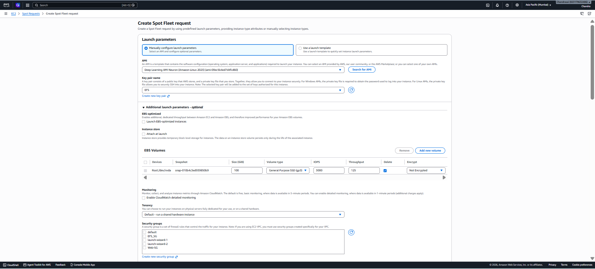
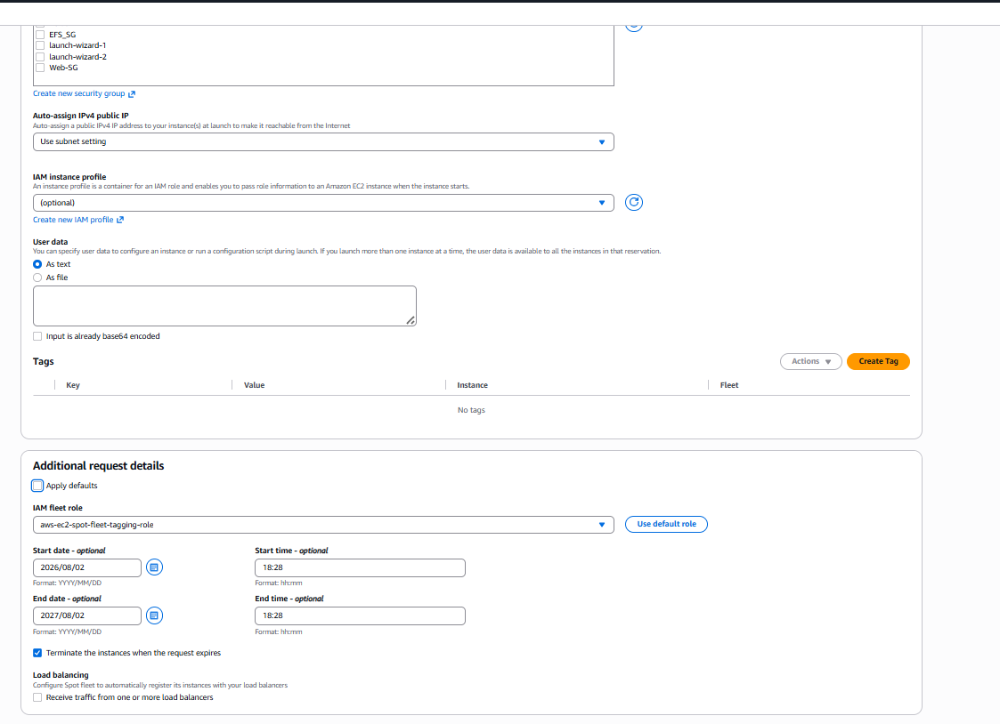
2. in Target capacity tab we will define instance/cpu/memroy count and *set cost intance price*(this is where we mention our price the spot instance) --> then give network details --> in instance type requirement tab we will give cpu, memory details in *preview matching instance tab* we will select multiple instance types to increase fleet strength but it randomly allocates anyone of these types(if you want instance with min/max 4 cpus and memroy min/max 8gb it show all the instance type that matching this cpu and memory see the second image below) --> select your allocation strategy the luanch instance.
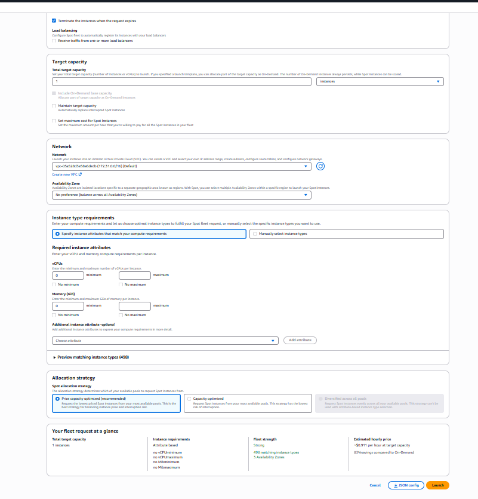
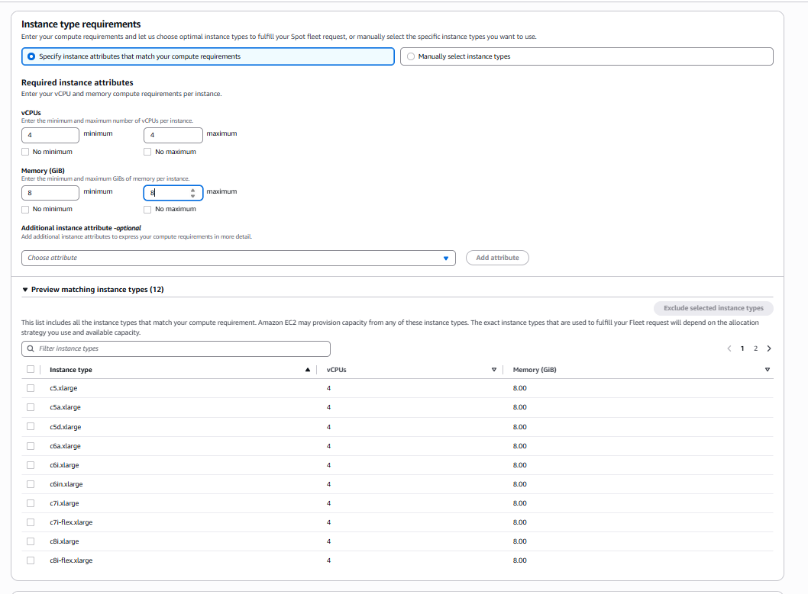

**Note:** in free account spot instances are not supported. we can't launch spot instances.

AWS exam scenario: 
1. you launced an spot instance it runs 3:47 mins Due to price change aws terminates the instance in thsi situation we only billed to 3hrs(will oly pay 3 hours) addtional/partical hours(47 mins or 0.77 hrs) we will not billed. if we terminates the instance that partical hours also get billed(pays for 3:47 hours).

---

Savings Plan : This is a billing commitment. 
"I will spend $2 per hour on ec2 compute capacity for 1 year"

--> We can change instance type (cpu/memory), AZs. 

on-demand, spot and reserved instance ==> We are reserving the capacity.


Tenancy : 

Multi/Shared-Tenancy : One hardware/physical server can be shared with multiple customers.

Single/Dedicated-Tenancy : hardware/physical server specifically allocated to only one customer. we mainly use to meet complaince regulations like HIPPA, PCI-DSS etc.

1. Creating reserved instance goto ec2 console--> on left pane click on reserved instance --> click purchase reserved instance --> fill details like instance type, tenancy(default is shared tenency), term etc.

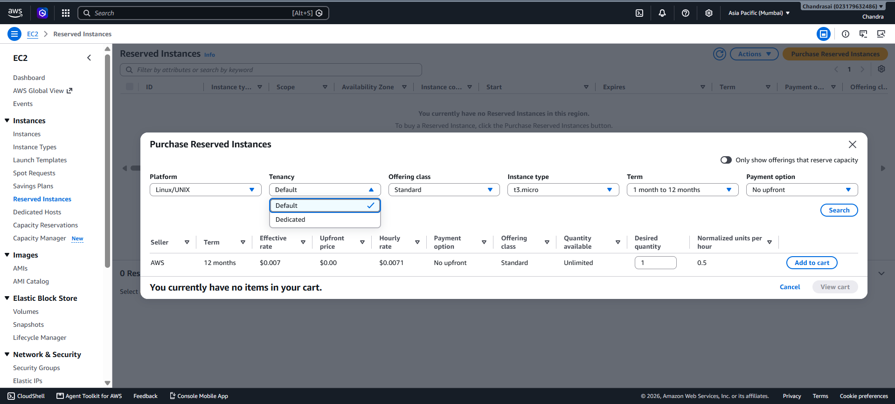


---

3/3 status checks

Instance status check : reboot / inspect logs / ssm connect / root volume replacement
System status check : stop and start / contact aws (physical servers check)
Storage/EBS status check : AWS responsibility

---

placement groups : 

Cluster PG : all instances runs on same h/w.. ultra low latency and low network throughput..
if underlying h/w fails, all instances get affected.

Partition PG : we will have partitions, every partition will have its own power and network connectivity.. 

Spread PG : every instance runs on a seperate hardware..

## AWS Load Balancer:
Load balancer will ping the instances for every 30 seconds the instance need to give the response in 2 seconds it wll use port 80 to ping to consider a instance is healthy we have healthy and unhealthy threshold.

**Healthy threshold:** load balancer pings instance if we get 3 consecutive response from instance that instance would be consider as healthy and routes the traffic.

**UnHealthy threshold:** load balancer pings instance  if the request failed 5 consecutive times(will not get no response)  that instance would be consider as unhealthy and stops traffic.

By default ELB follows Round roubin mechanism.
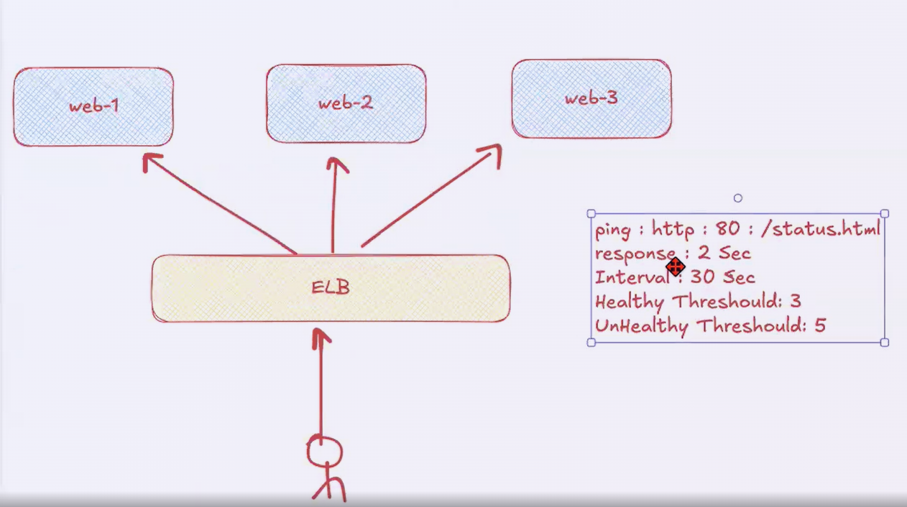

### creation of load balancer
first create two ec2 instance enable httpd service and create a index.html.
1. Goto EC2 console pane left pane click on target group on load balancing tab--> create target group --> on settings tab select target type instances (other types ip address(used when running containers in instance conatainers doesn't have instance id's it have ip's only), lambda, application LB) --> for ALB use http/https with port 80/443 (use tcp/udp or other settings) select the protocol version Http1 --> in health check tab configure the protocol(http/https) configure the path(like "/" or /status.html LB ping this path every 30 seconds) in advanced settings we change we can add health thresholds and other settings. --> target optimizer it is optina(limits the maximum number of concurrent (simultaneous) requests a single backend server can receive.) if we turn on we need install target target optimizer agent in instance. --> add tags(optional) click next
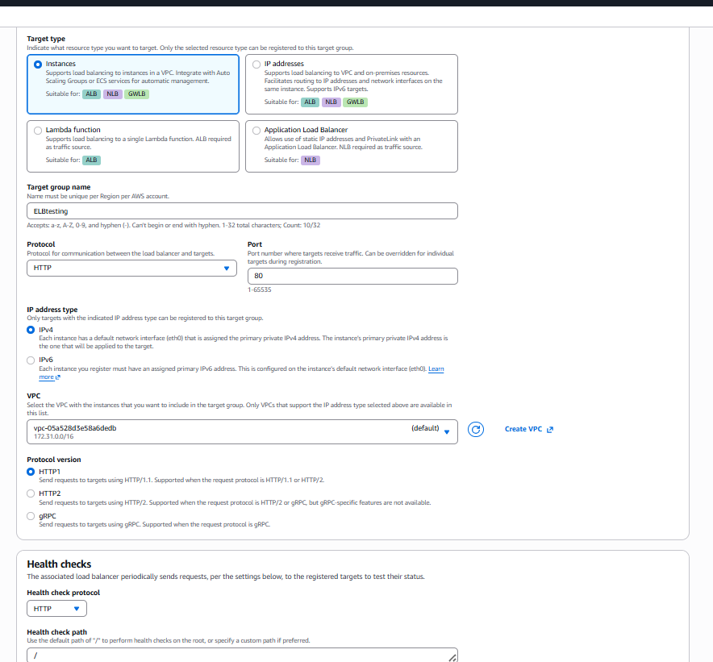
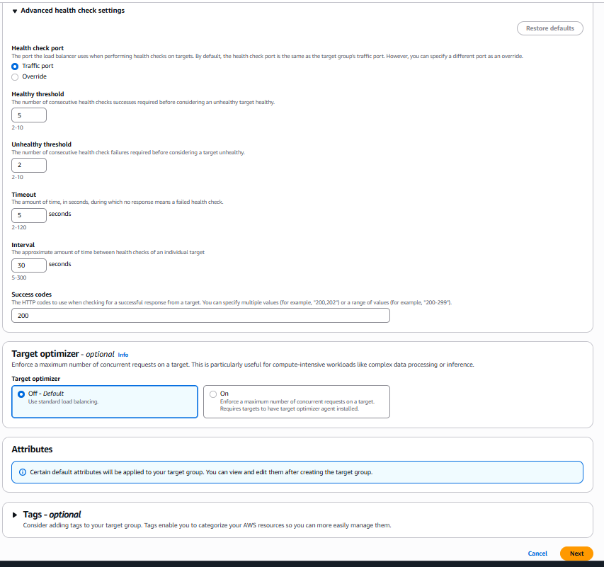
2. selct the instances and click on *include as pending below* --> review targets --> click next --> review the TG and click on create taret group.
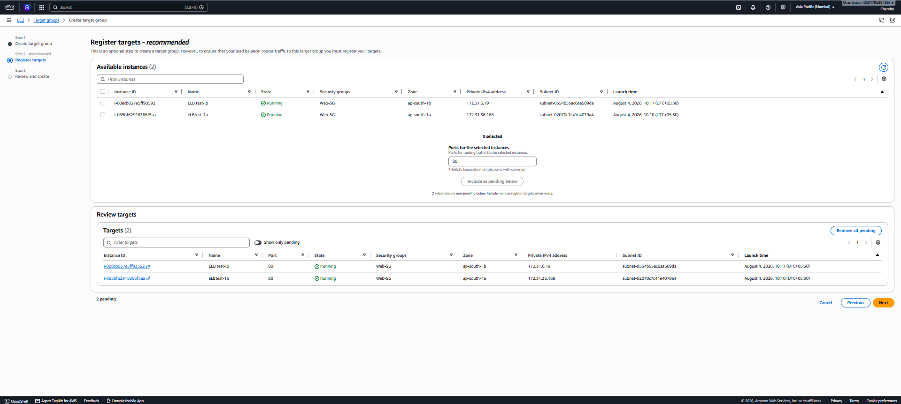
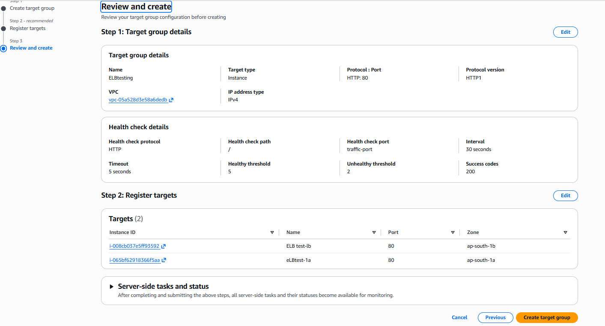

3. create a security group and open the http/80 port.
4. goto ec2 console on left pane click load balancer and create load balancer --> select the load balancer type (App,network,gateway) --> give name --> select internet facing --> select ip4 --> in network mapping section select VPC and select the availability zones(atleast select 2 availability zones) --> selct security group --> inspect listeners and routing section --> then review the other settings create a load balancer.

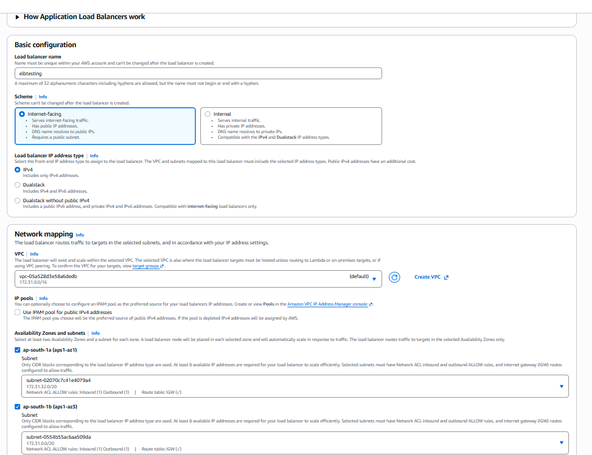
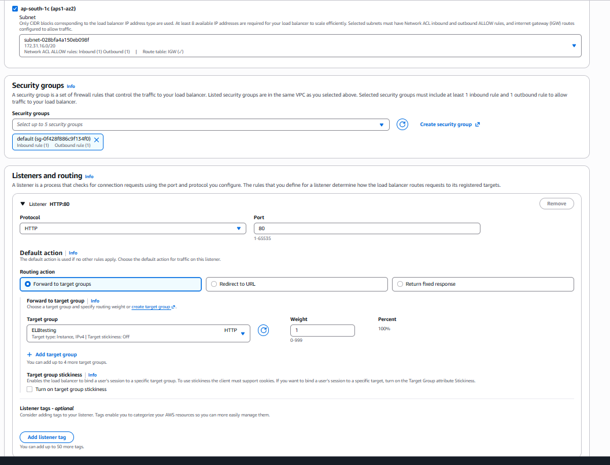
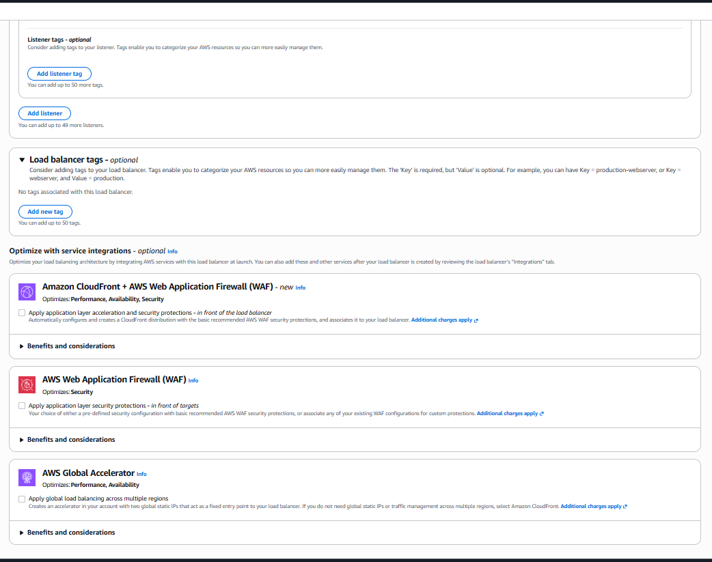
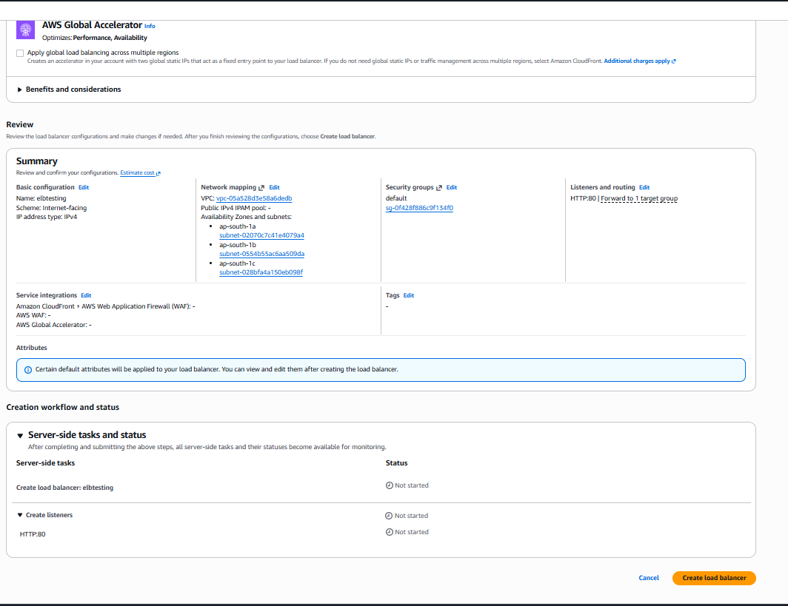
5. after creating load balancer check the health check status in target group if it is not healthy might be issue with the path we gave for health check(like "/" or "status.htmL")
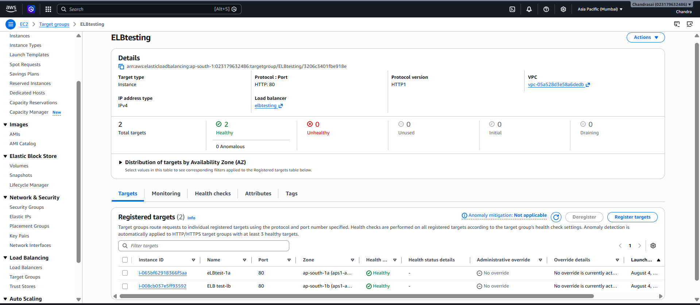

**Note:** application port number and listener port can be same or differnet as well but for no confusion we will use same port. 
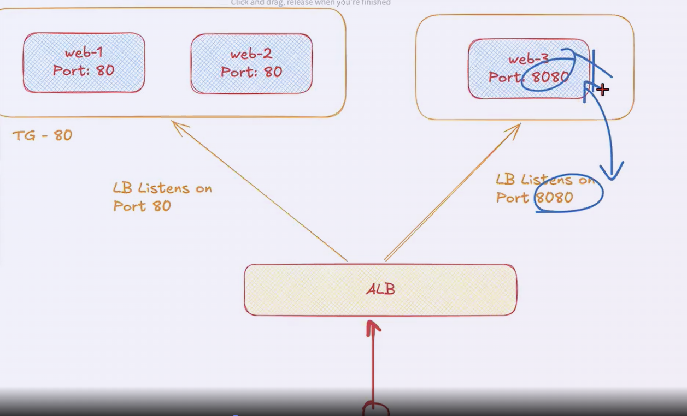

6. *Stickiness*(binds a user's session to a specific server within your target group) will see this option in attributes section after creating target group if we enable this if i connect to frontend server with laptop my session will stick same server(1 hour or 1 day as per configured)
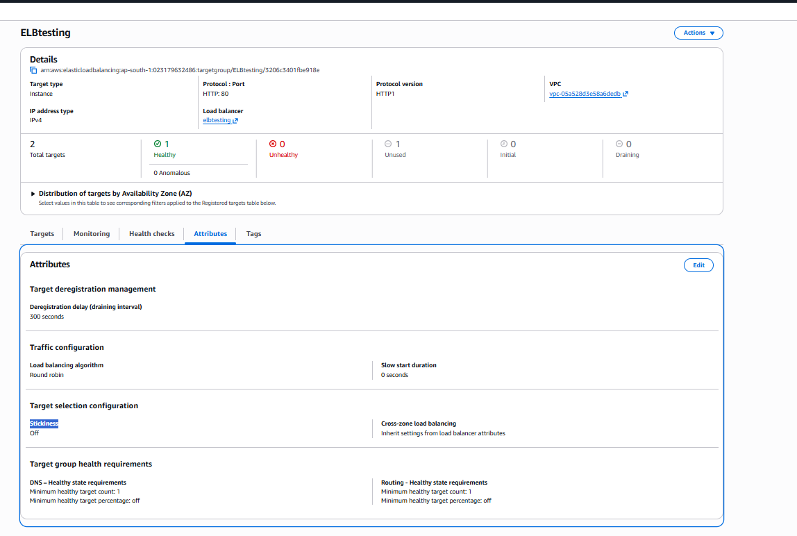

i want to restrict the access of application through server public ip app only access through elb dns only how you achieve this?
A. using pipeline mechanism means in ec2 security group we will route the port 80 traffic to ELB security group(instead of anywhere ip4) this is called pipeline mechanism this is secure way.

#### ELB Routing rules/Algorithms:
**1. Round Robin:** Classic Load Balancers (CLBs) use a round-robin algorithm to distribute incoming requests evenly across all healthy targets.
**2. Least Outstanding Requests (LOR):** The ALB dynamically tracks how many active, unfinished HTTP requests each EC2 instance is currently processing. It automatically routes the next incoming request to the server with the lowest number of active jobs(requests).

Ex: If Server A has 5 active requests and Server B has 2 active requests, the ALB will route the next incoming request to Server B because it has the least number of active jobs.

**3. Weighted random:** Weighted random routes requests evenly across healthy targets, in a random order. While Anomaly detection is applied by default, you must turn on Anomaly mitigation for Automatic Target Weights (ATW) to apply.

Ex: Blue/Green deployments or testing new features on a tiny fraction of live users. we will configure one target group will receive 70% traffic other will receive 30%.

### Network Load Balancer:
--> Supports millions of requests at ultra low latency
--> NLB uses flow hash algorithm.
--> This supports Static IP (We can add EIP) 
if we supporting our application service to client as well if client ask give me your ELB ip's we will whitelist them in this scenario we will use static ip's.
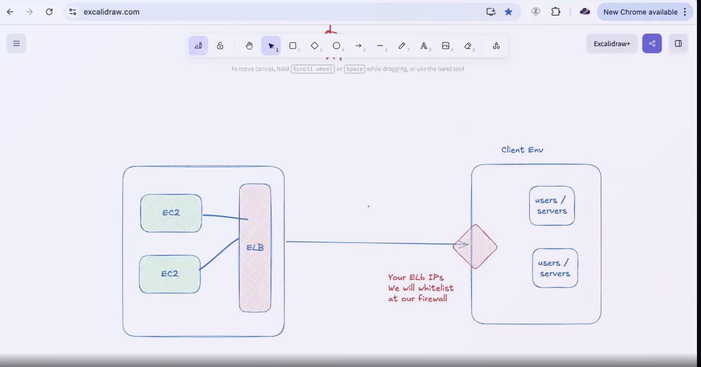

#### NLB and ALB combination:
we are using the combination of NLB and ALB to deliver our application of static ip. 

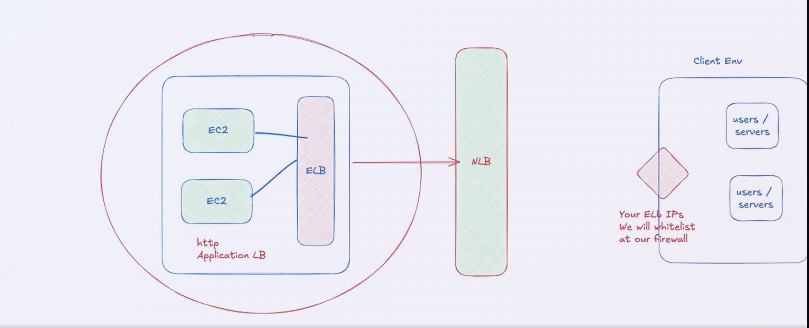
1. goto target group console click on create target group  --> select the application load balancer --> give the tcp 80 port --> click next
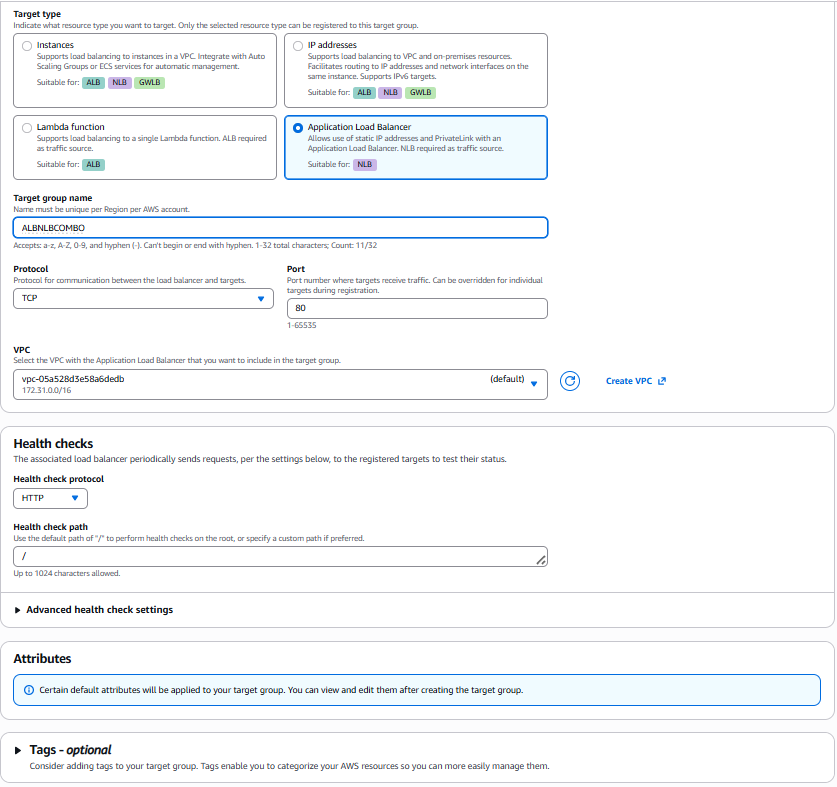
2. select the ALB --> click next

## Autoscaling Group
ASG scale up instances quickly but scale down takes slowly
 
1. create a launch template Goto EC2 console pane left pane click on launch template --> create lauch template --> give the name and check the Auto Scaling guidance(will check this if we attach lauch template to autoscaling it will tell whilch fields required which are not) --> click on Browse AmI's and select the ami(we can select AMI's as well) -->select key pair--> in networking section don't include subnet and AZ if we add our ASG will lauch instances in one AZ only --> select SG and click create.


2. creating ASG Goto EC2 console left pane click on ASG  --> create lauch template --> give the name and select the launch template click next 

3. In instance type if we can reset launch template settings as well --> in networking section select the VPC and availability zones and explore the Availability Zone distribution options. click next


4. Attacht the load balancer --> in Health checks tab give the Health check grace period(it dealys first heath check beacuse some apps starts lately apps will take time to up and running). click next

5. here will configure desired capacity, max and min--> we have instance maintenance policy(Terminate and launch, Launch before terminating and other options explore) in advanced setting in monitoring section check the *Enable group metrics collection within CloudWatch*!

6. select the notification service if instance terminate or Replace root volume or Fail to launch and other options available click next --> then we can add tags click next review the settings clcik create.


#### Scaling policies
##### Dynamic scaling:
it's used to scale the instance according cloud watch alarms(cpu,memory uasge etc.) we have 3 types of scaling 

goto autoscaling group console select the ASG goto *Automatic scaling* tab you will find different types of scalings click create dynamic scaling select the policy type(simple,step,target tracking), --> select the cloudwatch alarm --> select action(add, remove, setup) --> *Andthenwait*(wait time for next scaling action if we put 300 seconds next scaling will happen after 5 mintues)


1. **Simple Scaling:** Scaling instances using cpu usage or other metrics, triggering by cloudwatch alarms. if cpu > 80%  scale up the instances if cpu < 20% scale down instances.

2. **Step Scaling:** it's similar like simple scaling we will add instances gradually according to cpu usage. if my cpu usage in in between 20% to 15% remove the 1 instance it's in between 15% to 10% remove the 2 instances like this.

3. **Target Tracking scaling:**AWS automaticly creates scale  up and sacle down the instance accrding cpu, network in/out etc. if cpu usage is >50% it will scale up instances(till avg cpu comes down to 50%) if cpu usage is <50% it will scale down.

Ex: if we have 2 instances we configured cpu 50% load goes 75%+ in 2 instances aws adding one instance will put the load at 50% it will add new instance(if cpu usage is 65% in each instance it will not add new instance) this how it works.


##### Predictive scaling:
we can sacle the instances based on historical data(last 2 weeks or 8 weeks).


##### Scheduled scaling:
we scale instance at a particular time(based on scheduled). we can use cron job as well.


### Vertical scaling:
as of know we did horizontal scaling for vertical scaling we need to modify lauch template first then we do instance refresh in ASG. it will follow Rolling update startegy.
1. modify the instance type in launch template and switch to latest version then goto ASG select the ASG click on instance refresh select the options then click on start instance refresh.


**some settings definition in ASG's:**

Default Cooldown Period – A waiting period (default 300 seconds) after a scaling activity before another can begin; prevents rapid, unnecessary scaling

Warm Pool – Pre-initialized instances kept in a stopped/running state so they can be launched faster than cold-starting new ones

Instance Warm-up Period – Time given to a newly launched instance before it starts contributing to CloudWatch metrics (prevents premature scaling decisions based on incomplete data)

Lifecycle Hooks – Allow you to pause instances during launch or termination to perform custom actions (e.g., pulling config, draining connections)

## S3:
S3: Object Based Storage : GDrive / Dropbox / icloud

EBS : Block Based Storage : 

EFS : Shared Storage / Store over the Network (SAN/NAS)

S3 is an object based storage solution.. 
We can upload anything and we call it as object.

We can store data into "Bucket".. Unique namespace across the globe..

bucket = folder / directory..


S3 bucket name minimum 3 characters and maximum 63 characters.

Bucket name must start with a lowercase letter or number
Bucket name must not end with dash or period
The bucket name contains characters that aren't valid: ,
Bucket name must not contain two adjacent periods
Bucket name must not resemble an IP address

We use s3 platform to store static data..

We can store unlimited data inside an s3 bucket. 

Min Obj size : 0 bytes
Max Obj size : 50 TB

s3 : 

Virtual path:
https://bucket-name.region-code.amazonaws.com/object-name
https://bucket-name.s3.amazonaws.com/object-name

Standard path: https://s3.region-code.amazonaws.com/bucket-name/object-name

--

By default, all data we upload to s3 is private. We need to make it public to share the data over the internet.

3 Level public block access settings available in AWS.

1. Account level block public access - Disabled by defaultly
2. Bucket level block public access - Enabled by defaultly
3. Object level settings

We have 2 ways to make data public

--> ACL --> Disabled by defaultly, Enable it. (one time)

--> Bucket policy

---

AWS Pricing:
How many API calls hapening on our data. (PUT/GET)
How much data transferring


S3 Standard : Frequently Accessed Data.. 
** We can access data without any delays.
Data will be span across multiple AZs, Data replicates >=3 AZs(it stores in backend we can't see)
99.99% Availability
99.999999999 % Durability


S3 Standard - IA (Infrequently Access) / OneZone - IA : Infrequently accessed data (once a month) with milliseconds access

OneZone - IA : Recreatable, infrequently accessed data (once a month) with milliseconds access
**We can access data without any delays.
Data will be span across multiple AZs, Data replicates >=3 AZs


S3 Glacier (Instant Retrival / Flexible retrival / Deep Archieve) : 
**We cannot access data immediatly.. 

Glacier Instant Retrieval: Long-lived archive data accessed once a quarter with instant retrieval in milliseconds

Glacier Flexible Retrieval (formerly Glacier) : Long-lived archive data accessed once a year with retrieval of minutes to hours

Glacier Deep Archive : Long-lived archive data accessed less than once a year with retrieval of hours

To access the data stored in glacier, We need to initialise the restoration.

Bulk retrieval: Typically within 5-12 hours.

Standard retrieval: Typically within 3-5 hours.

Expedited retrieval: Typically within 1-5 minutes when retrieving less than 250 MB.

**Note:** once we moved the object from standard to glacier(Flexible Retrieval or Deep Archive) we can't move it back to standard(we can restore the data and download it then upload that data to standard again). if we move the object from standard to any other class other than glacier flexible retrieval or deep archive, we can move it back to standard directly.


S3 Intelligent Tier: S3 Intelligent-Tiering is a storage class that automatically moves objects between different S3 tiers based on changing access patterns.(If not accessed for 30 days → moves to Infrequent Access tier, If not accessed for 90 days → moves to Archive Access tier, If not accessed for 180 days → moves to Deep Archive Access tier)

### S3 versioning:
S3 Versioning:

THis help us to maintain multiple versions of an object within same bucket.

By Defaultly, Versioning is suspended in new buckets. 
If We can enable this, S3 will keep track of the file changes. 

--> When we delete any file accidentally, we can recover it.

Delete : if we type *delete*, we can recover. S3 will create a "Delete Marker", Delete the delete marker to get your object back.(we see this option when we enable versioning and turn off show versions(see the below image) in bucket)

Permanently Delete : if we type *permanently delete*, no recover option.(if we can see this if versioning not enabled or show versions is turn on)


### S3 Lifecycle:
using this we automatically move the data from one storage class to another storage class based on the rules we created. we can also delete the data after certain period of time.

it will cost per transistion.

#### creating lifecycle rules:
1. goto s3 console --> select the bucket --> click on management tab --> click on create lifecycle rule --> give the name and description --> in rule scope section we have 2 options 1. apply to all objects in the bucket 2. limit the scope of this rule using prefix(if we have three folders in bucket if we give dev it will apply the rules to dev only) or tags(if will only applicable to objects with specific tags) or object size(if we want to apply the rules to objects with specific size) --> in lifecycle rule actions section we have different versions 1. is current version actions(we get 2 tabs below 1. transition current version to another storage class(in this we will tell after how many days transition will performed) 2. Expire current version of objects(we will tell after how many days the object will be deleted)) 2. similary we will get the same options for non-current version actions but we will get one more option to restore the latest version of the object from non-curent version(for back up purpose) --> in review section we can see the summary of the rules we created click on create rule.

 
in the image at the end you can see for current version after 365 object will expire(we retrive that object for current version if we click on delete it will show delete option not permanently delete because we have versioning enabled) but for non-current version it will show permenately deleted.

Note: life cycle rule follows top to bottom approach if we convert the standard to IA we can't convert it back to standard.

### Replication rules:
helps to replicate the data from one bucket to another bucket.(use this mostly for Disaster recovery purpose or report sharing purpose)

**prerequisites:** Enable versioning in source and destination bucket.

SRR (Same Region replication) : Source and destination bucket will be in same region.

CRR (Cross Region replication) : Source and destination bucket will be in different regions.

Cross Account replication : Source and destination bucket will be in different accounts.


Note:   
1. If you delete an object normally (without specifying a version ID), S3 creates a Delete Marker. S3 will replicate the Delete Marker to the destination bucket. The object will now look "deleted" in both buckets, but all historical versions remain safe underneath.

2. If you explicitly delete(permanently delete) a specific Version ID, that version is gone forever from the source. S3 will NOT replicate this permanent deletion. The version remains safely stored in your destination bucket. This is an intentional security design to stop accidental or malicious data wipes from destroying your backups

### Creating replication:
1. create a s3 bucket in differnet region and enable versioning in both source and destination bucket.
2. goto source bucket --> click on management tab --> click on replication rules --> click on create replication rule --> give the name --> we can enable and disable this rule using enable/disable button --> priority(if we have multiple rules copying same object to destination we can set this priority) --> in Source bucket section we can select which object to sync --> in destination bucket section browse the bucket if your bucket is in same account selct the *specify bucket in other account* and give account id and bucket name --> se;ect the new IAM role --> enable encryption if you want --> Destination storage class we can put our replicated object in differnet storage class like IA, glacier etc. --> and enable replication metrics(useful to track if object replication fails we can create alerts also) and delete marker replication --> click save. 
2. after saving the rule it will ask to replicate existing objects or not.(if you give yes it will create one time batch job to replicate the existing objects from source bucket to destination bucket)


## S3 Events:
Amazon S3 Event Notifications allow you to trigger automated workflows when specific actions occur in your storage bucket.(like sending sns notification or lambda function trigger when an object is created in s3 bucket.)

Lambda function : Run a Lambda function script based on S3 events.

SNS topic : Fanout messages to systems for parallel processing or directly to people.

SQS queue : Send notifications to an SQS queue to be read by a server.

### creating S3 event notification:
1. select the bucket --> click on properties tab --> scroll down to event notification section --> click on create event notification --> give the name --> in event types section select the events(like object creation, object deletion) --> in destination section select the destination type(like lambda, sns, sqs) --> click save changes.


## AWS KMS(Key Management Service):
AWS Key Management Service (AWS KMS) is a secure, managed tool to create and control the cryptographic keys used to encrypt and sign your data.

Encryption : 

In-Transit Encryption / At Flight Encryption : When data is in flught state / travelling state to s3 platform, data will be encrypted. Its AWS responsibility.


Client Side Encryption : before uplaoding data to s3 platform, we cna use our own encry method and encrypt the data.. Customer responsibility..

Server Side Side Encryption : When data is in s3 platform, we can apply encyption methods.

SSE-S3 : Defualt encryption key.. 
--> S3 generates and managed the key material..
--> Whoever has access to s3 platform, they can decrypt the data.. No Additional permissions required..
--> Suitable for public sharable data..
--> No direct access to key/material to user.

---

SSE-KMS - DMK (Default Master Key)..
--> KMS Service generates and manages the key material..
--> Whoever has access to s3 platform, they can decrypt the data.. No Additional permissions required..
--> No direct access to key/material to user.
--> We cannot make object public, if object is encrypted using KMS key..

---

SSE-KMS - CMK (Customer Managed Key)..
--> Customer has to create the KMS key and KMS Service manages the key material.. We can use this key to multiple AWS services
--> Along with the S3 Service access, User/Role should have KMS Key usage permissions to decrypt the data..
--> No direct access to key/material to user. But customer can rotate the key material..
--> We cannot make object public, if object is encrypted using KMS key..

---

SSE-KMS - C (Customer Provided Key)..
--> Customer has to create the KMS key and Customer has to manages the key material.. We can use this key with multiple AWS services
--> Along with the S3 Service access, User/Role should have KMS Key usage permissions to decrypt the data..
--> Customer can manage / rotate the key material.
--> We cannot make object public, if object is encrypted using KMS key..

Symmetric Key : A single key will be used for encryption and decryption purposes. : ** S3

Asymetric key : A public and Private key pair used for encrypting and decrypting data. signing and verifying messages.

### Creation of KMS customer managed key(CMK):
1. goto KMS console --> click on customer managed keys on left pane --> click on create key --> select the key type symmetric(asymmetric key is not supported for s3) go with default options click next --> provide the key alias(name) and description --> click next --> in key administrative permissions section add the user who can manage the key --> click next --> in key usage permissions section add the user who can use the key for encryption and decryption if you want to use this key in other AWS accounts below add other aws account and provide account id --> click next --> add the policy statement if you want --> click next --> review the settings and click on create key.


2. we can rotate this key material automatically or manually. click on the key we created *Key material and rotations* you have ondemand rotation and automatic rotation(by default it is disabled) options. 


3. after clicking on the key we created we can see key user section in key policy tab who ever the users/roles added there can access the s3 bucket objects which is encrypted using this key.

4. attach this kms key to s3 bucket. select the bucket --> click on properties tab --> scroll down to default encryption section --> click on edit --> select the *AWS Key Management Service key (SSE-KMS)* option --> select the key we created in previous step --> click save changes.

Note: if we accidentally delete the key we created, we will not able to access and decrypt(object data) the objects in s3 bucket which is encrypted using this key. we can't delete kms key immediately we need to schedule the deletion of the key minimum 7 days to 30 days. 

Key creation steps: 

Step 1 : Symmetric Key.. "Encryption and Decryption"..

Step 2 : Privide name and descr

Step 3 : Key administrative permissions : Avinash_T

Step 4 : Key usage permissions : Avinash_T

Step 5 : Review policy and create key

## S3 static website hosting:
Static Website : S3 supports static website hosting

Bucket Name = Domain Name

--> NO need to run our server 24x7 for our static website
--> Defualt, our website gets S3 performance

3500 PUT Operations per Second		--> Upload
5500 GET Operations per Second		--> Download/access/get

--> We have to make our s3 bucket public
--> It runs with http protocol 
--> Integrate with cloudfront for https and Private buckets


http status codes:

2XX : ok/success
3XX : Redirect
4XX : Client Side error
5XX : Server Side error

## S3 bucket policy:
I have an IAM user, who has "S3 Full Access".. but one bucket host some sensitive infromation that need to protect from Delete and upload from a specific/set of user..

1. Bucket ARN (Amazon Resource Name) : arn:aws:s3:::avinash-awar07-s3-demo
2. Principal : user / group : 
3. Effect : allow / deny
4. Actions to take effect : PutObject, GetObject, ListObject

Bucket level operation : arn:aws:s3:::avinash-awar07-s3-demo(using this we can s3:ListBucket, s3:GetBucketLocation etc. but we can't put/get object)
Object level operation : arn:aws:s3:::avinash-awar07-s3-demo/*(using for object level actions s3:GetObject, s3:PutObject, s3:DeleteObject we can't list buckets using this)


1. arn:aws:s3:::avinash-awar07-s3-demo,arn:aws:s3:::avinash-awar07-s3-demo/*
2. arn:aws:iam::655700896650:user/encry-test
3. deny
4. DeleteObject and PutObject


1. Bucket ARN (Amazon Resource Name) : arn:aws:s3:::avinash-awar07-s3-demo/*
2. Principal : user / group : *
3. Effect : allow
4. Actions to take effect : GetObject

Note: if we use Deny option on *GetBucketPolicy* and *DeleteBucketPolicy* actions in bucket policy even if a user has S3 full access he can't view policy from console; if he sees the policy from CLI he can't delete the policy from CLI as well.

## S3 transfer acceleration:
Upload data quickly to S3 bucket via transfer acceleration feature.

S3 Transfer Acceleration enables fast, easy, and secure transfers of files over long distances between your client and an S3 bucket. Transfer Acceleration takes advantage of Amazon CloudFront’s globally distributed edge locations. As the data arrives at an edge location, data is routed to Amazon S3 over an optimized network path.

we can enable this option in s3 properties tab --> scroll down to transfer acceleration section --> click on edit --> select enable --> click save changes.

Note: if we have "."(period) in s3 bucket name we can't use transfer acceleration feature for that bucket. we need to create new bucket without "." in the name.


Default S3 bucket performance:

3500 PUT Operations per Second per prefix(folder in s3 bucket)	--> Upload
5500 GET Operations per Second per prefix(folder in s3 bucket)	--> Download/access/get

Use prefixes to get more performance
Add some randomness(storing prod related things in prod specifically naming like eks data, instance data etc. ) to the object names (Improves the search mechanism)

## s3 Server access logging: 
used to store the logs of S3 bucket(like which object created, deleted, accessed etc.) we will store the logs in another bucket. we can enable this option in properties tab of s3 bucket --> scroll down to server access logging section --> click on edit --> select enable --> select the target bucket where we want to store the logs and give the prefix name --> click save changes.(mostly we willnot use this because we will use cloudtrail to track the s3 bucket activities)

---

## AWS Object Lock : 
We can enforce delete standards on S3 bucket. 

Note: we can delete the objects those are created before enabling the object lock. we can't delete the objects those are created after enabling the object lock. 

Governance Mode : We can disable the object lock and delete it.
Compliance Mode : No one can delete the data (including root user).

### creation of object lock:
select the bucket --> click on properties tab --> scroll down to object lock section --> click on edit --> select enable object lock and select the mode(governance/compliance) give the duration(7 days or 1 year) --> click save changes.


## s3 Cross origin resource sharing(CORS):

youtube video link: https://youtu.be/YrfDLrSVxQ8?si=wocnwpTLvsWWJ2Co

S3 Cross-Origin Resource Sharing (CORS) allows you to specify which origins are permitted to access your S3 bucket. This is useful when you want to allow web applications hosted on different domains to interact with your S3 bucket.

To enable CORS on an S3 bucket:
1. Select the bucket --> click on the "Permissions" tab --> scroll down to the "Cross-origin resource sharing (CORS)" section --> click on "Edit".
2. Add a CORS configuration in JSON format. For example:
```json
[
  {
    "AllowedHeaders": ["*"],
    "AllowedMethods": ["GET", "POST"],
    "AllowedOrigins": ["https://example.com"],
    "ExposeHeaders": ["ETag"],
    "MaxAgeSeconds": 3000
  }
]
```
3. Click "Save changes".

## S3 Directory buckets:
Built for high-speed, single-digit millisecond performance. Optimized for specialized workloads using the S3 Express One Zone class. Recommended for low-latency use cases. These buckets use only the S3 Express One Zone storage class, which provides faster processing of data within a single Availability Zone.

--> Data is stored in a single Availability Zone. It uses S3 Express One Zone storage class.
--> For every bucket name we get a zone prefix "--aps1-az1--x-s3"
--> Support very high request rate.
--> Relatime data processing (low HA/FT)

## s3 Table buckets : 
Buckets designed specifically for analytics purposes.
Supports data formats i.e; parquet, apache iceberg.

--> Buildin table management
--> We can integrate these buckets wityh Analytics engines. (Athena, EMR, Spark, Redshift)
--> It supports ACID table operations

A - Atomicity : A transaction executes completely or not at all. 
C - Consistency : Transaction moves the system from one valid state to another valid state.
I - Isolation : Multiple transactions run concurrently. 
D - Durability : Once a transaction is committed, the changes are permanent, even if the system fails.

---

## s3 Vector Buckets : 
buckets are designed to store and query vector embeddings used by AI applications.

RAG (Retrieval Augmented Generation)

---

## S3 Consistency Model: 
Amazon S3 currently uses a strong "read-after-write" consistency model for all operations

---

## MultiPart Upload : 
Dividing a large file into multiple parts and uploading small chunks and combining the file once all chunks/parts uploaded.

aws s3 cp largefile.mp4 s3://bucket-name/ --part-size 10MB

## Presign url : temp url that expires automatically after given ttl value.

aws s3 presign s3://bucket/objectname --expires-in 60
==================

## AWS Cloudfront : 
Amazon CloudFront is a fast, secure content delivery network (CDN) service built by Amazon Web Services. It speeds up the delivery of static files, dynamic web apps, APIs, and videos to users. It uses a global network of data centers called edge locations to serve data with low delay.

Note: first customer request always take igh latency because it will fetch the data from origin server and store in edge location for future requests.

CloudFront by default uses lazy loading mechanism.

cloudfront is global service we can use it in any region but the edge locations are available in specific regions. if we want to map ACM certificate to cloudfront distribution we need to create the ACM certificate in N.Virginia region only(because cloud front is a global service).

defautl ttl value : 86400 seconds(24 hours) we can change this value in cache behavior settings of cloudfront distribution.

## Creating CloudFront distribution:
1. Goto cloudfront console --> click on create distribution --> give name and description --> select single website app in Distribution type section --> add the origin domain name(pruthvilearnaws.shop) click next --> select the origin type as S3 and browse the bucket name --> in settings section *Allow private S3 bucket access to CloudFront* is by default allowed if we disable it we need to make the bucket public to access the data from cloudfront distribution  and have other options explore click next --> in enable section if you want you can enable web application firewall and but i am going with *Do not enable security protections* click next --> in this section click on create it will create a certificate in ACM in northern virginia region and select it(if you have already created the certificate in ACM you can select that certificate) --> review the settings and click on create distribution.


2. create a A record in Route53 and map the cloudfront distribution.


3. we didn't gave default root object(we we hit the domain name it will display the object we gave in default root object field) in cloudfront distribution settings. click on edit and give the default root object name and click on save changes.


if want to access the other files give /objectname in the url like "https://pruthvilearnaws.shop/objectname" to access the other files in the that bucket.

## CloudFront invalidations option: 
An invalidation in Amazon CloudFront is a command that forces CloudFront to delete its cached copies of your files. for example, if you update a file in your S3 bucket and want CloudFront to serve the updated version, you can create an invalidation request for that file. This will remove the cached version from all edge locations, ensuring that users receive the latest version of the file. or after deleting the object from s3 bucket some users sill accessing the file using caching using invalidations we can remove that cached copy from edge locations.

1. goto cloudfront console --> select the distribution --> click on invalidations tab --> click on create invalidation --> give the object name(/objectname) or give /* to remove all cached copies from edge locations --> click on create invalidation.


## CloudFront geographic restrictions:
we can block the access to our application from specific regions(like china, russia etc.) using cloudfront geo restriction feature. we can allow or block the access to our application from specific regions.
1. goto cloudfront console --> select the distribution --> click on security tab --> click on edit on CloudFront geographic restrictions section --> select the restriction type(allow/block/norestriction) --> select the countries from the list --> click on save changes.  


you will get 403 error if you try to access the application from blocked region.

