## Route53
AWS DNS Servcie

DNS = Domain Naming System / Service..

Route53 = AWS DNS Service

A Record : Address Record : IP <--> Name (ipv4) (converts ipv4 to Domain name, domain name to ipv4)

AAAA Record : Address Record : IP <--> Name (ipv6) (converts ipv6 to Domain name, domain name to ipv6)

CNAME : Cananical Name : Another Name ( Creates an alias pointing one domain name to another domain name instead of IP address.)
EX: rds.pruthvilearnaws.shop ---> pruthvilearnaws.shop like fb.com --> facebook.com
TXT :  Simple Text Record : sometimes we will create this to prove this domain is belongs to us.
MX : Mail Serer Records..

Alias : THis helps us to pick the aws appropriote resources automatically.

TTL(time to live): how long DNS answer is cached. low TTL = FASTER UPDATES, high TTL = less DNS traffic(browser caches the DNS till then till check the Route53 for updates so less DNS traffic)

EX: you chaned ip of your DNS but users still routing to old ip Their browser caches the old IP (1.1.1.1) for 5 minutes. you set TTL 300 seconds after completing 300 seconds you will get new updates(new ip) till then their browsers refuse to check Route 53 for updates until the timer hits zero.

We cannot delete these records..
NS : Name Server Record (THis helps to map AWS and Domain Registrer)
SOA : Start of Authority Record : 

DomainRegistrer : Godaddy, Bigrock, namecheaap, aws route53, hostinger (using this webiste we can register our domain name)
ICANN(Internet Corporation for Assigned Names and Numbers): maintains Domain uniqueness
IANA root zonedb

Step 1 : Purchase a Domain name 

Step 2 : Create a HostedZone in R53 (Public)

Step 3 : Grab the NS records from HostedZOne and configure it at Doamin Registrer

ns-1959.awsdns-52.co.uk
ns-154.awsdns-19.com
ns-667.awsdns-19.net
ns-1183.awsdns-19.org

### Creating Route53
1. first we will create hosted zone goto route53 on left pane click on hosted zone click create hosted zone --> give your domiain name(pruthvilearnaws.shop) select type public(have private also it's used to resolve domain internally in particular region in particular VPC).

Note: after creating hosted zone 2 records will be created namw server record and SOA(Start of Authority Record) we can't delete these records. 
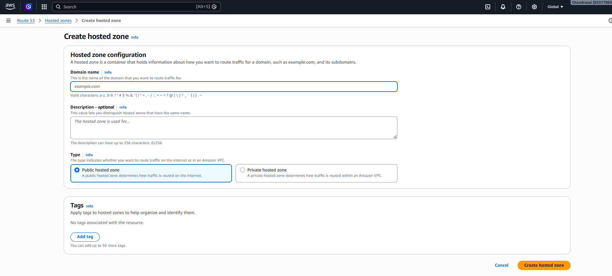

2. copy the NS(name server) records vailable in hosted zone and register them in domain register(where you purchased domain) see the below image. goto hostinger on left pane click on domains then click on DNS/Nameservers then click change nameservers select change nameservers then give the copied name servers from hostedzone. it will take 24 hours to activate.

Note: because of this when we hit pruthvilearnaws.shop it will route traffic to Route53 instead of passing it to Hostinger. From 
Route53 the traffic route to server(or other service) we need to configure that server.
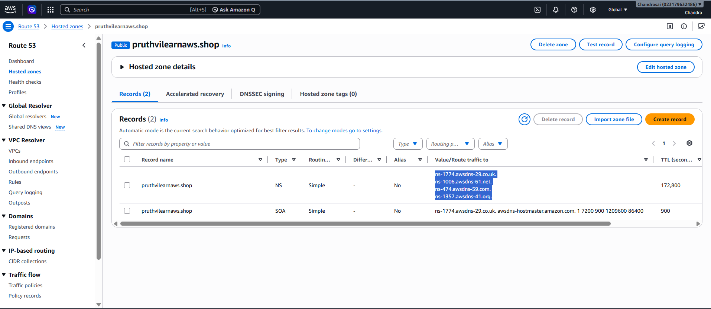

3. create a webserver(enable httpd, create index.html in ec2 instance) goto Hosted zones click on create record --> give record name(it's like subdomain name) we put this blank as well. --> in value give the ip address(allows multiple ip addresses goto next line give ip comma separted values are not accepting) of server we have Alias also(read the note) then select routing policy(simple, weighted etc.) then click on create record.
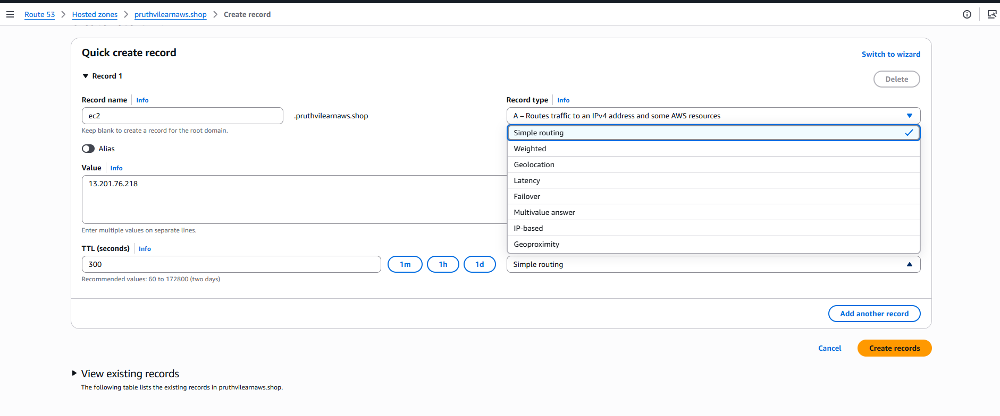

Note: Alias maps your domain name directly to AWS resources(ELB, CloudFront distributions, S3 buckets etc). above our domain name to ip(ec2 server) like we can map directly to AWS resources.
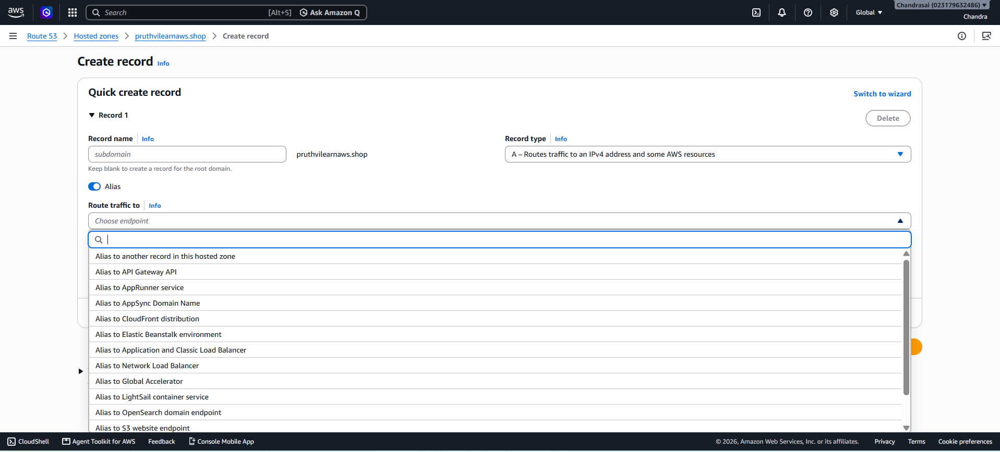

### Routing policies:
in organisations 90% of time we will use simple routing policy only.

1. **Simple Routing Policy:** Routes traffic to a single resource (like an EC2 instance public IP) or multiple static resources specified in a single record.

If you specify multiple IP addresses in one record, Route 53 returns all values to the client browser in a randomized order for basic load balancing.
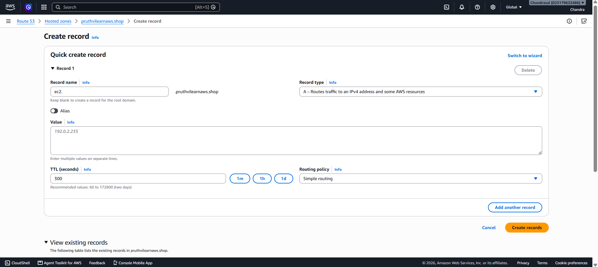

2. **Weighted Routing Policy:** Assigns numeric weights (e.g., 0 to 255) to multiple resources to split traffic proportionally. 

If you have two servers and give Server A a weight of 255 and Server B a weight of 0, Server A will receive 100% of your incoming traffic.
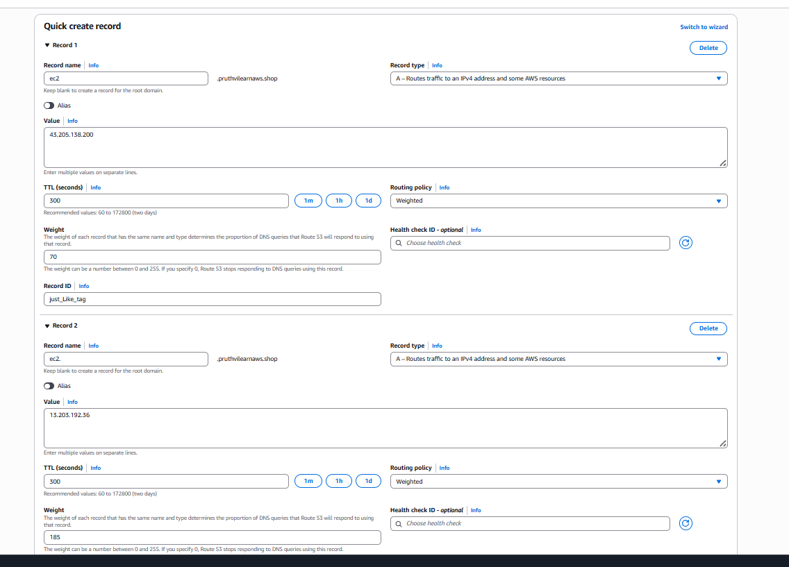
3. **Latency-Based Routing Policy:** Routes users to the AWS region that provides the lowest network latency.

Route 53 constantly measures network latency across the globe. A user in Tokyo will automatically hit your Tokyo EC2 instance, while a user in London hits your London instance.
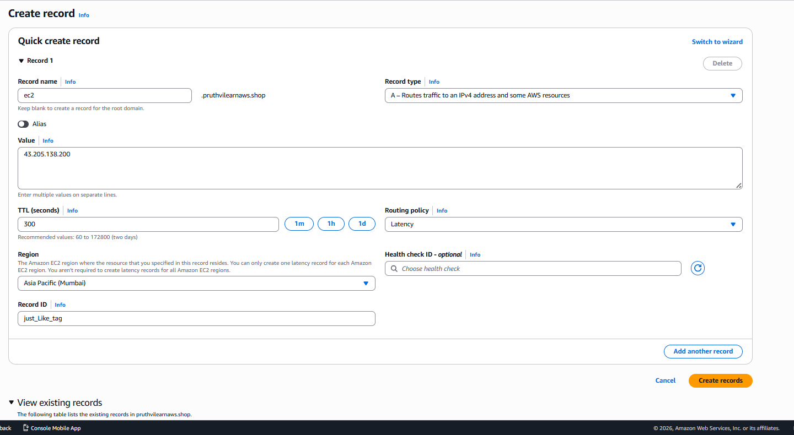

4. **Failover Routing Policy (Active-Passive):**  Routes traffic to a primary resource while it is healthy, and automatically shifts traffic to a backup secondary resource if the primary goes down.
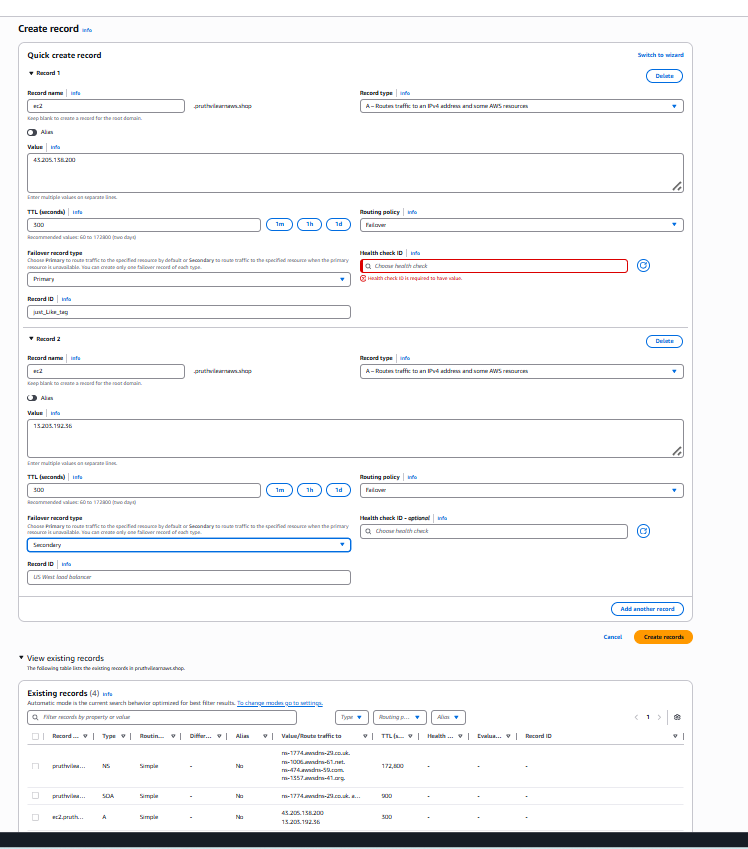
5. **Geolocation Routing Policy:**  Routes traffic based on user's geographic location(by continent, country, or US state). best for compliance and localization. uses when complying with local data sovereignty regulations.
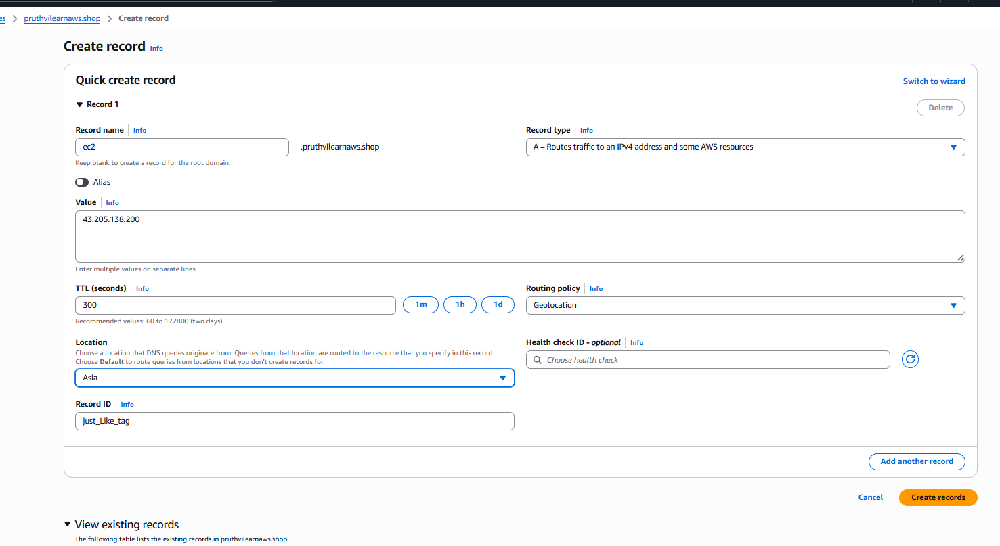
6. **Geoproximity Routing Policy (Traffic Flow):** Routes traffic based on the geographic distance between your users and your physical AWS resources.

You can choose to expand or shrink the size of a geographic region using a value called a Bias. A positive bias expands a resource's footprint to handle more traffic, while a negative bias shrinks it.
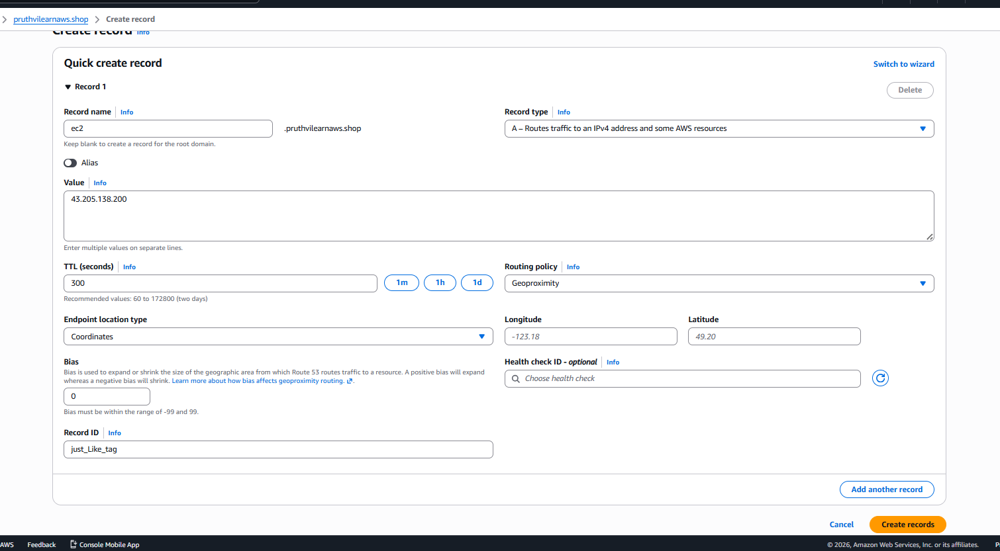
7. **Multi-Value Answer Routing Policy:** Returns up to eight healthy IP addresses or resource records in response to a single DNS query. it will route traffic randomly.

It acts like Simple Routing, but with a massive advantage: it incorporates Health Checks. If one of your servers dies, Route 53 stops giving out its IP address entirely, allowing the browser to retry a healthy IP.
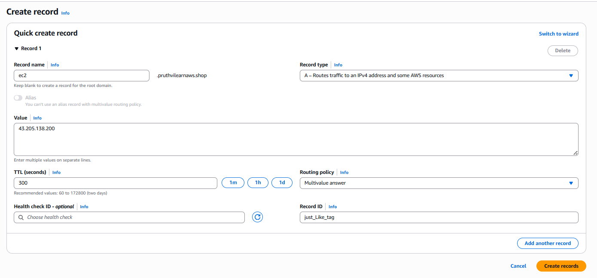

ipconfig /flushdns --> used to clear the Windows(your computer's) local DNS resolver cache.

AWS Route53 DNS has 2 types of resolvers, when we have hybrid-environments(aws and on-premises clouds)...

Inbound DNS Resolver : On-Prem to AWS : 
--> Allow on-premise systems to resolve private records inside the AWS VPC.

Flow: On-prem server trying to access AWS DB with DNS name..

On-Prem DNS server receives the query --> Forwards to Route53 "Inbound Endpoint" --> Route53 Hosted Zone --> verify the record --> Reach the Db server --> gets the response by On-prem server..

---

Onbound DNS Resolver : AWS --> On-Prem : 

Flow: AWS Server trying to access on-prem hosted DB with DNS name..

AWS Ec2 instance trying to access --> DNS HostedZone Resolver rule --> Forwards the traffic to "outbound endpoint" --> Req sends to on-rem DNS server --> reach the DB server...

http : HyperText Transfer Protocol : 
Port : 80 
Data is sent in Plain text
No Encryption
No Identity verification
MITM : Man In The Middle Attach : If someone intercepts the traffic they can read, Passwords, API Token, Form data, Credit Card.. 

https : Secure Over HTTP :
HTTP Over TLS (Transport Layer Security) 
Default Port: 443
Data Is encrypted
Server Identity Verified
Data Integrity verified

HTTPS uses: Symetric/Asymetric encryption, Digital Certificate, TLS handshake

==========
## Amazon certificate manager
ACM : Amazon Certificate Manager, it is free in AWS. it is region specific we can't use one region ACM certificate to another region.

We need to prove our ownership on the domain we are rquesting for SSL/TLS certificate.

**Note:** ACM certificate will expire after 1 year it will not renew automatically, to renew the certificate automatically in validation method select DNS validation.(imp for certificate exam)

### creating ACM certificate
1. goto ACM console click on request a certificate click next --> give your domain name(it will allow wild characters if you add *Another name to this certificate* like this "*.pruthvilearnaws.shop" if we browse ec2.pruthvilearnaws.shop it will redirect to https not only ec2 for any prefix it's work's) --> in allow export section select disable export(if you select Enable export we can use this certificate outside AWS) --> select DNS validation(auto renews certificate) --> click request.
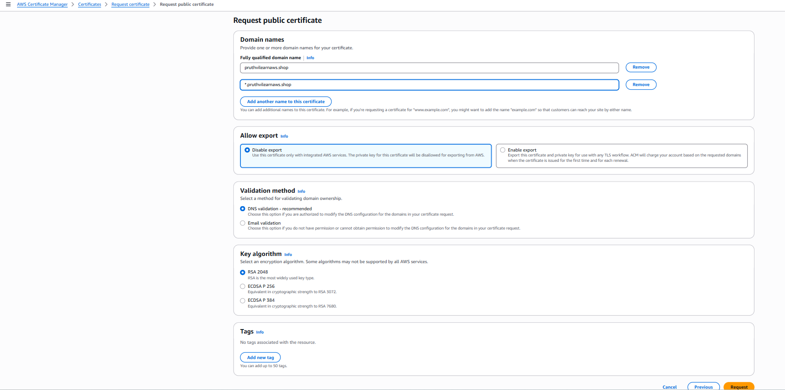

2. after creating staus is showing pending --> in Domain tab click on *create records in Route53* then click create records it will create a Cname record in route53 after it will show issued. we can add this certificate ELB, we can't add directly this to ec2 instance.
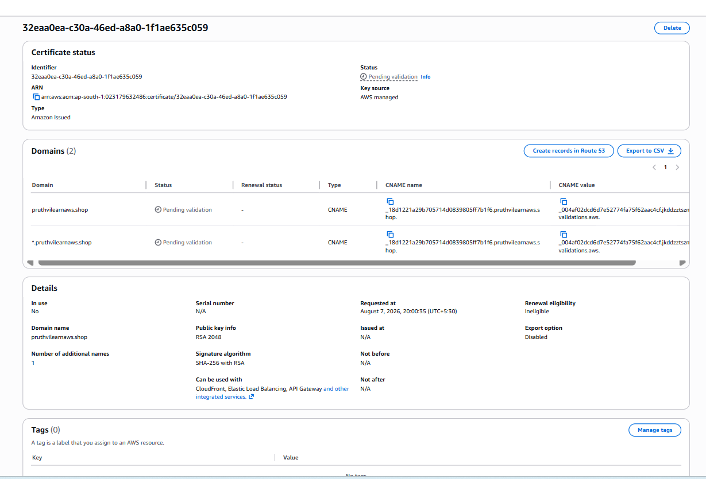

3. Adding ACM certificate to load balancer goto loadbalancer console --> click on loadbalancer --> goto listener tab create the listener with https add target group and ACM certificate. in route53 create Alias and add loadbalancer. then try to browse you will see the https working and see the certificate details by clicking on first symbol of url tab.

4. browser automatically convert http to https but in some other server or anywhere if type http://pruthvilearnaws.shop it will not redirect https to make that also route to https we need do some configuration in our serve where our website is hosted.

Open configuration file : /etc/httpd/conf/httpd.conf --> add below code under http listener restart the httpd server.

<VirtualHost *:80>
RewriteEngine On
RewriteCond %{HTTP:X-Forwarded-Proto} =http
RewriteRule .* https://%{HTTP:Host}%{REQUEST_URI} [L,R=permanent]
</VirtualHost>ed.

### converting Http to Https:

Pre-Requisites:
Create A record for your domain with Instance IP Address.. 

ec2.pruthvilearnaws.shop
www.ec2.pruthvilearnaws.shop

Note: create A record for both ec2.pruthvilearnaws.shop, www.ec2.pruthvilearnaws.shop

Verify output with nslookup.. It should resolve to ec2 instance IP Address..

sudo dnf install -y certbot mod_ssl python3-certbot-apache

Create a configuration file first..

vim /etc/httpd/conf.d/pruthvilearnaws.conf

---

<VirtualHost *:80>
    ServerName ec2.pruthvilearnaws.shop
    ServerAlias www.ec2.pruthvilearnaws.shop
    DocumentRoot /var/www/html
    
    <Directory /var/www/html>
        AllowOverride All
        Require all granted
    </Directory>
    
    ErrorLog /var/log/httpd/pruthvilearnaws-error.log
    CustomLog /var/log/httpd/pruthvilearnaws-access.log combined
</VirtualHost>

-----

sudo systemctl restart httpd

sudo apachectl configtest

sudo certbot --apache -d ec2.pruthvilearnaws.shop -d www.ec2.pruthvilearnaws.shop

============

#### Http to Https redirection for Apache:
_____________________________________
Open Apache configuration file : /etc/httpd/conf/httpd.conf

Add a rewrite rule to the VirtualHost section as below

<VirtualHost *:80>
RewriteEngine On
RewriteCond %{HTTP:X-Forwarded-Proto} =http
RewriteRule .* https://%{HTTP:Host}%{REQUEST_URI} [L,R=permanent]
</VirtualHost>

Save file and restart the service

#### Http to Https redirection for Nginx:
_____________________________________

Open nginx configuration file :  /etc/nginx/nginx.conf
Add a below entry

server {
    listen 80;
    server_name _;
    if ($http_x_forwarded_proto = 'http'){
    return 301 https://$host$request_uri;
    }
}

Save file and restart the service
