# Networking
ISP : Internet Service Provider

Public IP: use below webistes to check public ip of pur machine
1. https://checkip.amazonaws.com/
2. https://whatismyipaddress.com/

Private IP:
1. ipconfig (192.168.1.18) --> windows
2. ipcionfig /all

ncpa.cpl --> network inter --> IP Info

Public IP : Glabally unique IP allocated to a device. In our Home network ISPs allocate one Unique IP..  

Private IP : Used within an internal network and it should be unique (within the network)

IPv4 : 32 bit Address space : 32 empty slots to fill with 0 & 1 : 8.8.8.8 : 2^32 --> 4.3 Billion..
IPv6 : 128 bit address space : 128 empty slots to fill with 0 & 1 : 2^128 --> 340 Undecillion IPs..

--

IPv4 has 5 classes

Class A : 0.0.0.0 - 126.255.255.255 : 
Class B : 128.0.0.0 - 191.255.255.255 : 
Class C : 192.0.0.0 - 223.255.255.255 : 

Class D : 224.0.0.0 - 239.255.255.255		: Multicasting
Class E : 240.0.0.0 - 255.255.255.255		: Reserved for R&D

127 --> loopback Address

DHCP : Dynamic Host Configuration protocol : It allocates IP address to the device that added to the network.
 
====
### private ip's in different ranges free of use
if you see the below range ip's these are private ip's we use this ip ranges for free of cost for internal purpouse if you use 11 series(like 11.0.0.0) we need to pay money(for internal purpouse also). that's why in home routers we mostly see the below range ip's addresses(mostly uses 192 series.)
Class A : 10.0.0.0 - 10.255.255.255
Class B : 172.16.0.0 - 172.31.255.255
Class C : 192.168.0.0 - 192.168.255.255

Network : Group of inter connected devices.. All these devices can communicate each other.. 
Host : A device with in a network, that consumes an IP.. 

Class A : N.H.H.H
Class B : N.N.H.H 
Class C : N.N.N.H

Class A : 0.0.0.0 - 126.255.255.255
Class A : N.H.H.H
How many networks we can create.? Ans: 127 Networks
How many hosts we can add/create in a single network : Ans: 16 Million Hosts

10.0.0.0
10.(0-255).(0-255).(0-255)

====

Class B : 128.0.0.0 - 191.255.255.255
Class B : N.N.H.H
How many networks we can create.? Ans: 16,000 networks
How many hosts we can add/create in a single network : Ans: 65k Hosts

172.16.0.0
172.16.0.1 / 0.2 / 0.3 ... 0.255.. 1.1...1.255.. 2.0..2.555... 255.255

====

Class C : 192.0.0.0 - 223.255.255.255
How many networks we can create.? Ans: 2 million networks
How many hosts we can add/create in a single network : Ans: 256 Hosts
192.168.0.0
192.168.0.1 
192.168.0.2
192.168.0.3
...
...
192.168.0.255

===========

Subnetting: The process of dividing a larger network into smaller sub neworks

CIDR : CLassless Inter Domain Routing :
 
IPv4 : 32 Bit
 
/32 --> 32 - 32 = 0 = 2^0 = 1
/31 --> 32 - 31 = 1 = 2^1 = 2
/30 --> 32 - 30 = 2 = 2^2 = 4
/29 --> 32 - 29 = 3 = 2^3 = 8 
/28 --> 32 - 28= 4 = 2^4 = 16							--> --> Min A VPC Supports is /28 Only
/24 --> 256
/20 --> 4096
/16 --> 32 - 16 = 16 = 2^16 = 65536						--> Max A VPC Supports is /16 Only
/0 --> 32 - 0 = 32 = 2^32 = 4M

# AWS VPC
You can take any network, First IP and Last IP will be reserved.. 
First IP : Network ID
Last IP : Broadcast ID

Along with above 2.. We cant use 3 more IPs in AWS.. 
AWS DNS Server : Second IP
AWS VPC Route : Third IP
Future Use : 1 IP reserve

Note:
1. we can't add more than 60 entries in security group(60 entries for inbound and 60 entries for outbound)
2. For Nacl we can't add more than 20 entries(20 for inbound and 20 for outbound)

--> In AWS Environment, Every VPC reserves 5 IPs.. 

/28 --> 32 - 28= 4 = 2^4 = 16 - 5 = 11 Usable IPs.. 
/24 --> 256 - 5 = 251 Usable IPs
/20 --> 4096 - 5 = 4091 Usable IPs
/16 --> 32 - 16 = 16 = 2^16 = 65536 - 5 = 65531 Usable IPs

---	

CIDR Planning : 
--> How big VPC we required.? Ans : 100.. (/25 or /24)
--> How many Subnets we required.? Ans : 8 subnets
--> How many Public SUbnets.? Ans: 2 subnets
--> How many private Subnets.? Ans: 6 subnets
--> Do you have any future plans to extend this network.? Ans: yes

Public Subnet : Internet facing
Private Subnet : No Direct Exposure to outer world to the resources running here.
	--> Private Subnet with NAT : No Direct exposure to internet, but it can access internet.
	--> Private Subnet without Internet

100 IPs --> /25 --> 128 - 5 = 123 Usable IPs
/24 --> 256 IPs - 5 = 251 Usable IPs..

251 IPs --> Make it 8 parts

192.168.0.0 - 192.168.255.255 --> Network.? : 
Ans: 192.168.100.0/24

2 --> Web
WEB-CVPC-1A: 192.168.100.0/28
WEB-CVPC-1B: 192.168.100.16/28

2 --> App
APP-CVPC-1A: 192.168.100.32/27
APP-CVPC-1B: 192.168.100.64/27

2 --> Db
DB-CVPC-1A: 192.168.100.96/27
DB-CVPC-1B: 192.168.100.128/27

2 --> Lambda / caching / future
SL-CVPC-1A: 192.168.100.160/27
SL-CVPC-1B: 192.168.100.192/27

Future use: 192.168.100.224/27

IPAM : IP Address manager : tool used to track ip's usage(enterprises uses solarwinds tools to manage ip's it is less cost.)
 
Use visual subnet calculator to divide the 192.168.100.0/24 into subnets.

When you create a new vpc, what are the components you get defualtly? 

Ans: RouteTable, NACL, DefaultSecurityGroup

1. create a VPC with CIDR range we selected. goto vpc console click on create VPC --> select VPC only give VPC name --> in ipv4 CIDR section select *IPv4 CIDR manual input* give VPC range 192.168.100.0/24(if we are using IPAM tool we will select *IPAM-allocated IPv4 CIDR block*) --> go with Default option click create VPC.
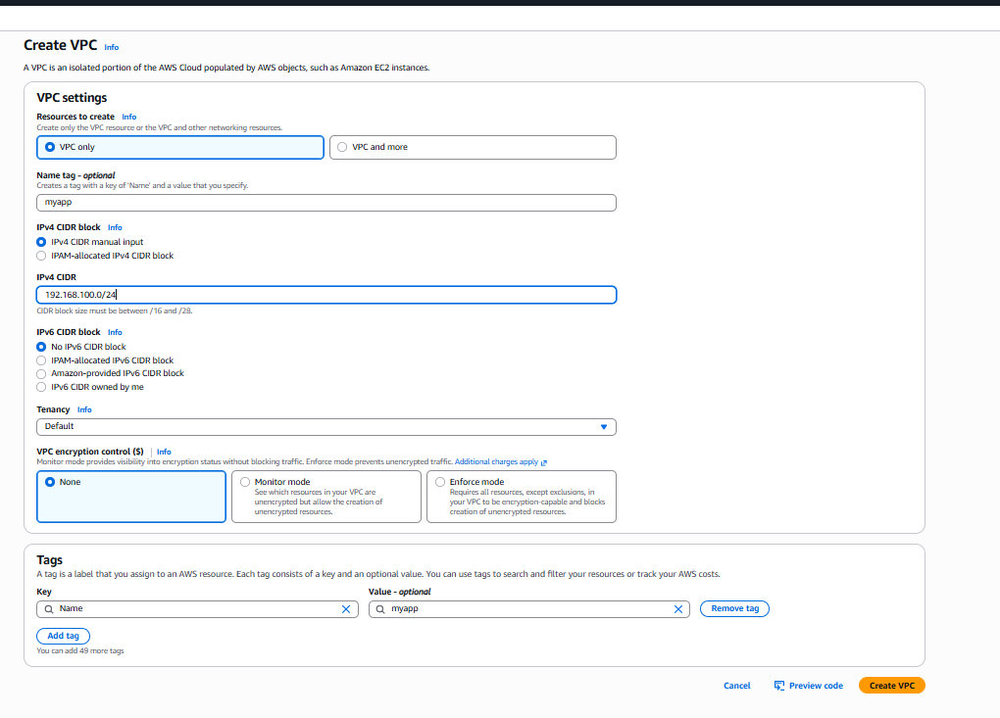

2. Creating Subnets on left pane click on subnets click on create subnet --> select our VPC --> in Subnet section give the name for subnet select availability zone and give subnet CIDR block(like 192.168.100.0/27). --> click on add subnet to create multiple subnets.
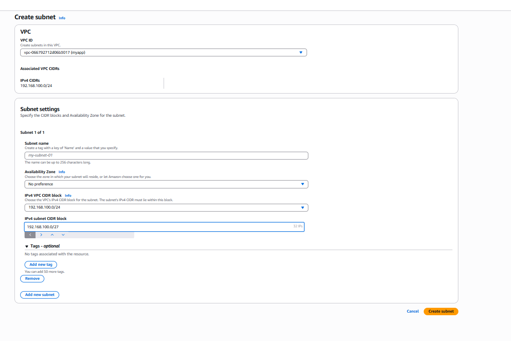

WEB-CVPC-1A: 192.168.100.0/28
WEB-CVPC-1B: 192.168.100.16/28
APP-CVPC-1A: 192.168.100.32/27
APP-CVPC-1B: 192.168.100.64/27
DB-CVPC-1A: 192.168.100.96/27
DB-CVPC-1B: 192.168.100.128/27

**Note:** all these subnets automatically(implicitly) associated to main route table if we explictly add to other route table they will automatically removed from main route table.
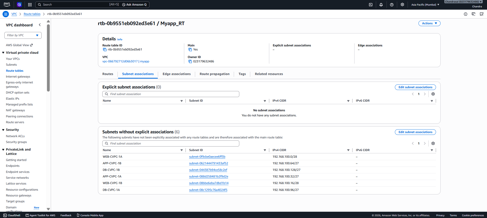

3. creating custom route tables for routing traffic for public and private subnets. creating 3 route tables
 
	1. **public route table:** creating route table for public subnets(WEB-CVPC-1A, WEB-CVPC-1B) follow the route table creation in step-2 then click on route table add the public subnets.
	2. **private route table:** repeat the above step and add the private DB subets(DB-CVPC-1A, DB-CVPC-1B).
	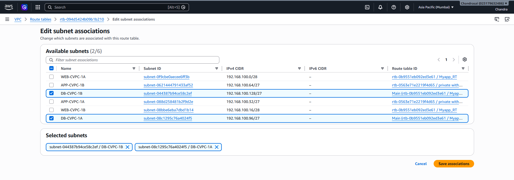
	3. **private route table with internet:** repeat the above step and add the private APP subets(APP-CVPC-1A, APP-CVPC-1B).
4. then we will attach internet gateway to public subnet then only it can able access the internet. goto route table select the public route table below select the edge associations tab click on edit edge association select the internet gateway click save changes.
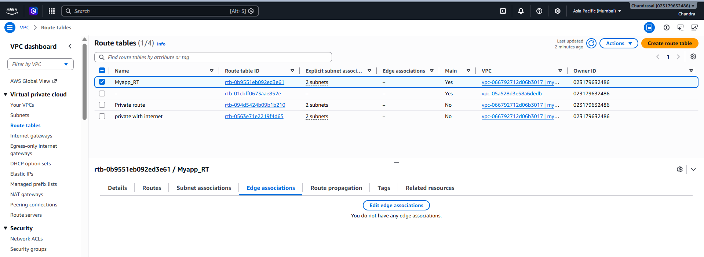
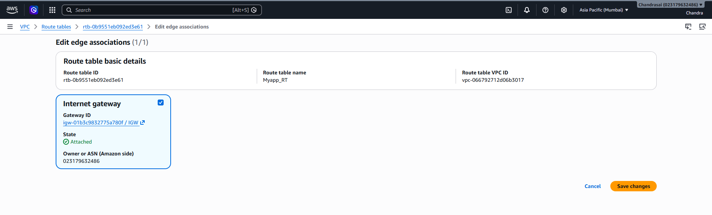

5. it is optional if we want auto assign ip's to resorces deployed in subnets we need to enable Auto Assign Public IP. goto subnets console select subnet click on actions select edit subnet settings in *Auto-assign IP settings* click enable auto assign ip click save. we can also enable auto assign ip while creating instance as well.
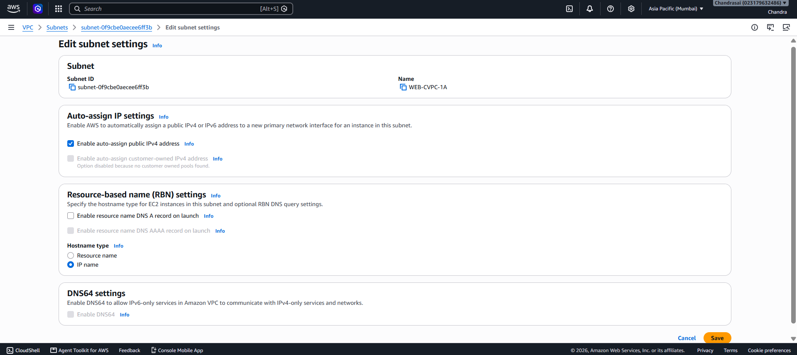

6. it's also optional but recommended choose VPC, Select "edit vpc settings", Enable "DNS Hostnames" and "DNS resolution".
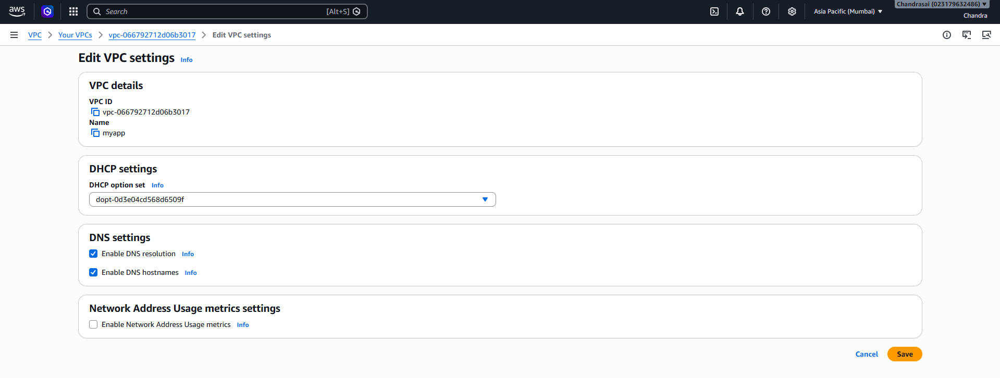

Note: if you see the target local in a specific subnet console means it can communicate with every subnet in that vpc.
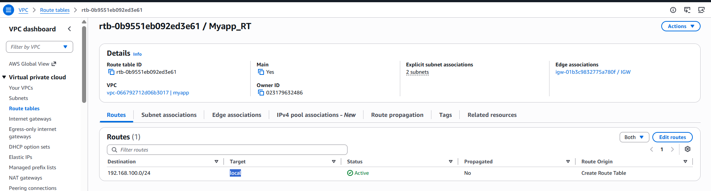

7. we add a route in public subnet to allow traffic flow from internet vpc and vpc to internet goto route table console select the public route in routes tab section click on edit routes and add like routes 0.0.0.0/0 to IGW.
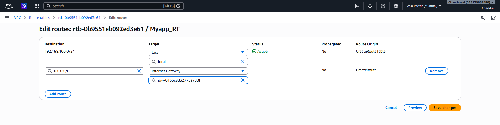

---

** MAKE SURE TO DELETE NAT AFTER YOUR PRACTICE. 

I need internet to my private subnet instances.!!

## NAT Gateway: 
We can control communication (Public / Private)

Public NAT gateway (Regional): 
--> Placed in a Public Subnet
--> Uses an EIP
--> This allows Private subnet instances to access internet.
--> Managed by AWS

Private NAT gateway : 
--> Placed in private Subnet
--> No EIP
--> used for Private-to-private traffic
--> No Direct access to internet.

### creating nat gateway
1. goto natgatway console click on create nat gateway give name --> in availability modes select zonal select the public subnet(WEB-CVPC-1A) --> select public in connectivity type allocate elastic ip click on create nat gateway.

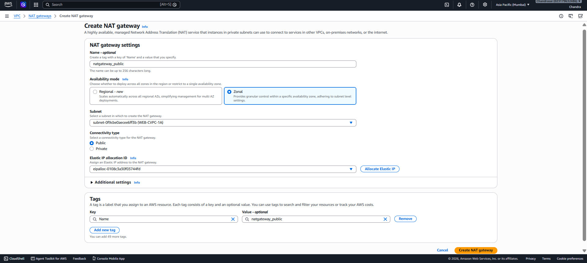

create a route in private with internet subnet from 0.0.0.0/0 to nat gateway.
Availability Mode of NAT: 

Regional : Scales automatically across all regional AZs, simplifying management for multi AZ deployments.
Zonal: Provides granular control within a specific availability zone, adhering to subnet level settings.

---

We can use Site-2-site VPN conenction / Direct Connect to establish connection between AWS and On-premise environment. Directly, we can access all the AWS private subnet resources using Private IPs.

---

## NETWORK ACL / NACls : 

By default, all subnets will be part of the Default NetworkACL. And, It allows all the traffic to all the network..

newly created network ACLs, won't allow any traffic to any network. It blocks everything.

One subnet can be member of one NACL at a time.(one subnet will not be part of multiple NACLs at a time.)

We have to create rules increments of 100s.. (100 / 200 / 300..) lowest rule number will be evaluated first(it takes the high priority). if i deny the ssh traffic with 100 and allow the ssh traffic with 101, it will deny the traffic because 100 is evaluated first.

SGs will have only allow option.. SG Dont have DENY option..

NACLs have allow and deny option. If you want to deny the traffic to a particular network, you can grab the Network IP and deny it.

#### ephemeral ports:
Ephemeral ports are temporary ports used for outbound connections. 

how it works: 

the nacl is stateless, it does not remember the state of the connection. they completely forget the incoming request and require a separate rule to allow the return traffic out.

The Request: A client connects to your server. Their packet has a Source Port (a random ephemeral port like 51023) and a Destination Port (80). Your inbound NACL rule allows this because port 80 is open.

The Server Response: Your web server processes the request and sends the webpage back. The return packet flips the ports: the Source Port becomes 80, and the Destination Port becomes the client's ephemeral port (51023).

The NACL Block: When this return packet hits your outbound NACL, the NACL checks its rules. It does not remember that this packet is part of an active session. If you do not have an outbound rule allowing ports 1024-65535, the NACL drops the packet, and the user's browser times out.

### creating NACLs
1. goto NACL console click on create network ACL give name --> select the VPC --> click on create network ACL. goto subnet associations tab and add the public subnets to this NACL. then allow the inbound and outbound rules for this NACL. even though we have added inbound and outbound rules we can't access instance because we need ephemeral port range to be allowed in outbound rules. ephemeral port range is 1024-65535. 
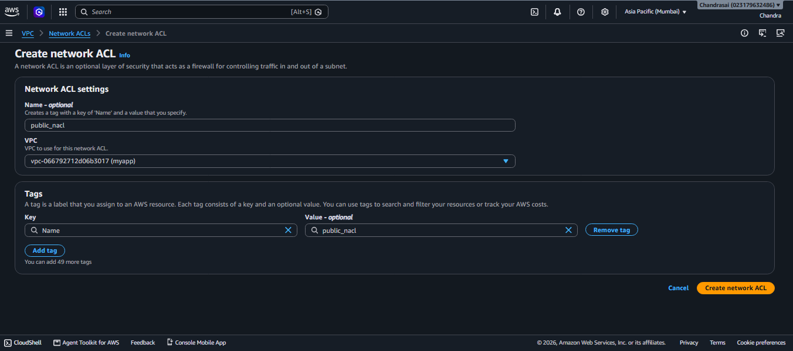
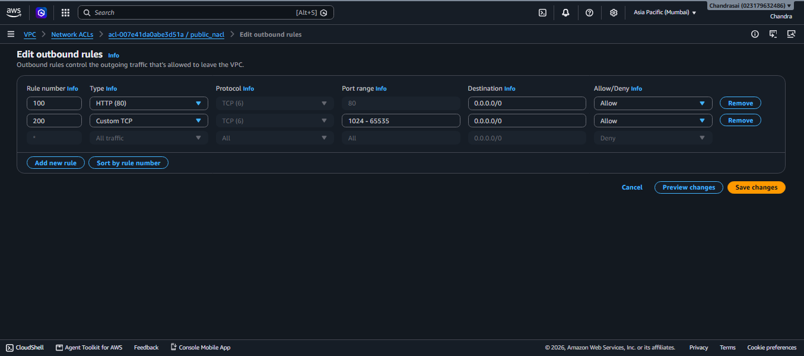

**Note:** 
1. when we create new NACL by default traffic will be blocked. 
2. if you want to block the traffic to a particular network add deny rule in Inbound rule in outbound rule it will not work because it uses ephemeral port(random port) for return traffic if we deny http in outbound rule it will not work because it uses ephemeral port for return traffic.
3. while entering an ip to allow or deny in NACLs we need to put /32 at the end of the ip address.(/32 locks down all 32 bits if we use /24 it only lock down first 24 bits and allow the last 8 bits to access the network.) 
--

## VPC Flow Logs:
We have option to enable logs at 
1. vpc level
2. subnet level
3. individual instance level

1. before creating flow logs we need to create a log group in cloudwatch goto cloudwatch console on left pane click on logs then click on log management then click on create log group give name --> rentention seetings(how many you will store logs like 7days or 90 days etc.) --> explore other options --> click on create.
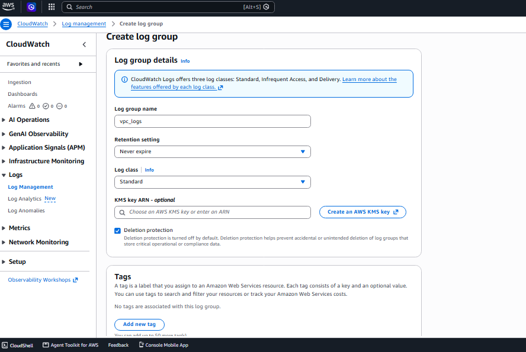
2. goto vpc console select vpc select the flow logs tab click on create flow log --> give name --> in filter section select the type of traffic you want to capture(accept / reject / all) --> in maximum aggregation section select 1 min --> in destination section select the cloudwatch logs select the log group we created in step-1.(we can send the logs to S3 also but to see those logs we need to use glue and uses sql queries to see the logs it's complex but cloud watch also supports alarms as well.) --> in service role section select the new role --> log format select the default format(we can use custom format as well)
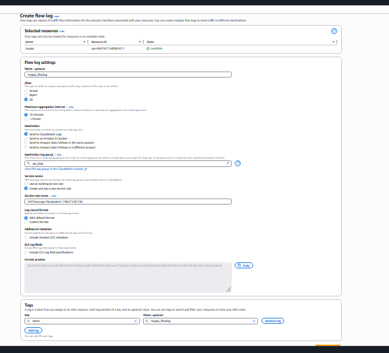

3. goto log group we created in log stream tab you see the instance network interface id you will see that instance network logs in that NIC.

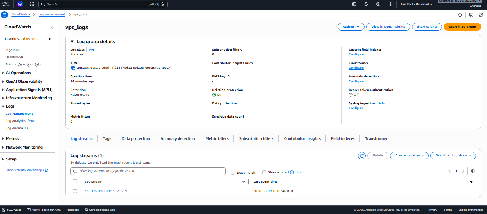

4. click on the NIC to view the instance logs in actions click on log insights in prompt section using plain prompt we can view logs(example: to view the latest 5 logs write prompt see the below image)
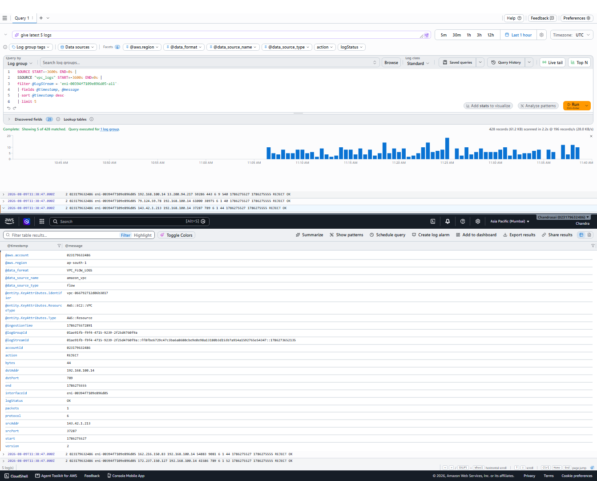

Note: we can also create flow logs at subnet level and instance level as well but it will log only subnet level or instance level traffic not the entire vpc traffic. 

---
## VPC Endpoints:
VPC endpoints are used to connect to AWS services without using public IPs or going through the internet. VPC endpoints are virtual devices that enable private connections between your VPC and supported AWS services and VPC endpoint services powered by AWS PrivateLink.

Endpoints: Access S3/dynamodb / other resources without internet using endpoints

1. goto vpc console on left pane select endpoints click on create endpoint give name --> enable cross region endpoint(if required) --> in services section type s3 click enter we have 2 types gateway(aws managed only charges for data transfer) and interface(if we select this it creates ENI(elastic subnet interface) in our subnet it costs per hour and also charges data transfer as well) endpoint select the gateway endpoint --> select our VPC --> in configure route tables section select the route table where our private instance are running(private with internet) --> in policy section select the full access(for s3) --> click on create endpoint.
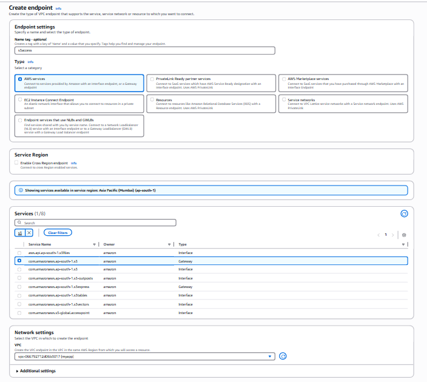
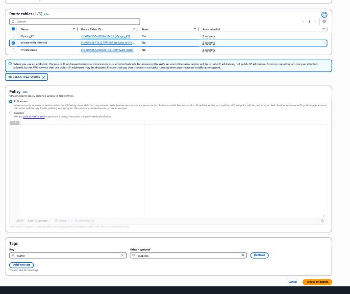

now you can access the s3 bucket without internet from your private instance

in private with internet route table we ca see the vpc endpoint route with pl-xxxx(pl means private link).
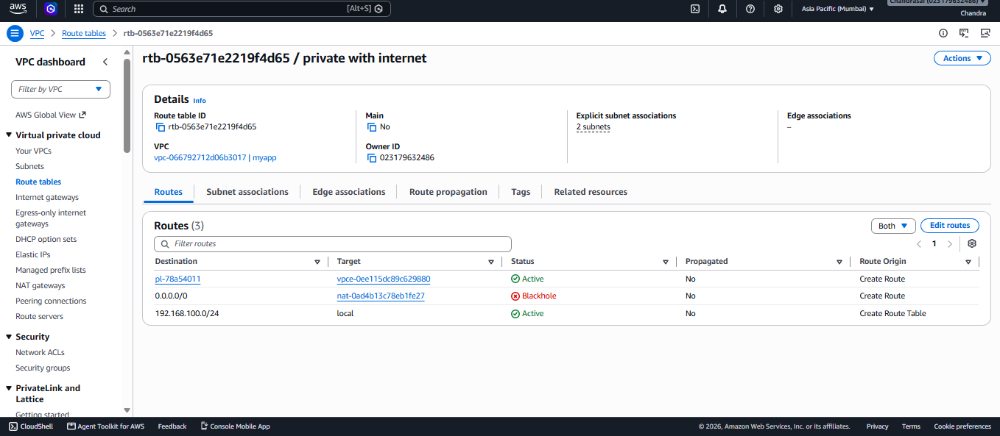
---

## VPC Peering:
This helps to enable communication between 2 VPCs. to enable communication between 2 VPCs, Source VPC and Target VPC should not have the same CIDR ranges.

VPC peering is Non-Transitive peering.

qw need below details to create a VPC peering connection between 2 VPCs.

				Requester VPC				Accepter VPC
Acc ID			655700896650				655700896650
VPC ID			vpc-09fa12df9e4d9e195		vpc-0cbfc0d30295f9d10
CIDR Range		192.168.100.0/24			10.0.0.0/16
Region			ap-south-1					ap-southeast-2

---
### creating VPC Peering:
1. we need other vpc in other region create VPC(use vpc and more option while creating vpc) with only private subnet in sydney region(make sure CIDR is different from source vpc(mumbai).)

2. create VPC peering connection in source vpc(mumbai) on left pane in VPC console select peering connections click on create peering connection give name --> in requester section select our vpc(mumbai) --> in accepter section select my account(if our vpc is in other account select other account & give account id) --> in region section select another region select sydney(ap-south-1) region and give vpc id of accepter vpc(sydney vpc) --> click on create peering connection.
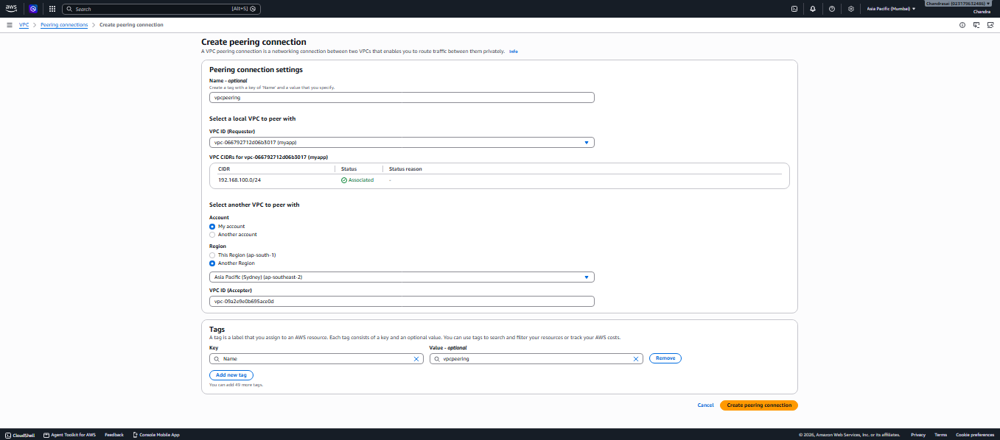

3. after creating the peering connection we need to accept the request in accepter vpc(sydney) goto peering connection console select the peering connection click on actions select accept request.
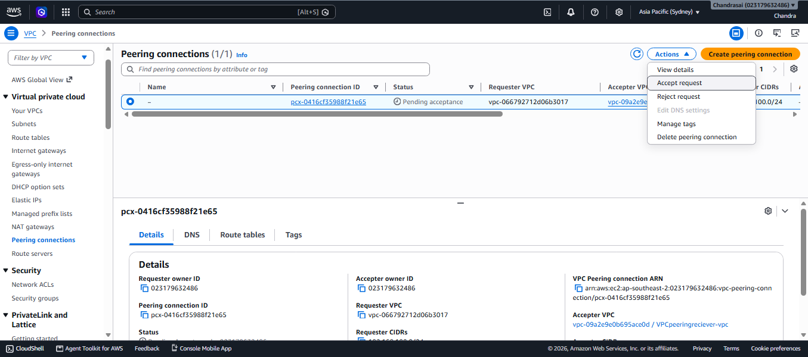

4. then we need to add the routes in both the vpc route tables in accepter vpc(sydney) route table add the route to source vpc(mumbai) cidr range(192.168.100.0/24) and in source vpc(mumbai) route table add the route to accepter vpc(sydney) cidr range(10.0.0.0/16).

goto sydney VPC route table select the route table click on routes tab click on edit routes add the route to source vpc(mumbai) cidr range(192.168.100.0/24) and in target select the peering connection then give the peering connection. --> create the route. 
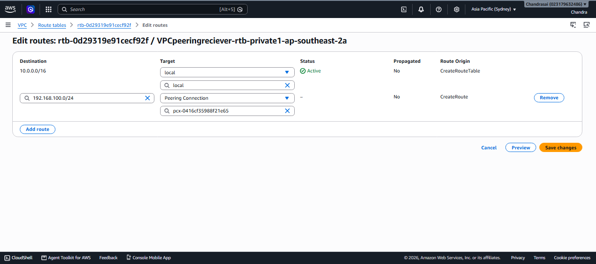
then goto mumbai vpc route table select the route table click on routes tab click on edit routes add the route to accepter vpc(sydney) cidr range() and in target select the peering connection then give the peering connection. --> create the route.
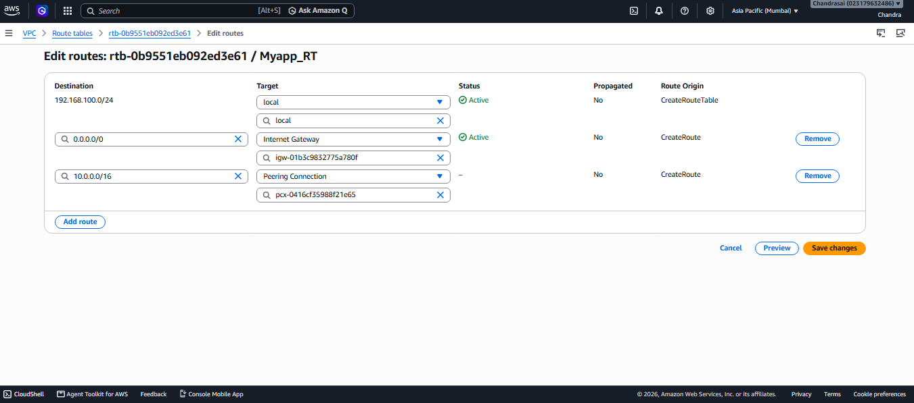

then we can able access the resources in sydney vpc from mumbai vpc and vice versa.

## Transit gateway:
it is difficult to manage the multiple vpc peering connections for different vpc's so we use transit gateway to manage the multiple vpc peering connections. Transit gateway is a regional resource(By default a Transit Gateway only connects to VPCs inside its own account.) and it can be shared across multiple accounts using AWS RAM service.

Central NW Account = Place where TGW created..(generally we use the dedicated account for TGW and networking purpose)

### creating Transit Gateway for cross account VPC's communication:

1. create transit gateway in mumbai region goto transit gateway console click on create transit gateway give name --> go with default options --> click on create transit gateway.
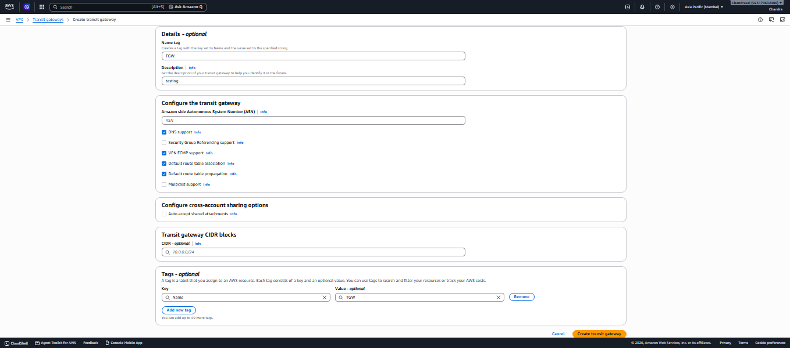

2. to connect cross account VPC's we need RAM service got RAM(resource access manager) console click on create resource share give name --> in resources section select the transit gateways the select the transit gateway we created in step-1 click next--> leave the policy as default click next --> in principals section select the account id then add account id other aws accounts we want to share the transit gateway with --> click next --> review the details and click create resource share.
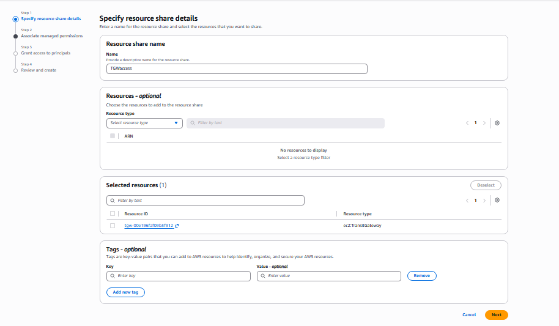
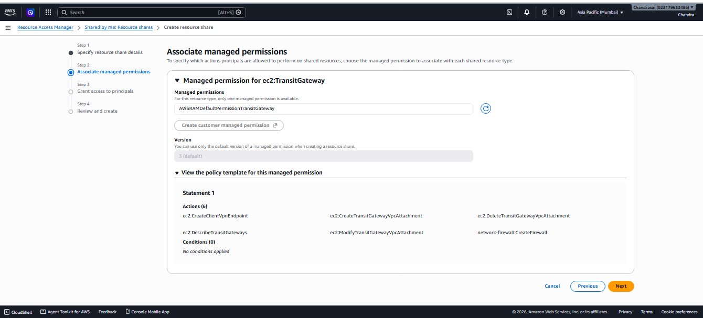
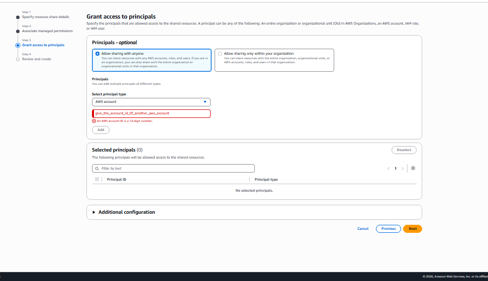

3. in other aws account goto RAM console click on shared with me tab select the resource share invitation click that invitation and accept it.
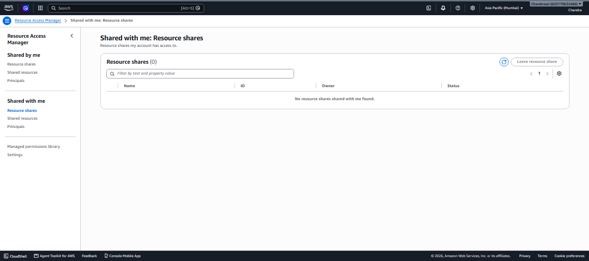
i don't another aws account so i am adding aviz account screenshots for reference.
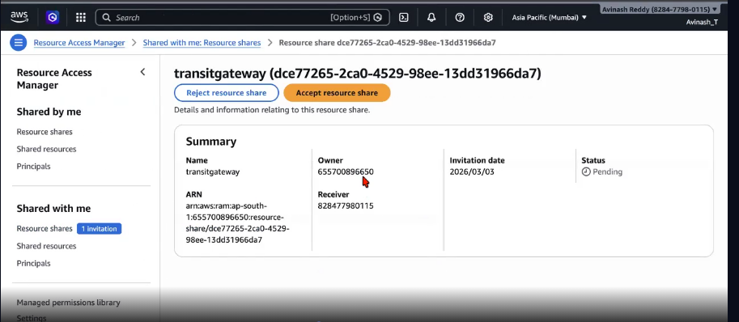

4. then create a transit gateway attachment in central networking account(where transit gateway is created) goto vpc console on left pane goto transit gateway section click on transit gateway attachments click on create transit gateway attachment give name --> in transit gateway id section select the transit gateway we created in step-1 --> in attachement type select vpc --> in vpc section select the vpc we want to attach to transit gateway --> in subnet section select the subnets we want to attach to transit gateway --> click on create transit gateway attachment.
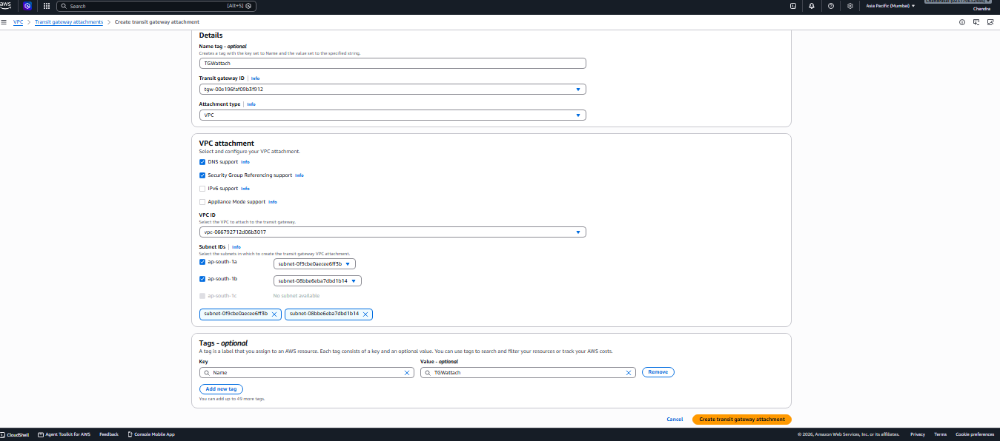

5. repeat the above step in other aws account also. goto CNW account(where transit gateway is created)
goto transit gateway attachments you can see the new attachment request from other aws account select that attachment click on actions select accept attachment request.
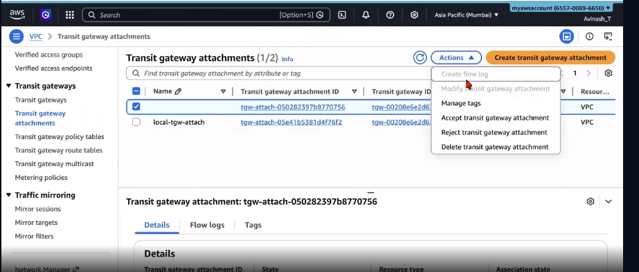

6. add the route to other account vpc CIDR range in CNW account route table and in target select the transit gateway and then add the route of CNW account vpc CIDR range in other account route table and in target select the transit gateway.
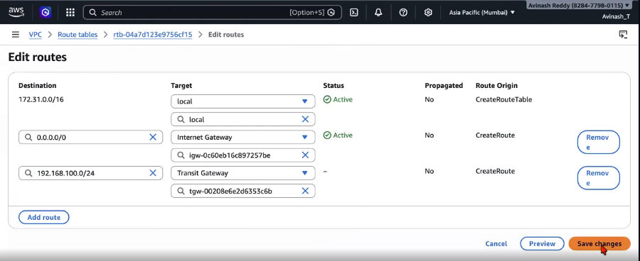

7. vpc in account-A want to communicate with vpc in account-C, in VPC-A route table add the route to VPC-C CIDR range and in target select the transit gateway(if VPC in A/C-A wants to communicate with A/C-B vpc i think we no need to add the route in A/C-B VPC-B route table) and i am not sure about this(in VPC-C route table add the route to VPC-A CIDR range and in target select the transit gateway. then we can able to communicate between VPC-A and VPC-C.)

Step 1 : create a TGW/Transit Gateway in Central networking account.

Step 2 : Share it Multiple AWS Accounts, Switch to other accounts RAM service and accept the invitation.

Step 3 : In central NW account, Create a TGW attachment with local VPCs desired subnets.. 

Step 4 : In Member account, Create a transit gateway attachment with local VPC subnets.

Step 5 : Switch to Central NW VPC TGW, Choose the attachment and accept it (Accpeting Step 4).

Step 6 : Edit Member account route table with "Central NW" Account VPC CIDR. 

Step 7 : Edit Central VPC account route table with "Member account"  VPC CIDR. 

### creating Transit Gateway for same account different region VPC's communication:
1. create the transit gateway in mumbai region and create transit gateway in sydney region.

2. create a transit gateway attachment for VPC in mumbai region and create a transit gateway attachment for VPC in sydney region.(same like step-4 in *TGW for cross account VPC's communication*)

3. In mumbai region create a transit gateway peering attachment goto transit gateway attachements click on create transit gateway attachment give name --> in transit gateway id section select the transit gateway --> in attachment type select peering connection --> in peering connection attachment section select my account --> give the sydney region --> then give the sydney region transit gateway id --> click on create transit gateway attachment.
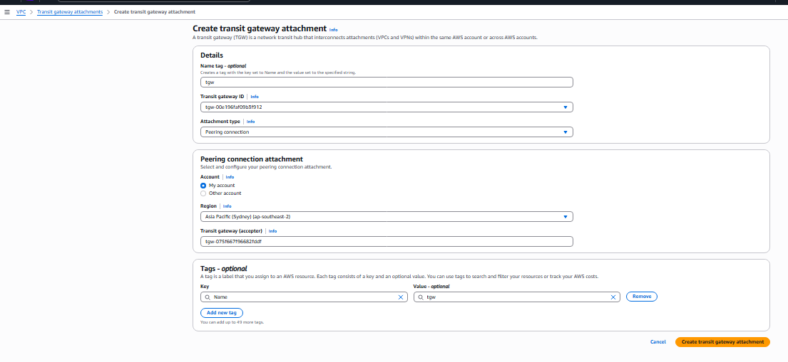

4. In sydney region create a transit gateway attachment console you will see the new attachment with peering as resource type select that attachment click on actions select accept attachment request.(after accepting the request in few minutes we can see the status as available.)
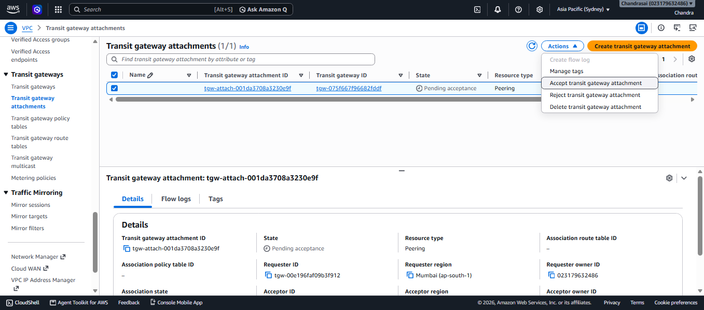

5. Create the new transit gateway route in transit gateway route table in mumbai(transit gateway route table automatically created when we create a transit gateway) --> select the route table goto routes tab click on create static route give VPC CIDR(10.0.0.0/16) of sydney region and in target select the  transit gateway peering attachment. do the same in sydney region transit gateway route table add the route to mumbai region vpc cidr range and in target select the transit gateway peering attachment.
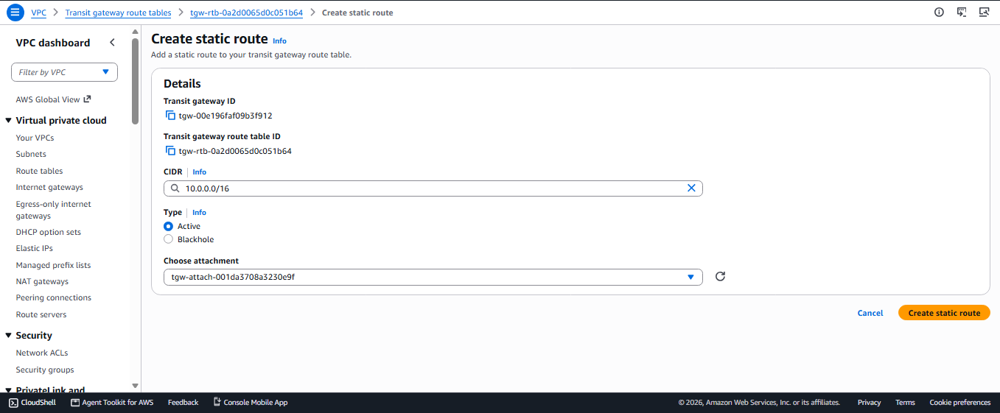

6. goto mumbai region public route table in routes tab click on edit routes add the route to sydney region vpc cidr range and in target select the transit gateway. repeat the same step in sydney region route table add the route to mumbai region vpc cidr range and in target select the transit gateway.

now you can able to communicate between mumbai region vpc and sydney region vpc. we can able to ssh into instances in sydney region instnace from mumbai region instance using private ip's.
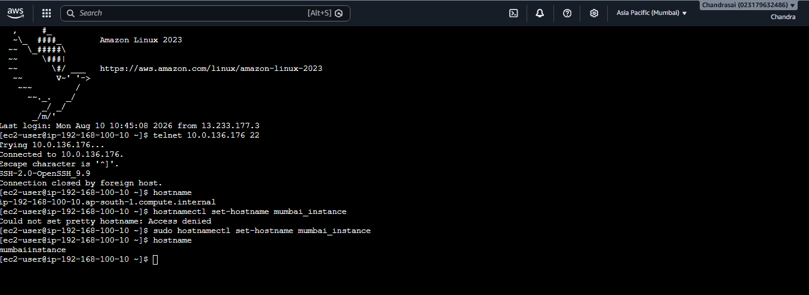

Step 1 : Create a TGW/Transit Gateway in Mumbai region and create a TGW in Sydney region.

Step 2 : In Mumbai region, Create a TGW attachment with local VPC desired subnets. Repeat the same in Sydney region.

Step 3 : In Mumbai region, Create a TGW peering attachment → Select the Mumbai TGW → Attachment type: Peering Connection → Select "My Account" → Choose Sydney region → Provide Sydney TGW ID.

Step 4 : Switch to Sydney region TGW Attachments console → Select the new peering attachment → Actions → Accept Attachment Request.

Step 5 : In Mumbai region TGW Route Table → Create Static Route → Destination: Sydney VPC CIDR → Target: Peering Attachment. Repeat in Sydney region TGW Route Table → Destination: Mumbai VPC CIDR → Target: Peering Attachment.

Step 6 : Edit Mumbai region VPC Route Table → Add route → Destination: Sydney VPC CIDR → Target: Mumbai TGW.

Step 7 : Edit Sydney region VPC Route Table → Add route → Destination: Mumbai VPC CIDR → Target: Sydney TGW.

---

## Site-2-Site VPN : 
it's used to create a secure, encrypted connection over the internet or via private IP between an on-premises data center, branch office, or corporate network and your Amazon Virtual Private Clouds (VPC)

### creating Site-2-Site VPN:

1.  create a customer gateway with office firewall device public ip. goto vpc console on left pane goto vpn sections click on customer gateways click on create customer gateway give name --> we need to give the public ip of our office firewall device(for testing giving random ip) --> click on create customer gateway.
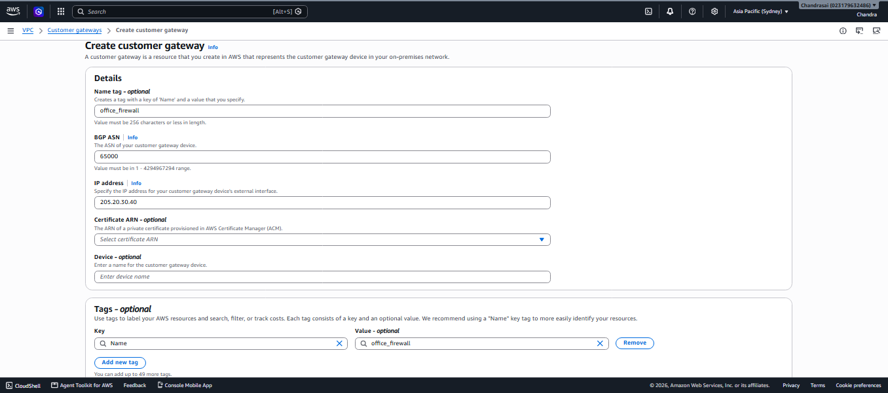

2. create a virtual private gateway goto vpc console on left pane goto vpn sections click on virtual private gateways click on create virtual private gateway give name --> click on create virtual private gateway.(this is for aws end)
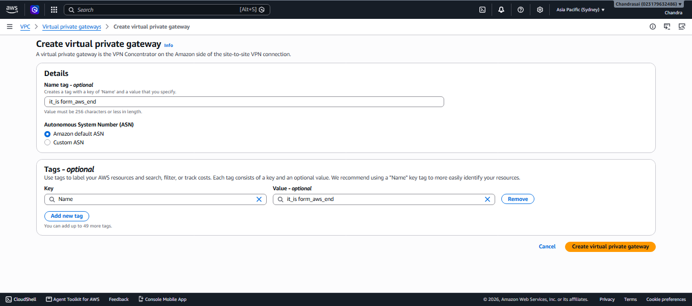

3. create site-to-site vpn with CGW and VPGW. goto vpc console on left pane goto vpn sections click on site-to-site vpn connections click on create site-to-site vpn connection give name --> in target gateway section select virtual private gateway we created in step-2 --> in customer gateway section select the customer gateway we created in step-1 --> click on create site-to-site vpn connection.
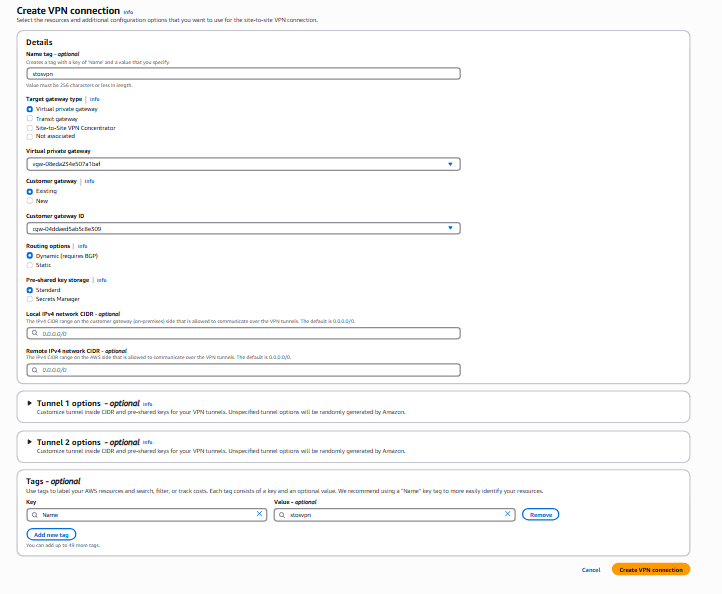

4. after creating the site-to-site vpn connection we need to download the configuration and provide it with Firewall team. select the site-to-site vpn connection click on actions select download configuration in prompt section select the vendor(paloalto, F5), platform and os version then click on download configuration.
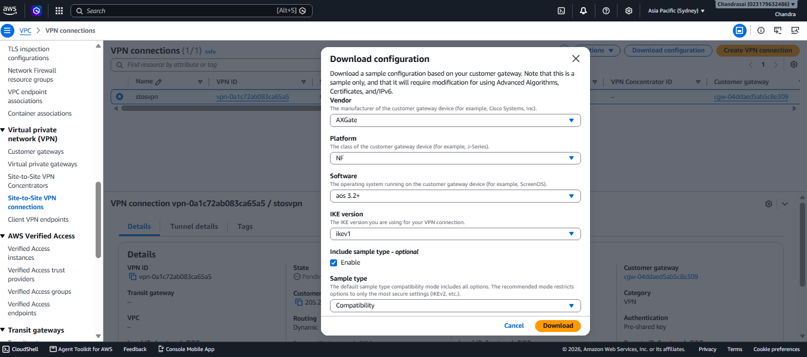

Dowloaded configuration file available in VPC directory.

Step 1 : Create customer gateway with office firewall device public ip.

Step 2 : Create virtual private gateway.

Step 3 : Create site-to-site vpn with CGW and VPGW. Donwload the configuration and provide it with Firewall team.

---

Just like NAT Gateway, If you want to provide internet to "private subnet instances" in "IPv6", we use "Egress-only Internet gateways".

---