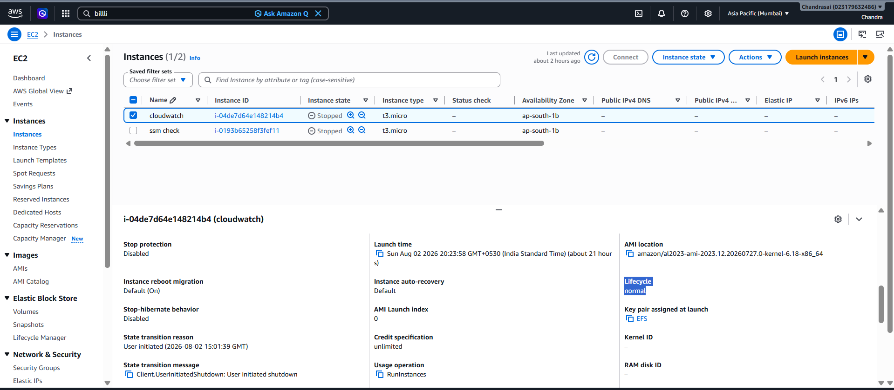

# TCS interview Questions

### 1. What is the difference between ALB & NLB?
A. **Application Load Balancer:**An Application Load Balancer (ALB) operates at Layer 7 (HTTP/HTTPS) and routes traffic based on application content such as Path-based, and also routes host-based, query string parameters(in ALB rule condition if we provide v2 it will route traffic to v2 or if it's ). it is slow(due to layer inspection).
it uses Dynamic IP(use DNS name) and don't use static IP.

ALB uses in web applications, e-commerece applications.

**Network Load Balancer:**. A Network Load Balancer (NLB) operates at Layer 4 (TCP/UDP) and routes raw traffic based strictly on IP addresses and ports without inspecting content. it uses static ip(an ip address doesn't change in AWS have EIP). it's extremely fast. when you need extreme performance, require ultra-low latency, are handling non-HTTP traffic.

NLb uses in gaming, iot Devices and trading to handle millions requests and sudden spikes in financial transaction traffic during market openings.

### 2. if EC2 instance is unreachable then how would you troubleshoot it?
1. i will check the EC2 instance is up and running.
2. i will verify SG's port 22 open for ssh and port 3389 open for RDP(windows). then i will verify the NACL's allowing the inbound and outbound traffic allowing.
3. i will the check the permissions of ssh private key and set the permissions 0664. then i will connect the ec2 through ec2 serial console and checks the sshd service is running.
4. i will check the instance screenshot in ec2 console by clicking *Actions > Monitor and troubleshoot > Get instance screenshot* to see if it's a blue screen or kernel panic and checks the system logs by clicking on *get system logs*.
5. i will also check the cloudwatch logs and metrics to see the cpu and other details.

### 3. how will you check if app performance is slow?
1. First, I check the Load Balancer metrics like ALB response times if it's high, it confirms the issue is on our backend.
2. then I also look at the HTTP status codes(like 503, 500 errors).
3. next i will check the load on server using cloudwatch metrics like cpu and memroy utilization. if app code is consuming more cpu or any memory leaks in the code i will collect the thread dump and heap dump and shares those with developers.
4. if server looks fine i will trace the network between applications using tracing tools like jagar or AWS x-ray to identify the bottelnecks, and also checks the Garbage Collection (GC) pauses in Java, or Event Loop delay in Node.js, which can cause intermittent freezing.
5. then i check the database layer I look at Active Connection Counts to see if the app is blocking while waiting for a DB connection, then checks Slow Query Logs and Database CPU to identify unindexed tables or heavy joins that are locking up rows.
in RDS i will the read replicas to see there is any sync lag between original RDS and RDS read replicas due to high traffic/cpu in my main database the sync is delayed.
6. Once the immediate issue is resolved, I establish long-term fixes. This includes setting up CloudWatch Alarms on p95/p99 response times, configuring autoscaling policies based on request counts, and ensuring we have robust caching layers like Redis or CloudFront to protect our database from repetitive hits."

### 4. you found a process it is consuming 40% to 50% of memory what will you do and what will be approach?
1. i will check which process is consuming more memory using *top and ps* commands then i will check blastradius(scope of impact) of that process before terminating.
2. then i will check if it's normal behaviour for heavy application or it's a memory leak.
3. i will check memeory allocation for that process using VIRT(VSZ) virtual memory and RES memory. RES tells exactly how much physical RAM process holding now.
4. I’ll run free -h to see how much total buffer/cache and free RAM remains on the host. If the system still has 30%+ free memory and isn't swapping(if it's swapping server is under heavy RAM pressure), the instance is not in immediate danger of crashing.
5. If it is a Database (like PostgreSQL/MySQL) or a Java app, 50% memory consumption might be completely normal due to pre-allocated buffers i will confirm this using historical metrics(cloudwatch metrics) in cloud watch If memory consumption is a flat line at 50%, it's normal. If it is a steady, upward staircase over hours or days, it is a memory leak.
6. if it's emergency i will restart service/server(temporary solution). if it's a memory leak i will share the thread and heap dumps to developer team to resolve the memory leak till then i will schedule graceful daily/weekly service restarts until solution deployed to prod.
7. if it's not a memory leak it's normal i will vertically scale the server.

**Swapping:** Swapping means the operating system moves less-used data from RAM to disk space called swap(swap memory) when RAM is getting full. This frees up memory for active processes, but it is much slower than RAM, so performance can drop significantly.

### 5.How restarting a service or server resolves the high cpu or memory usage problems?
A. **memrory issues:**
1. It Completely Wipes Memory Leaks
2. It Clears Fragmented Memory Pools:Long-running processes frequently allocate and deallocate memory blocks, leaving tiny gaps of unallocated space across the RAM sticks. Even if total free memory looks sufficient, the OS might fail to find a large, continuous block of memory for new requests, causing allocation errors or slowdowns.
3. It Instantly Empties the Swap Space

**CPU Issues:**
1. It Kills Garbage Collection Loops
2. It Terminates Infinite Code Loops and Deadlocks
3. It Clears Blocked Network and File Descriptors

### 6. what is cost forecasting how it helps in AWS?
A. Cost forecasting is the process of using historical spending data and machine learning algorithms to predict your future cloud expenditures over a specific period (e.g., the next month, quarter, or year).

in AWS we have AWS Cost Explorer that has built-in forecasting capabilities.

### 7. how to know a instance is on-demand or spot or reserved?
A. we can know using console and aws cli. in ec2 console select the instance in details tab look lifecycle it is normal on-demand instnace if it is spot it's spot instnace. but for reserved or other type instance it shows normal only to know instnace is reserved or not look into billing console(AWS cost explorer) same goes for cli method also(only identifies spot or on-demand).
#### cli method:
```sh
aws ec2 describe-instances --instance-ids i-1234567890abcdef0 --query "Reservations[*].Instances[*].[InstanceId,InstanceLifecycle]" --output text
```


### 8. My ec2 instances are using EFS autoscaling group will scale the instances every time when adding new ec2 instance we need to mount the EFS id don't want to do this how would you resolve this issue?
A. it's difficult manaually login to every new instnace and mount EFS. so we use *GoldenAMI* we will create a ami with EFS already mount to desired mount point(dir like /var/www/html) and in Autoscaling group launch template we will use this ami to create instances.


## Infosys interview questions

### 1. i have 300 aws accounts how can i check the vulnerabilities in these accounts using single dashboard?
A. AWS Inspector, guard duty and AWS Security HUB.

**AWS Inspector:** An automated vulnerability management service that inspects the inside of your workloads (such as EC2 instances, ECR container images, and Lambda functions) for software flaws and insecure configurations. it looks our resourse *inside out*(inspects internal components—packages, OS libraries, application dependencies detect those vulnerabilities before an exploit happens.)

It detects Outdated software packages, known software vulnerabilities (CVEs), and unintended network exposure.

**EX:** EC2 instance i-12345 is running an outdated version of OpenSSL that is vulnerable to data leaks

**AWS Guard Duty:** A managed threat detection service looks at your environment from the *outside in* continuously monitors your  AWS account activity, logs, and data patterns for malicious or unauthorized behavior. it monitors VPC Flow Logs, CloudTrail management/data events, DNS logs, EKS audit logs, and RDS login attempts etc.

**EX:** EC2 instance i-12345 is actively sending traffic to a known Bitcoin mining pool.

**AWS Security Hub:**AWS Security Hub is a cloud security posture management (CSPM) service that acts as a central dashboard for security findings from AWS inspector, guard duty and other AWS and third-party tools.

i will use both Guard duty and inspector to detect vulnerabilities and malicious activity in AWS accounts and then AWS security Hub aggeregates these findings via AWS organisations(Without this,we manually generate IAM roles, trade API keys, and accept 300 individual cross-account invitations it is a heavy process that takes weeks) and that data will be visible in a single dashboard.