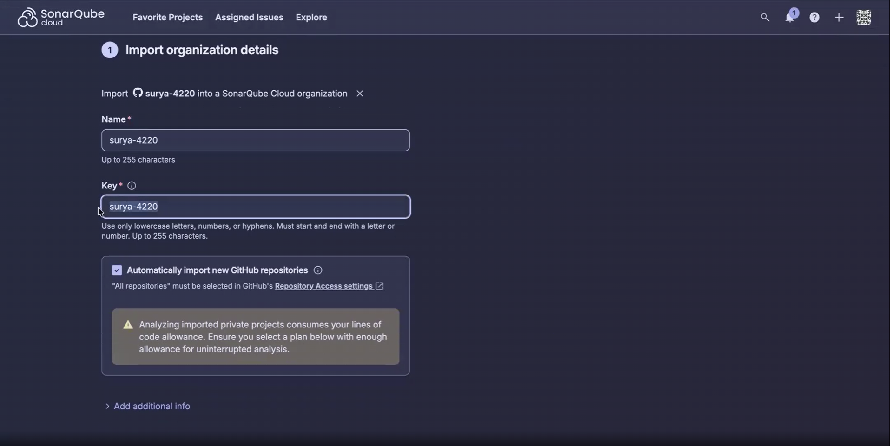
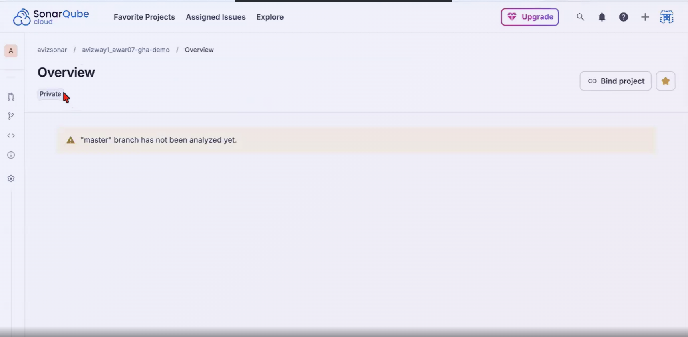
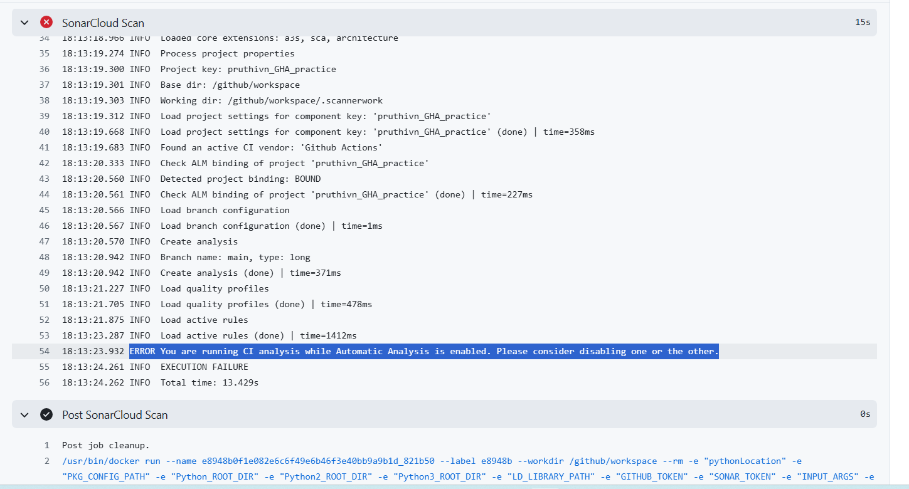
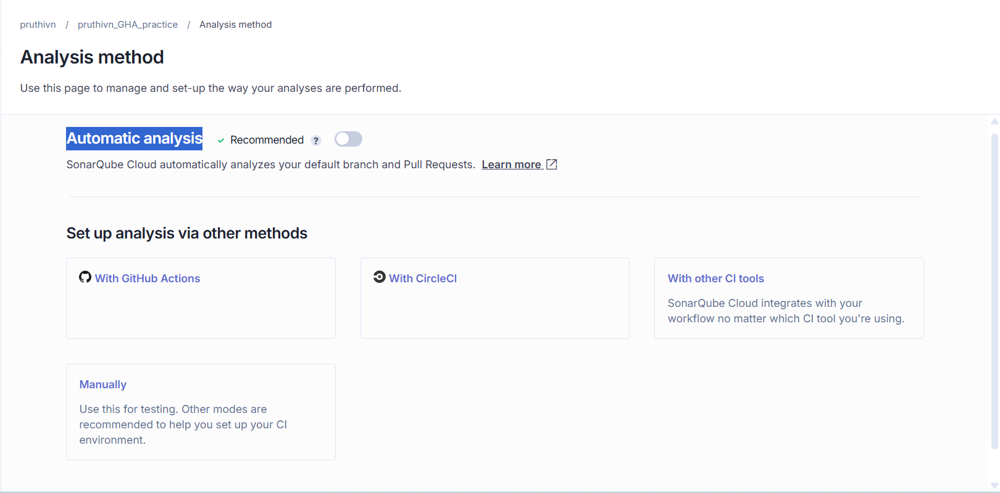

# GitHub Actions

This directory contains GitHub Actions-related DevOps interview questions and resources.

SDLC : Software development life cycle.

Waterfall methodology : 10 pages website --> We take req for 10 pages, develope 10 pages and deliver 10 pages..
Requirement --> Design --> Implementation --> Verification --> Maintenance

---

Agile methodology : 10 pages website --> We take 1 page, develope 1 pages and deliver 1 page for sprint..
Requirements --> plan --> Design --> Develop --> Release --> Track & Monitor 

Sprint Planning : Spring goal, Sprint plan, Product backlog items.. 
Daily Scrum : Daily 15 min event/meeting.. Progress towards the sprint goal.. Actionalble plan for next day..
Sprint Review : Inspect the outcome, Plan for next sprint, Plan next activities on Product backlogs..
Sprint Retrospective : Review backlog items, PLan to increase quality and efficiency

---

DevOps methodology : 
Slow release cycle
Eliminated manual build / errors
Fixed poor communication between dev team and ops team
Early issue detection

---

CICD Tools 

CI : COntineous Integration : 

CD : Contineous Delivery   : After CI, There is a manaul step added to perform the deployment
	 Contineous Deployment : After CI, Deployment will happen automatically. No manual step involved.
	 
======

github actions : CI/CD platform build into github. Track changes happening on our repo 24/7. Whenever something happens (push, pr) it automatically handles the tasks we configure.


--> Native github integration
--> YAML configuration
--> marketplace with pre-build actions
--> Multi-os : We can run/test apps across diff OS.
--> matrix build : Test across multiple version
--> 2000 Mnts/Month free for Private Repos.. Unlimited for public repos
--> No addtional dedicated tools required for Secrets management.

===

Core components of Github Actions : 

---

1. Workflow : A complete automation of our process defined in a YAML file. 
This file should be in "Repo --> .github --> workflows --> name.yml"

---

2. Event : An event is the trigger that starts our workflow.

Common event types : 
push 				: When any code is pushed to repo.
pull_request		: When a PR is created
schedule			: run at a specific time (cron)
workflow_dispatch	: Manually trigger from Github

---

3. Job : A group of steps that run on a machine (runner)

1. Verifying code quality
2. Preparing a build
3. result print

---

4. Step : A single task inside a job.

---

Runner : This is a virtual machine that executes our jobs.

Github hosted runners : ubuntu, windows, macos (Managed by GitHub)
Self-hosted runners : your ec2 instance or other manages server can be a runner.

---

## Different ways of triggering pipeline

1. on push: when you push the code to github pipeline will trigger.

```yaml
name: myfirst workflow
on: push
jobs:
```
2. when we rise PR then trigger pipeline

```yaml
name: PR workflow
on: 
  pull_request:
    branches:
      - main
jobs:
```
3. if we workflow_dispatch we manually need to trigger the pipeline in github console

```yaml
name: manual dispatch
on:                          or      # on: workflow_dispatch this also vaild
  workflow_dispatch:        
jobs:
```
4. for specific branch: pipeline will trigger only when we push the code to feature or dev branch.

```yaml
name: Push on specific branch
on: 
  push:
    branches:
      - feature
      - dev

```
5. Scheduled basis: below pipeline will trigger every mon-fri 9 am.

```yaml
name: Scheduled workflow
on: 
  schedule:
    - cron: '0 9 * * mon-fri'
```

6. Pipeline will trigger for multiple events

```yaml
name: Multiple events
on: 
    push: 
        branches: [main, demo]
    pull_request:
        branches: [main]
    workflow_dispatch:
```
## Conditional statements
In the below code if head refers/points to main then only run the job.

```yaml
jobs:
  only_on_main:
    if: github.ref == 'refs/heads/main'
    name: Only on main branch
    runs-on: ubuntu-latest
    steps:
      - name: shell script
        run: echo "running on main branch"
```
## dependency stages
we use needs key for in the below code if code stages pass then only build stage executes.
```yaml
jobs:
  code:
    runs-on: ubuntu-latest
    steps:
      - name: clone the code from github repo
        run: echo "Code cloned from the github repo"
        
  build:
    needs: [code]
    runs-on: ubuntu-latest
    steps:
      - name: Build Docker image
        run: echo "Docker image build succesfully"
```

Actions : Its a reusable piece of code that does a specific task. Using a specialised tool multiple times in our workflow.

actions/checkout@v4	--> checks out our repo code.
actions/setup-node@v6 --> Setup nodejs

=======


- uses: actions/setup-node@v6

- uses: actions/checkout@v6

actions : official namespace provided by github
checkout : This will fetches code in the workflow to access.
@v6


- name: checkour repo
  uses: actions/checkout@v6
- name: run build
  run : npm build && npm run build
  
========

## matrix in Githubactions
A matrix is a configuration strategy that lets you run a single job multiple times using different variables.
in the below example we are testing our nodejs app with differnet versions in different environments

```yaml
jobs:
  matrix-test:
    runs-on: ubuntu-latest
    strategy:
      matrix:
        os: [ubuntu-latest, windows-latest, macos-latest]
        node: [12, 14, 16]
    steps:
      - uses: actions/checkout@v4
      - name: Set up Node.js ${{ matrix.node }}
        uses: actions/setup-node@v6
        with:
          node-version: ${{ matrix.node }}
      - run: npm install
      - run: npm test.js
```

## Variables

workflow variables : $NAME, $VAR_NAME

we can define workflow varibales like above for varables stored in github we use below format.

Config Varibales : ${{ vars.VAR_NAME }}

**Note:** varaible precedence in workflow level:  steplevel > joblevel > workflowlevel

Overall vars precedence: Step Level > Job Level > Workflow Level > Environment Level > Repository Level > Organization Level

```yaml
name: Workflow level variables

on: workflow_dispatch

env:
    VAR: workflow level variable
# steplevel > joblevel > workflowlevel
#Picks from workflow level variable    
jobs:
    print-cloud:
        runs-on: ubuntu-latest
        steps:
            - name: Print cloud variable
              run: echo "I am running on $VAR"
#Job level variable overrides workflow level variable
    print-cloud-again:
        runs-on: ubuntu-latest
        env:
            VAR: job level variable
        steps:
            - name: Print cloud variable again
              run: echo "I am running on $VAR"
#Step level variable overrides job and workflow level variable
    print-cloud-step-level:
        runs-on: ubuntu-latest
        steps:
            - name: Print cloud variable again
              env:
                VAR: step level variable
              run: echo "I am running on $VAR"
#config variables are defined at the repository level and can be used across all workflows in the repository. They are accessed using the vars context and take precedence over workflow, job, and step level variables.
    print-repo-level-variable:
        runs-on: ubuntu-latest
        steps:
            - name: Print project variable 
              env:
                VAR: repository level variable
              run: echo "I am running a project named ${{ vars.VAR }}"
```

context variables : In GitHub Actions, contexts are objects that store information about your workflow runs, runner environments, jobs, and steps.

ref:https://docs.github.com/en/actions/reference/workflows-and-actions/contexts

 ```yaml
 name: context variables example

on: 
    push:
        branches:
        - "*"
jobs:
    print-cloud:
        runs-on: ubuntu-latest
        steps:
            - name: Print repo name
              run: echo "I am on this repo ${{ github.repository }}"
            - name: Print workflow name
              run: echo "I am running this workflow ${{ github.workflow }}"
            - name: Triggered by
              run: echo "Triggered by ${{ github.actor }}"
```

for secrets we call secrests in this way "{{ secrets.access_key }} we con't see secrets in logs.

```yaml
  - name: Using to test the secret variable
    run: echo "THis access key is used to access AWS environment ${{ secrets.AWS_ACCESS_KEY }}"
  - name: Using to test the secret variable-2
    run: echo "THis secret key is used to access AWS environment ${{ secrets.AWS_SECRET_KEY}}"
```
=====

# OIDC provider for connecting AWS to GithubActions

TO access AWS environment from GHA using OIDC method (Secured)

Step 1 : create OIDC provider with below info. 
Navigate to IAM in AWS click on identity providers click on add provider and add the below values in provider url and auidence section. Make sure no Blank spaces on provider url section.

provider: token.actions.githubusercontent.com

audience: sts.amazonaws.com


Step 2 : Create an IAM role for GHA.

Click on create role and then choose "web identity"

provider: token.actions.githubusercontent.com
audience: sts.amazonaws.com
GitHub organization : <provide github username>


Step 3 : Add required polcies to access resources in AWS from yaml file.

Step 4:  Create and grab the role arn

role : arn:aws:iam::655700896650:role/GHA-Role

```yaml
name: AWS OIDC example

on:
  push:
    branches: main
permissions:
  id-token: write  # Allows the workflow to request an OIDC token from GitHub.
  contents: read   # Allows the workflow to read repository files.
jobs:
  aws-access:
    runs-on: ubuntu-latest
    steps:
      - name: checkout the code
        uses: actions/checkout@v6
      - name: configure aws credentials (OIDC)
        uses: aws-actions/configure-aws-credentials@v6.1.0
        with:
          aws-region: us-east-2
          role-to-assume: arn:aws:iam::655700896650:role/GHA-Role
      - name: verify the user
        run: aws sts get-caller-identity
      - name: list s3 buckets
        run: aws s3 ls
```
**Note:** while creating identity privider we are telling aws to please save GitHub's address (https://githubusercontent.com) and public keys(aws know about keys using OIDC Discovery) in your contact list so you can trust them later.


## Runners
### github hosted runner : 
GitHub gives a VM --> THis VM runs our Job --> Destroys the VM
--> max a job can run for 6 hours

### Self-Hosted Runner : 
We can setup our own machine --> Github sends jobs to it --> Machiebe stays alive.
--> Can access private VPC / Databses
--> We can have pre-installed tools (docker, kubectl)
--> We can use IAM roles without storing any credentials at GHA.
--> We can consider for jobs that runs more than 6 hrs period.


sudo dnf update -y
while configuring the ec2 instance into a selfhosted runner it will ask some dependences we need to install those.

dnf install dotnet-sdk-8.0 libicu -y


./run.sh

sudo ./run.sh install
sudo ./run.sh start

```yaml
name: Create S3 Buckets

on:
  workflow_dispatch:
  
jobs:
  s3-list:
    runs-on: self-hosted # it will pick randomly
    steps:
      - name: list S3 bucket
        run: aws s3 ls
  
  s3-create:
    runs-on: [self-hosted, dev] # for running in a specific instance
    steps:
      - name: list S3 bucket
        run: aws s3 ls
```
if you want run a workflow in specific self-hosted runner(instance) while configuring runners realted things in ec2 instance while performing below command we need to add --lables option
```sh
./config.cmd --url https://github.com/pruthivn/GHA_practice --token AYCSRJIHCIIGC4BGUVWZFPLKIYYDK --label dev
```
then we need to mention that in yaml file see the above yaml


# reusable modules/workflows

we use workflow_call in module and use "uses" in actual/main yaml file like below.
main.yml
```yaml
name: CI Pipeline

on:
  push:
    branches: [main]
  workflow_dispatch: 

jobs:
  code-quality:
    uses: ./.github/workflows/code-quality.yml

  dependency-scan:
    uses: ./.github/workflows/dependency-scan.yml
```
dependency.yml
```yaml
name: Dependency scan

on:
  workflow_call:

jobs:
  validate:
    runs-on: ubuntu-latest

    strategy:
      fail-fast: false # if we put true if one matrix job fails rest of the matrix jobs didn't execute.
      matrix:
        python-version: [3.12]
        
    steps:
      - name: checkout code
        uses: actions/checkout@v6

      - name: Setup python 3.12
        uses: actions/setup-python@v6
        with:
          python-version: 3.12
          
      - name: Install pip-audit
        run: pip install pip-audit

      - name: Audit Dependencuies for known CVE
        run: pip-audit -r requirements.txt
```

# Tools configuration

## Git leaks

using actions we can configure gitleaks in the code we use fetch_depth = 0 (by default it is "1") then only it will scan whole repo for secrets otherwise it will only scan latest commit.

```yaml
name: Secrets Scan

on: [pull_request, push, workflow_dispatch]

jobs:
  scan:
    name: gitleaks
    runs-on: ubuntu-latest
    steps:
      - uses: actions/checkout@v6
        with:
          fetch-depth: 0  # by default it is 1 only scans latest commit for secrets.
      - uses: gitleaks/gitleaks-action@v2
        env:
          GITHUB_TOKEN: ${{ secrets.GITHUB_TOKEN }}
          GITLEAKS_LICENSE: ${{ secrets.GITLEAKS_LICENSE}} # Only required for Organizations, not personal accounts.
```

## Trivy & Dockerhub Auth

for Dockerhub access we need to create a token from dockerhub and add that token in github secrets and create a dockerhub username variable in repo env vars.

```yaml
jobs:
  docker-build-and-push:
    runs-on: ubuntu-latest
    steps:
      - name: Checkout Code
        uses: actions/checkout@v6 
        
      - name: Login to Docker Hub
        uses: docker/login-action@v4
        with:
          username: ${{ vars.DOCKERHUB_USERNAME }}
          password: ${{ secrets.DOCKERHUB_TOKEN }}

      - name: Build and push to Docker Hub
        uses: docker/build-push-action@v7
        with:
          push: true
          tags: |  # pushing image with different tags we will use anyone of these recommended sha id.
            ${{ vars.DOCKERHUB_USERNAME }}/github-actions-app:${{ github.ref_name }}
            ${{ vars.DOCKERHUB_USERNAME }}/github-actions-app:latest
            ${{ vars.DOCKERHUB_USERNAME }}/github-actions-app:${{ github.sha }}

  image-scanner:
    runs-on: ubuntu-latest
    steps:
      - name: Checkout code
        uses: actions/checkout@v6
        
      - name: Login to Docker Hub
        uses: docker/login-action@v4
        with:
          username: ${{ vars.DOCKERHUB_USERNAME }}
          password: ${{ secrets.DOCKERHUB_TOKEN }}        

      - name: Run Trivy vulnerability scanner
        uses: aquasecurity/trivy-action@v0.36.0
        with:
          image-ref: '${{ vars.DOCKERHUB_USERNAME }}/github-actions-app:latest' #This is the image name with tag build and pushed to dockerhub
          format: 'table'
          exit-code: '0' # "0" is default means even if we find the critical or high CVE's we will proceed to next step marked a passed if we use "1" if we find vulnerabilites mentioned in servinity step marked as failed.
          severity: 'CRITICAL,HIGH'
          trivyignores: ${{ github.workspace }}/.trivyignore
```
**Note:** if we are calling this workflows as modules we are using secrets in the above module we need to tell main workflow to inherit the secrets see the below yml.
using "inherit" to pass all secrets from the parent workflow to the called workflow.

Parent workflow:
```yml
name: CI Pipeline

on:
  push:
    branches: [main]

jobs:
  call-build:
    uses: ./.github/workflows/docker-build-push.yml
    secrets: inherit # without this The called workflow can't able access any secrets, and authentication will fail

  call-scan:
    needs: call-build
    uses: ./.github/workflows/image-scanner.yml
    secrets: inherit
```
## SonarQube
step-1: Goto sonarqube official website and login to sonarqube it ask repositry access give and after that it will show username and key this key is very important see the below image. best practice is use username as key as well.


step-2: goto github settings on left click on Applications and install sonarqube cloud and configure it.

step-3: after configuration you see analyse new repositry click on it it will show all your repo's select the repo after that it will perform sonar analysis on that repo.

Step-4: Create a token in sonarqube(goto your profile on leftpane click on Access tokens generate token) add that token in gitub secrets.

step-5: create a sonar-project.properties in git repo it look like below code

```yaml
# ─────────────────────────────────────────────
# SonarCloud Project Properties
# (Equivalent to -Dsonar.projectKey in your Jenkins Groovy)
# ─────────────────────────────────────────────

# Get these from SonarCloud dashboard after creating your project
sonar.projectKey=pruthivn_GHA_practice # githubusername_Reponame
sonar.organization=pruthivn            # githubusername

sonar.projectName=GHA_practice         # Reponame
sonar.projectVersion=1.0

# Source code location (. = root of repo)
sonar.sources=.

# Exclude files you don't want scanned
sonar.exclusions=**/__pycache__/**,**/*.pyc,**/migrations/**,**/tests/**

# Test files location
# sonar.tests=tests/

# Coverage report (generated by pytest-cov in workflow)
sonar.python.coverage.reportPaths=coverage.xml

# Python version
sonar.python.version=3.11
```


**Errors:** 
1. if you see the error "master branch is not analysed" 

**Resolution:** on leftpane click on branches you see 2 branches name master and main delete the main branch and rename the master branch into main branch then it will analyse the your repo.

Error:


2. if you see this error in ci pipeline " ERROR You are running CI analysis while Automatic Analysis is enabled. Please consider disabling one or the other." turn off the automatic analysis in sonarcloud.

Error:


**Resolution:**
if you not see the automatic as shown in image go to "other ci tools" option there you can find.


**Note:**
sonar.projectKey=githubusername_Reponame

sonar.organization=githubusername

sonar.projectName=Reponame

sonar yaml code

```yaml
name: SonarCloud Code Quality

on:
  push:
    branches:
      - main

jobs:
  sonarcloud:
    name: SonarCloud Analysis
    runs-on: ubuntu-latest

    steps:
      # Step 1: Checkout your code
      - name: Checkout code
        uses: actions/checkout@v6
        with:
          fetch-depth: 0  # Required by SonarCloud to analyse git history

      # Step 2: Setup Python
      - name: Setup Python 3.11
        uses: actions/setup-python@v5
        with:
          python-version: "3.11"

      # Step 3: Install dependencies
      - name: Install dependencies
        run: |
          python -m pip install --upgrade pip
          pip install -r requirements.txt
          pip install pytest pytest-cov

      # Step 4: Run tests with coverage
      # exit code 5 = "no tests found" — we allow that so the scan still runs
      - name: Run tests with coverage
        run: |
          pytest --cov=. --cov-report=xml --cov-report=term-missing || true

      # Step 5: SonarCloud Scan
      - name: SonarCloud Scan
        uses: SonarSource/sonarcloud-github-action@v3
        with:
          args: >
            -Dsonar.branch.name=main
        env:
          GITHUB_TOKEN: ${{ secrets.GITHUB_TOKEN }}   #Github provides automatically
          SONAR_TOKEN: ${{ secrets.SONAR_TOKEN }}     #Generate and store as secret in GHA
```

## ECR and ECS deplooyment with GHA


region : ap-south-1
repo : gha-ecrdeploy
role : arn:aws:iam::655700896650:role/GHA-Role


aws ecr get-login-password --region ap-south-1 | docker login --username AWS --password-stdin 655700896650.dkr.ecr.ap-south-1.amazonaws.com
the above step was done by amazon-ecr-login action.

docker build -t gha-ecrdeploy .

docker tag gha-ecrdeploy:latest 655700896650.dkr.ecr.ap-south-1.amazonaws.com/gha-ecrdeploy:latest

docker push 655700896650.dkr.ecr.ap-south-1.amazonaws.com/gha-ecrdeploy:latest


echo "ECR_REGISTRY=${{ steps.login-ecr.outputs.registry }}" >> $GITHUB_ENV
we have step called login-ecr it will login into ecr and it contains some registry details and other info in form of output from that we are getting registry info and storing it as env variable see the below code.

```yaml
name: Reusable - Docker Build and Push to ECR

on:
  workflow_call:
    inputs:
      aws-region:
        description: "AWS region where ECR is hosted"
        required: false
        type: string
        default: "ap-south-1"
    outputs:
      image-uri:
        description: "Full ECR image URI that was pushed (ACCOUNT.dkr.ecr.REGION.amazonaws.com/REPO:SHA)"
        value: ${{ jobs.docker-build-push.outputs.image-uri }}

permissions:
  id-token: write
  contents: read
jobs:
  docker-build-push:
      name: Build and push to ECR
      runs-on: ubuntu-latest
      needs: dockerfile-lint

      outputs:
        image-uri: ${{ steps.build-push.outputs.image-uri }}

      steps:
        - name: Checkout code
          uses: actions/checkout@v4

        - name: Configure AWS credentials (OIDC)
          uses: aws-actions/configure-aws-credentials@v4
          with:
            aws-region: ${{ inputs.aws-region }}
            role-to-assume: ${{ secrets.AWS_ROLE_ARN }}

        - name: Login to Amazon ECR
          id: login-ecr
          uses: aws-actions/amazon-ecr-login@v2

        - name: Build, tag and push to ECR
          id: build-push
          env:
            ECR_REGISTRY: ${{ steps.login-ecr.outputs.registry }}
            ECR_REPOSITORY: ${{ secrets.ECR_REPO_NAME }}
            IMAGE_TAG: ${{ github.sha }}
          run: |
            IMAGE_URI="$ECR_REGISTRY/$ECR_REPOSITORY:$IMAGE_TAG"

            docker build -t "$IMAGE_URI" .
            docker tag  "$IMAGE_URI" "$ECR_REGISTRY/$ECR_REPOSITORY:latest"

            docker push "$IMAGE_URI"
            docker push "$ECR_REGISTRY/$ECR_REPOSITORY:latest"

            echo "image-uri=$IMAGE_URI" >> $GITHUB_OUTPUT
```

======

region : ap-south-1
repo : gha-ecrdeploy
role : arn:aws:iam::655700896650:role/GHA-Role
task def : my-gha-python
ecs cluster : myecsdemo
container name: mypythonapp
ecs service name: my-gha-python-service-ly7a0301

we need to store all above variables in github as secrets and env vars.


aws ecs describe-task-definition \
  --task-definition my-gha-python \
  --query 'taskDefinition.containerDefinitions[].name'

we need to download task definition file from ecs because we need to made a revision to add the new image name in task definition file.

```yaml

jobs:
  deploy:
    name: Deploy to ECS (${{ inputs.environment }})
    runs-on: ubuntu-latest
    environment: ${{ inputs.environment }}

    steps:
      - name: Checkout code
        uses: actions/checkout@v4

      - name: Configure AWS credentials (OIDC)
        uses: aws-actions/configure-aws-credentials@v4
        with:
          aws-region: ${{ inputs.aws-region }}
          role-to-assume: ${{ secrets.AWS_ROLE_ARN }}

      - name: Login to Amazon ECR
        id: login-ecr
        uses: aws-actions/amazon-ecr-login@v2

      - name: Download current ECS task definition
        run: |
          aws ecs describe-task-definition \
            --task-definition "${{ secrets.ECS_TASK_DEF_NAME }}" \
            --query taskDefinition \
            --output json > task-def.json

      - name: Inject new image URI into task definition
        id: task-def
        uses: aws-actions/amazon-ecs-render-task-definition@v1
        with:
          task-definition: task-def.json
          container-name: ${{ secrets.ECS_CONTAINER_NAME }}
          image: ${{ steps.login-ecr.outputs.registry }}/${{ secrets.ECR_REPO_NAME }}:${{ github.sha }}

      - name: Deploy to ECS service
        uses: aws-actions/amazon-ecs-deploy-task-definition@v2
        with:
          task-definition: ${{ steps.task-def.outputs.task-definition }}
          service: ${{ secrets.ECS_SERVICE_NAME }}
          cluster: ${{ secrets.ECS_CLUSTER_NAME }}
          wait-for-service-stability: true
```
=================

## ECS End to end pipeline : 

https://github.com/avizway1/awar07-gha-demo-uat

my own repo:
https://github.com/pruthivn/GHA_ECS_pipeline.git

## slack webhook for notification.
1. Create webhook from slack(goto channels click on integration add apps search for webhook click on incoming webhook click on configure(if you not installed it will install) click on edit you webhookurl copy the url and store in github secrets.)

2. Store that in git repo secrets.

```yaml
name: Reusable - Slack Notification

on:
  workflow_call:
    inputs:
      status:
        description: "Overall pipeline status: success | failure | cancelled"
        required: true
        type: string
      pipeline-name:
        description: "Display name of the pipeline"
        required: false
        type: string
        default: "CI/CD Pipeline"
      environment:
        description: "Environment that was deployed (leave empty if no deploy ran)"
        required: false
        type: string
        default: ""
    secrets:
      SLACK_WEBHOOK_URL:
        required: true

jobs:
  notify:
    name: Notify Slack
    runs-on: ubuntu-latest

    steps:
      - name: Send Slack notification
        uses: slackapi/slack-github-action@v2.0.0
        with:
          webhook: ${{ secrets.SLACK_WEBHOOK_URL }}
          webhook-type: incoming-webhook
          payload: |
            {
              "text": "${{ inputs.status == 'success' && ':white_check_mark:' || inputs.status == 'failure' && ':x:' || ':warning:' }} *${{ inputs.pipeline-name }}* — ${{ inputs.status }}${{ inputs.environment != '' && format(' ({0})', inputs.environment) || '' }}",
              "attachments": [
                {
                  "color": "${{ inputs.status == 'success' && '#2eb886' || inputs.status == 'failure' && '#cc0000' || '#e8a400' }}",
                  "fields": [
                    { "title": "Repository",   "value": "${{ github.repository }}", "short": true },
                    { "title": "Branch",        "value": "${{ github.ref_name }}",  "short": true },
                    { "title": "Triggered by",  "value": "${{ github.actor }}",     "short": true },
                    { "title": "Commit SHA",    "value": "${{ github.sha }}",       "short": true },
                    {
                      "title": "Run",
                      "value": "<${{ github.server_url }}/${{ github.repository }}/actions/runs/${{ github.run_id }}|View run>",
                      "short": false
                    }
                  ]
                }
              ]
            }
```

## EKS deployment with Github Actions

1. add the EKS describe permissions to Github actions role and provide cluster access to that role by adding in EKS cluster access tab.


```yaml
name: Deploy to EKS

on:
  push:
    branches: main
  workflow_dispatch: 

permissions:
  id-token: write
  contents: read

jobs:
  aws-access:
    runs-on: ubuntu-latest
    steps:
      - name: checkout the code
        uses: actions/checkout@v6
      - name: configure aws credentials (OIDC)
        uses: aws-actions/configure-aws-credentials@v6
        with:
          aws-region: ${{ secrets.AWS_REGION }}
          role-to-assume: ${{ secrets.AWS_ROLE_ARN }}
          role-session-name: GithubActions-EKS-Deploy
      - name: Update the Kubeconfig for EKS
        run: |
          aws eks update-kubeconfig --region ${{ secrets.AWS_REGION }} --name ${{ secrets.EKS_CLUSTER_NAME }}
      - name: verify EKS Nodes
        run: |
          kubectl get nodes
          echo "Testing kubectl to fetch nodes"
      - name: Deploy manifest to EKS
        run: | 
          kubectl apply -f k8s/ --namespace=${{ secrets.EKS_NAMESPACE }}
      - name: verify rollouts
        run: | 
          kubectl rollout status deployment --namespace=${{ secrets.EKS_NAMESPACE }} --timeout=120s
      - name: verify pods
        run: | 
          kubectl get pods -n ${{ secrets.EKS_NAMESPACE }}
```