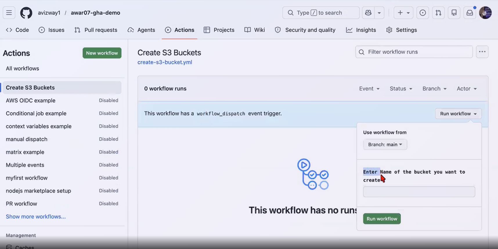

# GitHub Actions Scenarios

## i want to create a S3 bucket with Github actions but i don't want to hardcode the bucket name and i need to give the bucket name while running the pipline?
A. we can achieve this using workflow_dispatch(we manually need to trigger the pipeline).

```yaml
name: Create S3 Buckets

on:
  workflow_dispatch:
    inputs:
      bucket_name:
        description: 'Enter Name of the bucket you want to create'
        required: true # defintely provide the bucket name
        type: string
permissions:
  id-token: write
  contents: read
jobs:
  s3-create:
    runs-on: ubuntu-latest
    steps:
      - name: configure aws credentials (OIDC)
        uses: aws-actions/configure-aws-credentials@v6.1.0
        with:
          aws-region: ap-south-1
          role-to-assume: arn:aws:iam::655700896650:role/GHA-Role
      - name: Create S3 bucket
        run: |                              
          aws s3 mb s3://${{ github.event.inputs.bucket_name }} --region ap-south-1 
          aws s3 ls | grep ${{ github.event.inputs.bucket_name }}
          aws s3 ls
```



## 2. how to call a reusable module available in other repo?
using below format we are calling a workflow from a repo name called "shared-repo" into our current workflow.
**syntax:** owner/shared-repo-name/.github/workflows/file.yml@branch-or-tag

**Note:** we need to enable the permissions to access the workflow from shared-repo
open settings in shared-repo Settings > Actions > General and select the below permissions
"Accessible from repositories in the same organization"

```yaml
jobs:
  call-shared-workflow:
    # Syntax: owner/shared-repo-name/.github/workflows/file.yml@branch-or-tag
    uses: your-github-username/shared-repo/.github/workflows/shared-task.yml@main
```

## what is repository_dispatch?
A. if we run our pipline in repoA and this will trigger the other pipeline in repoB the repoB pipeline will run in repoB only it is not like shared repo concept it is like an event triggerng a pipeline to run in its own repo.(just like if we get a data in S3 how a lambda func process the data using event bridges)
Ex: i have 2 repo's A and B if repoA pipelines runs repoB pipeline also runs

Step1: Generate a GitHub Personal Access Token (PAT) with "repo" or "actions:write" permissions. go to repoA and store that PAT token in secrets.

RepoB pipeline:
```yaml
# File path in Shared Repo: .github/workflows/remote-receiver.yml
name: Shared Remote Processor

on:
  repository_dispatch:
    # The workflow only wakes up if the incoming event matches this exact string
    types: [deploy-event]

jobs:
  run-shared-logic:
    runs-on: ubuntu-latest
    steps:
      - name: Print Data Received From The Other Repo
        run: |
          echo "Triggered by: ${{ github.event.client_payload.triggered_by }}"
          echo "Target Environment: ${{ github.event.client_payload.env }}"
          echo "Commit SHA: ${{ github.event.client_payload.sha }}"
```
RepoA Pipeline:
```yaml
# File path in Actual Actions Repo: .github/workflows/trigger-shared.yml
name: Trigger Remote Shared Repo

on:
  push:
    branches: [ main ]

jobs:
  ping-shared-repo:
    runs-on: ubuntu-latest
    steps:
      - name: Send API Signal to Shared Repo
        uses: peter-evans/repository-dispatch@v3
        with:
          # 1. Provide the PAT secret you created in Step 1
          token: ${{ secrets.MY_CROSS_REPO_PAT }}
          
          # 2. State the destination target (username/repo-name)
          repository: your-github-username/shared-repo
          
          # 3. This MUST perfectly match the 'types' array in the Shared Repo
          event-type: deploy-event
          
          # 4. Pass any custom JSON data you want the Shared Repo to use
          client-payload: |
            {
              "triggered_by": "${{ github.actor }}",
              "env": "production",
              "sha": "${{ github.sha }}"
            }
```

## 3. My pipeline is running morethan 1 hour but pipeline is failing due to OIDC token expiry how to resolve this issue?
A. The token used for OIDC Auth is last for 5 min it is used for initial Authentication. we can't increase the time for it but we can increase our cloud session see the below code.

**Note:** we need to increase the IAM role session Duration as well. we can modify it through console and using aws cli commnand as well.
```sh
aws iam update-role \
    --role-name MyGitHubActionsRole \
    --max-session-duration 43200 # in seconds current value is 12 hours
```

```yaml
- name: Configure AWS Credentials
  uses: aws-actions/configure-aws-credentials@v3
  with:
    role-to-assume: arn:aws:iam::123456789012:role/my-github-actions-role
    aws-region: us-east-1
    role-duration-seconds: 3600 # 1 hour (Default is 3600, max is 43200)
```

## How to Deploy resources into different aws accounts?
A. i will provide step by step approach for Central base role creation soon.

```yaml
name: Deploy Multi-Account Infrastructure
on:
  push:
    branches: [ main ]

permissions:
  id-token: write   # MANDATORY: Required to request the OIDC JWT token from GitHub
  contents: read    # Required to checkout the source repository code

jobs:
  deploy-dev:
    runs-on: ubuntu-latest
    steps:
      - name: Checkout Code
        uses: actions/checkout@v4

      - name: Authenticate to AWS Dev Account via OIDC Role Chaining
        uses: aws-actions/configure-aws-credentials@v4
        with:
          # 1. Log into the Central Base Role via OIDC Web Identity
          role-to-assume: arn:aws:iam::IDENTITY_ACCOUNT_ID:role/github-actions-base-execution-role
          aws-region: us-east-1
          
          # 2. Chain directly into the Target Dev Account Role immediately
          audience: sts.amazonaws.com
          role-chaining: true
          role-to-assume-cross-account: arn:aws:iam::DEV_ACCOUNT_ID:role/github-target-deployment-role

      - name: Run Terraform for Dev
        run: |
          terraform init
          terraform apply -auto-approve

  deploy-prod:
    runs-on: ubuntu-latest
    needs: deploy-dev
    steps:
      - name: Checkout Code
        uses: actions/checkout@v4

      - name: Authenticate to AWS Prod Account via OIDC Role Chaining
        uses: aws-actions/configure-aws-credentials@v4
        with:
          role-to-assume: arn:aws:iam::IDENTITY_ACCOUNT_ID:role/github-actions-base-execution-role
          aws-region: us-east-1
          audience: sts.amazonaws.com
          role-chaining: true
          # Chains directly into the Production Account Role instead
          role-to-assume-cross-account: arn:aws:iam::PROD_ACCOUNT_ID:role/github-target-deployment-role

      - name: Run Terraform for Prod
        run: |
          terraform init
          terraform apply -auto-approve
```