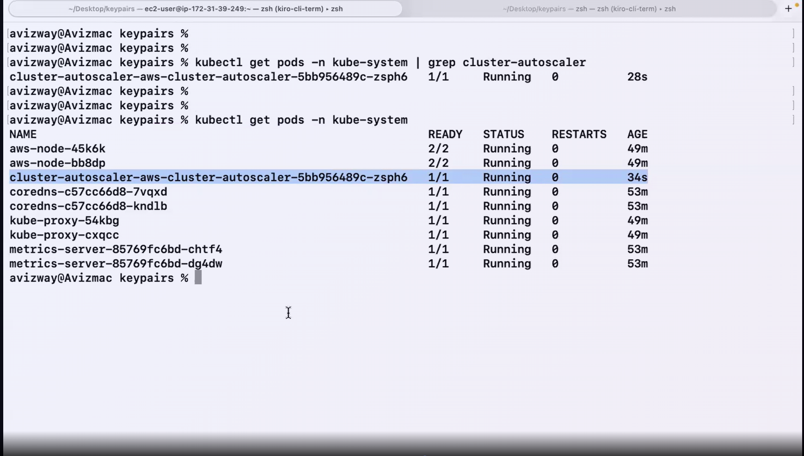
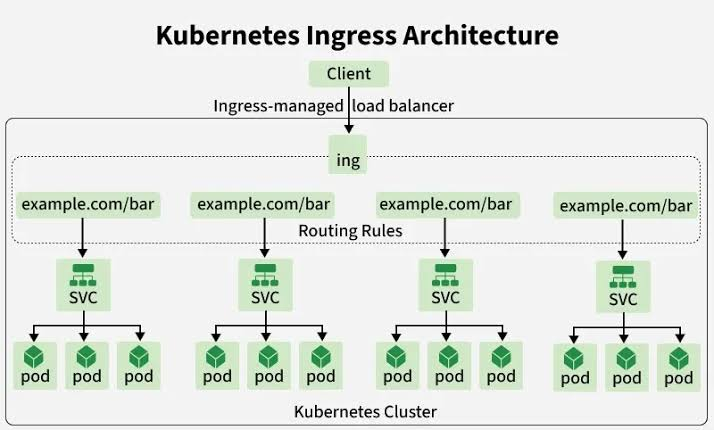
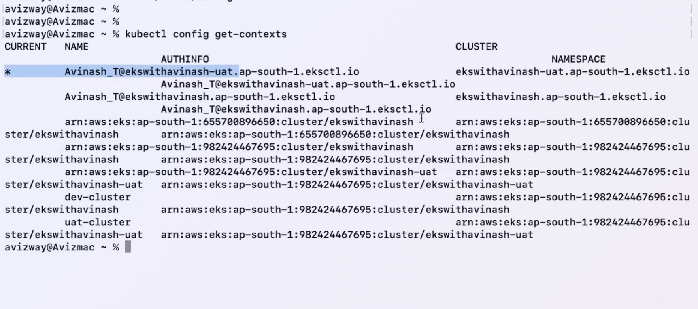

# Kubernetes Stateful set:
In the below picture you can see the 6/6 in Ready column for pods "ebs-csi-controller" means 6 containers are running that pod if we use describe pod command for "ebs-csi-controller" in kube-system namspace you will get detailed info of those 6 containers.
A pod can contain N number of containers.

**Note:** in K8's resource creation takes more priority than deletion
## How to attach EBS volume to a Pod?
**Answer:**  
Step 1 : First we will create a service account this name 'ebs-csi-controller-sa' if we are using EBS volume we can use other name also but we need to override the name using the "controller.serviceAccount.name" parameter in the official aws-ebs-csi-driver Helm chart, but you will then have to manually rewrite your AWS IAM Trust Policy to match the new string exactly.
--> Using below command we will create service account in eks cluster and attaches ebs driver policy to service role automatically created by EKS service.

eksctl create iamserviceaccount --name ebs-csi-controller-sa --namespace kube-system --cluster ekswithavinash --attach-policy-arn arn:aws:iam::aws:policy/service-role/AmazonEBSCSIDriverPolicy --approve

Step 2 : Using this command we will add ebs-csi-driver to our EKS cluster we con do it through console as well.

eksctl create addon --name aws-ebs-csi-driver --cluster ekswithavinash --force


Step 3 : Create a storageclass that can be provisoned dynamically.

```yaml
apiVersion: storage.k8s.io/v1
kind: StorageClass
metadata:
  name: fast-ssd
provisioner: kubernetes.io/aws-ebs
volumeBindingMode: WaitForFirstConsumer
reclaimPolicy: Delete
allowVolumeExpansion: true
parameters:
  type: gp3
  iops: "3000"
```

Provisioner : which csi driver creates the volume   
parameters.type: EBS volume type (gp2, gp3, io1)  
volumeBindingMode : it has 2 types Create volume in same AZ as Pod  
1. Immediate: Provisioning happens as soon as the PVC is created.
2. WaitForFirstConsumer: Postpones provisioning until a Pod using the PVC is created then Create volume in same AZ as Pod.
reclaimPolicy :   	
	Delete: Remove PV when PVC is deleted. 
	Retain : Keep PV when PVC is deleted. 

AccessModes: This access mode available in volumeClaimTemplates used in stateful set.  
RWO : ReadWriteOnce : One node can read/write. (gp2, gp3, io1) - EBS Supports  
RWX : ReadWriteMany : Multiple Nodes can read/write (EFS, NFS)  
ROX : ReadOnlyMany  : Multiple nodes can read only   

while using efs we will attach one storage to multile pods if we want to sync the storage data across the pods if we are taking mysql we will make one copy as primary and other as read operation we will config like this. (do serach in web for clearly understanding.)

Step 4 : StatefulSets required Headless service.

**Headless servcie:** We need to set ClusterIP as None to create a headless service. THis headless service gives each pod its own DNS name instead of a single service IP.  
** With headless service, each pod becomes individually addressable


```yaml
apiVersion: v1
kind: Service
metadata:
  name: my-headless-service
  namespace: default
spec:
  clusterIP: None
  selector:
    app: my-sql # using this identify the pods provide the statefu set name
  ports:
    - protocol: TCP
      port: 80
      targetPort: 8080

---
apiVersion: apps/v1
kind: StatefulSet
metadata:
  name: my-sql
spec:
  serviceName: "my-headless-service"  # we need to give the same name what we defined in the headless service
  replicas: 2                         # 2 replicas of my-sql pods with names my-sql-0 & my-sql-1 if 3 pods next one will be 3 it will give persistent names 
  selector:                           # if we delete one pod like delted mysql-0 it will create new pod with the same name.
    matchLabels:
      app: web-app
  template:
    metadata:
      labels:
        app: web-app
    spec:
      containers:
      - name: app-container
        image: nginx:latest
        volumeMounts:
        - name: app-data
          mountPath: /usr/share/nginx/html   # we are mounting the ebs volume this path inside the container
  volumeClaimTemplates:
  - metadata:
      name: app-data
    spec:
      accessModes: [ "ReadWriteOnce" ]
      storageClassName: "fast-ssd"      # provide the storage class name what we gave in the storage class yaml
      resources:
        requests:
          storage: 10Gi                 # we will get 2 different ebs volumes for 2 pods if it is 3 pods will get 3 different volumes.
```
sts = shrort form for statefulsets
kubectl get statefulsets
kubectl get sts
kubectl get sts
kubectl describe sts <name>

kubectl get pvc
kubectl get pv

## What is Headless service?
*Answer:** **Headless servcie:** We need to set ClusterIP as None to create a headless service. THis headless service gives each pod its own DNS name instead of a single service IP.  
```yaml
apiVersion: v1
kind: Service
metadata:
  name: my-headless-service
  namespace: default
spec:
  clusterIP: None
  selector:
    app: my-web-app  # using this identify the pods
  ports:
    - protocol: TCP
      port: 80
      targetPort: 8080
```
** With headless service, each pod becomes individually addressable
--> flow of normal service v/s headless service
Normal Service:
Client ──> [ClusterIP] ──> [kube-proxy (Load Balancer(Random or round robin ))] ──> Pod IP

Headless Service:
Client ──(Asks CoreDNS for IPs)──> Returns [Pod1 IP, Pod2 IP, Pod3 IP]
Client ──────────────────────(Direct Connection)──────────────────────> Pod1 IP


# Helm Charts
**Helm is a package manager for K8s like dnf/yum for linux and npm for node.js**

--> Instead of writing and managing multiple YAML file manually, you use a helm chart - a prep packaged collection of k8s resources.

**prerequisite:** We need to login to docker hub to install helm charts.
chart : A package of k8s resources template

Repository : A place where charts are stored (https://artifacthub.io/ / local)

release : A running instance of a chart in our k8s cluster (v1 v2)

Values : Configuration that customizes a chart at installation time.


windows: 
1. Install choco (https://chocolatey.org/)
2. Install helm (choco install kubernetes-helm)

Mac: brew install helm

Linux: curl https://raw.githubusercontent.com/helm/helm/main/scripts/get-helm-4 | bash

verify: helm version


helm repo add bitnami https://charts.bitnami.com/bitnami		--> Adding bitnami repo to local

helm repo list								--> shows installed repo list			

helm repo update							--> update the repos

helm search repo nginx						--> search for repo using cli


helm pull bitnami/nginx	--untar --> used to pull the nginx repo to check what is there in that repo

* chart.yaml		--> Chart metadata
* values.yaml		--> we will mention our values(like image names, versions and other values) to override the default values
* templates			--> K8s YAML templates


helm ls				--> List installed releases
helm ls -A			--> list from all namespaces
Make sure to login to docker "docker login"

helm install my-nginx bitnami/nginx						--> Install binami managed helm chart in our k8s environment, and helm name it as "my-nginx"

helm install my-nginx bitnami/nginx --version 23.0.0	--> Install with specific version

helm upgrade my-nginx bitnami/nginx --set replicaCount=4	--> Imperatively/explicitly pass the value

helm upgrade my-nginx bitnami/nginx -f values.yaml			--> Adjust the values file then deploy

helm history my-nginx					--> Shows my-nginx app history

helm rollback my-nginx 2				--> We can rollback to previous version

helm uninstall my-nginx					--> 


helm install my-nginx bitnami/nginx -f values.yaml --dry-run --debug

helm install mynodeapp ./mynodeapp  --> used to install our app 

helm upgrade mynodeapp ./mynodeapp --description "Adjusting pod count to 3"


helm show values mynodeapp 
helm get values mynodeapp --revision 3


## Horizontal Pod Autoscaler(HPA):
It is used increase the pod replicas according load on CPU
In the below manifest we have a deployment called 3 pod replicas(cpu 100m) and configured the HPA with 60% The HPA controller queries the Metrics Server and sees the 3 running pods CPU usage like Pod A: 70m (70% utilization) Pod B: 80m (80% utilization)
Pod C: 90m (90% utilization) so average usage is 80% and 
HPA Formula

```math
\text{desiredReplicas} = \left\lceil currentReplicas× \times \left(\frac{currentMetricValue\%}{desiredMetricValue\%}\right)\right\rceil
= \left\lceil 3 \times \left(\frac{80\%}{60\%}\right)\right\rceil
= \left\lceil 3 \times 1.333\right\rceil
= \left\lceil 4.0\right\rceil
= 4
```
so HPA Scale to 4 pods.
by default every 15 seconds it will check metrics If average CPU crosses your 60% threshold (and is outside the 10% tolerance) will create new replica.
### Scale up behaviour
By default, the tolerance is set to 0.1 (10%). '''math $$0.9 \le \text{Ratio} \le 1.1$$ ''' it completely skips autoscaling.
EX: Your Target CPU: 60% The Safe Zone: 10% below 60% is 54%, and 10% above 60% is 66%.
1. if your cpu usage is 64 64/60 is 1.066 no pod replica created.
2. if your cpu usage is 72 72/60 is 1.2 greater than 10% tolerance pod replica created.

### Scale down Behaviour
By default, the HPA looks back at a 5-minute window if the cpu usage is under desired thresold it will remove the pod gracefully.

```yaml
apiVersion: apps/v1
kind: Deployment
metadata:
  name: web-app
  namespace: default
spec:
  replicas: 3 # Initial starting pod count
  selector:
    matchLabels:
      app: web-app
  template:
    metadata:
      labels:
        app: web-app
    spec:
      containers:
      - name: application
        image: nginx:latest
        resources:
          requests:
            cpu: "100m"  # Required baseline for HPA calculation
          limits:
            cpu: "200m"
---
apiVersion: autoscaling/v2
kind: HorizontalPodAutoscaler
metadata:
  name: web-app-hpa
  namespace: default
spec:
  scaleTargetRef:
    apiVersion: apps/v1
    kind: Deployment    # if it is pod we will give pod here
    name: web-app
  minReplicas: 2
  maxReplicas: 10
  metrics:
  - type: Resource
    resource:
      name: cpu
      target:
        type: Utilization
        averageUtilization: 60
    behavior:
    scaleDown:
      stabilizationWindowSeconds: 60  # Reduces scale-down wait from 5 mins to 1 min
```

## EKS cluster Auto scaling

Cluster Auto Scaler implementation guide: 
https://github.com/avizway1/k8s/blob/main/07-%20eks-cluster-autoScaler.md

Add below polocies to EKS Node's IAM roles:
1. AmazonEKSComputePolicy
2. AutoScalingFullAccess
Need to provide above policies to automatically create the ASG to scale nodes then Navigate to AutoScaling group and adjust the max instance count.

We need below helm repo to install the Cluster Autoscaler for Kubernetes. Cluster Autoscaler automatically scale the nodes when load is increased.

helm repo add autoscaler https://kubernetes.github.io/autoscaler

helm repo update

helm install cluster-autoscaler autoscaler/cluster-autoscaler \
  --namespace kube-system \
  --set autoDiscovery.clusterName=<cluster_name> \
  --set awsRegion=ap-south-1 \
  --set extraArgs.balance-similar-node-groups=true \
  --set extraArgs.skip-nodes-with-system-pods=false


autoDiscovery.clusterName=<cluster-name>: Enables automatic node discovery for the specified EKS cluster.
awsRegion=<region-code>: Set your AWS region, e.g., ap-south-1 (Mumbai).
balance-similar-node-groups=true: Distributes workloads evenly across node groups.
skip-nodes-with-system-pods=false: Ensures system pods do not block node termination.

kubectl get pods -n kube-system | grep cluster-autoscaler

in the below img you can see the Cluster Auto scaler pod is running. this pod will take care of autoscaling in cluster.


kubectl scale deployment php-apache --replicas=10

## How many pods we can run in a ec2 instance?
**Answer:** '''math \(\text{Max\ Pods}=(\text{Number\ of\ ENIs}\times (\text{IPs\ per\ ENI}-1))+2\) '''

| EC2 Instance Type | Max ENIs | IPv4 Addresses per ENI | Default Max Pods |
|-------------------|----------|-------------------------|-------------------|
| t3.large / t2.large | 3 | 12 | 35 |

## Did you use VPA in your Prod workload?
A. mostly we don't use VPA in Prod workload.

## Goldilocks app performance test tool

Goldilocks is an opensource tool to identify suitable workload configurations.

helm repo add fairwinds-stable https://charts.fairwinds.com/stable

kubectl create ns goldilocks ---> recomended to create namespace for goldilocks

helm install goldilocks --namespace goldilocks fairwinds-stable/goldilocks --version 10.3.0


--> add a label to the namespaces you want to monitor using goldilocks.

kubectl label ns default goldilocks.fairwinds.com/enabled=true
kubectl label ns goldilocks goldilocks.fairwinds.com/enabled=true

kubectl -n goldilocks port-forward svc/goldilocks-dashboard 8080:80

---
repo for VPA: 
git clone https://github.com/kubernetes/autoscaler.git
follow below markdown to test VPA
https://github.com/avizway1/k8s/blob/main/08-%20vpa%20and%20Goldilocks.md


## Deployment Strategies in K8's?

```yaml
apiVersion: apps/v1
kind: Deployment
metadata:
  name: demo-app
spec:
  replicas: 4
  strategy:
    type: RollingUpdate   # if we want canary strategy will change to canary
    rollingUpdate:
      maxSurge: 1        # Allow 1 extra pod during update → 5 pods briefly
      maxUnavailable: 1  # Allow 1 pod to be down → minimum 3 always running
  selector:
    matchLabels:
      app: demo-app
  template:
    metadata:
      labels:
        app: demo-app
    spec:
      containers:
        - name: app
          image: avizway/app:v2   # ← Change to :v2 or :v3 to trigger rolling update
          ports:
            - containerPort: 5000
          env:
            - name: NODE_NAME       # Downward API — pod learns its own node name
              valueFrom:
                fieldRef:
                  fieldPath: spec.nodeName
            - name: POD_NAMESPACE
              valueFrom:
                fieldRef:
                  fieldPath: metadata.namespace
          readinessProbe:
            httpGet:
              path: /health
              port: 5000
            initialDelaySeconds: 5
            periodSeconds: 5
---
apiVersion: v1
kind: Service
metadata:
  name: demo-app-svc
spec:
  type: LoadBalancer
  selector:
    app: demo-app
  ports:
    - port: 80
      targetPort: 5000
```

**Rolling update:** it is k8's default updating strategy.

Downtime: None
Risk: low

if we didn't provide max_surge & max_unavailable K8s picks 25% of our replica count as "maxSurge" & 25% of our replica count as "maxUnavailable"


kubectl rollout status deployment/demo-app  

kubectl rollout history deployment/demo-app  

kubectl rollout undo deployment/demo-app  

kubectl rollout undo deployment/demo-app --to-revision=1 --> to rollback to specific revision

kubectl rollout restart deployment/demo-app

---

Recreate Deployment : The entire ols version will be deleted, then new version starts. 

brief downtime expected here.
Medium: risk

kubectl rollout history deployment/demo-app 

kubectl rollout undo deployment/demo-recreate

---

Blue/Green Deployment

Blue = Current live version
Green = New version

At a time, we need to have 2 environments up and running.. We can use service to switch to "blue / green"..
for a period of time, you should have 2x pods/cost..

```yaml
# ── BLUE Deployment (current live) ─────────────────────────────
apiVersion: apps/v1
kind: Deployment
metadata:
  name: demo-blue
spec:
  replicas: 3
  selector:
    matchLabels:
      app: demo-bg
      version: blue
  template:
    metadata:
      labels:
        app: demo-bg
        version: blue
    spec:
      containers:
        - name: app
          image: avizway/app:blue
          ports:
            - containerPort: 5000
          env:
            - name: NODE_NAME
              valueFrom:
                fieldRef:
                  fieldPath: spec.nodeName
            - name: POD_NAMESPACE
              valueFrom:
                fieldRef:
                  fieldPath: metadata.namespace
---
# ── GREEN Deployment (new version) ─────────────────────────────
apiVersion: apps/v1
kind: Deployment
metadata:
  name: demo-green
spec:
  replicas: 3
  selector:
    matchLabels:
      app: demo-bg
      version: green
  template:
    metadata:
      labels:
        app: demo-bg
        version: green
    spec:
      containers:
        - name: app
          image: avizway/app:green
          ports:
            - containerPort: 5000
          env:
            - name: NODE_NAME
              valueFrom:
                fieldRef:
                  fieldPath: spec.nodeName
            - name: POD_NAMESPACE
              valueFrom:
                fieldRef:
                  fieldPath: metadata.namespace
---
# ── Service — THE SWITCH ────────────────────────────────────────
apiVersion: v1
kind: Service
metadata:
  name: demo-bg-svc
spec:
  type: LoadBalancer
  selector:
    app: demo-bg
    version: blue     # ← This is the only thing you change to flip traffic
  ports:
    - port: 80
      targetPort: 5000
```

---

Canary Deployment : We can send small % of real user requests to canary version, then we can gradually increase it for everyone.

Multiple deployments required.. 

10 pods:
9 pods -> v1 (stable)
1 pod -> canary

If canary works good.. then extend some portion..
7 pods -> stable
3 pods -> canary

finally:
0 pods -> v1
10 pods -> canary


## Deployment controlls


eksctl utils associate-iam-oidc-provider --region ap-south-1 --cluster ekswithavinash --approve


Node Affinity : Choose which nodes pods prefer/require. 
Control which nodes you pods should run on, Based on "node labels".

kubectl get nodes
kubectl get nodes --show-labels
kubectl describe nodes <name>

kubectl get pods -o wide

kubectl label nodes <node-name> disktype=ssd

We have 2 options on Node Affinity :

1. Hard Rule: Pod must run on a matching node, if no match found, it stays pending.
requiredDuringScheduling

2. Soft Rule : Pod prefer matching nodes but it will run even if no node has the label.
preferredDuringScheduling

IgnoreDuringExecution : Running pods won't be evicted if labels change. if we remove the node label after running the pods with this label "RequiredDuringSchedulingIgnoredDuringExecution" the pods still run in those nodes.

RequiredDuringExecution: to overcome the above issue k8's introduced this but it is not widely used.


ip-192-168-3-17.ap-south-1.compute.internal    Ready    <none>   5m13s   v1.34.6-eks-bbe087e
ip-192-168-36-39.ap-south-1.compute.internal   Ready    <none>   5m12s   v1.34.6-eks-bbe087e


kubectl label nodes ip-192-168-3-17.ap-south-1.compute.internal disktype=ssd

kubectl describe nodes ip-192-168-3-17.ap-south-1.compute.internal
## Taint and Toleration:

Taint (node) : like a bus seat, marked as "reserved"
Tolaration (pod) : the special pass that lets the user to sit on "reserved" seat.

Effects:
NoSchedule : New pods wont be scheduled here
PreferNoSchedule : k8s avaoids scheduling here, but its not strict
NoExecute : Existing pods without tolaration are evicted.

```yaml
apiVersion: v1
kind: Pod
metadata:
  name: db-pod-2
spec:
  nodeSelector:
    disktype: ssd
  tolerations:
    - key: "role"           # the taint key on the node ( see the command)
      operator: "Equal"     # he pod must match the taint value exactly.
      value: "db"
      effect: "NoSchedule"  # this allows the pod to be scheduled on a tainted node, but only for this kind of taint.
  containers:
    - name: mysql
      image: mysql:8.0
      env:
        - name: MYSQL_ROOT_PASSWORD
          value: example
      ports:
        - containerPort: 3306
```

Step 1 : add a label to a Node, so that we can force our pod to run on that specific node using "nodeselector"

kubectl label nodes ip-192-168-3-17.ap-south-1.compute.internal disktype=ssd

Step 2 : taint the same node.

kubectl taint nodes ip-192-168-3-17.ap-south-1.compute.internal role=db:NoSchedule

to remove taint: kubectl taint nodes ip-192-168-3-17.ap-south-1.compute.internal role=db:NoSchedule-

**Note :** any k8's command ending with "-" means remove, in the above command we are removing the taint.

=====

Node Drain: 

Drain evicts all pods from a node gracefully. 
Used when:
Node Maintenance (patch / h/w upgrade)
Decomissioning a node
cluster upgrades

kubectl drain <node-name> --ignore-daemonsets --delete-emptydir-data --timeout=120s

kubectl describe nodes ip-192-168-3-17.ap-south-1.compute.internal
putting our node i maintainence mode

kubectl drain ip-192-168-3-17.ap-south-1.compute.internal --ignore-daemonsets --delete-emptydir-data --timeout=120s --force

--ignore-daemonsets: skips daemonset pods, because they are usually expected to run on every node
--delete-emptydir-data: deletes pods using emptyDir volumes, since those data are temporary
--timeout=120s: gives Kubernetes 120 seconds to evict pods
--force: forces eviction even if some pods are not evicted gracefully

kubectl uncordon ip-192-168-3-17.ap-south-1.compute.internal
it is used make the node available again after maintenance

Restart the deployment to rebalance pods:
kubectl rollout restart deployment nginx-deployment

## Probes

Liveness Probe : Is the container alive.? (if fails: Container restarts)

Readiness Probe : Is the container ready to serve traffic.? (if fails: Container remove from service)

Startup probe : Has the container finished starting.? (if fails: Container killed and restarted)


initialDelaySeconds : Wait before first check
periodSeconds : check every "x" seconds
failureThreshold : Restart after "x" consecutives failures.

```yaml
# KUBERNETES HEALTH PROBES DEMONSTRATION
# 
# THREE TYPES OF PROBES:
# 1. STARTUP PROBE: Checks if container has started successfully
# 2. READINESS PROBE: Checks if container is ready to receive traffic
# 3. LIVENESS PROBE: Checks if container is still running healthy
#
# PROBE EXECUTION ORDER: Startup → Readiness → Liveness (ongoing)

apiVersion: apps/v1
kind: Deployment
metadata:
  name: healthcheck-app
spec:
  replicas: 2
  selector:
    matchLabels:
      app: healthcheck
  template:
    metadata:
      labels:
        app: healthcheck
    spec:
      containers:
        - name: app
          # Using nginx with custom health endpoints via configmap
          image: nginx:1.25
          ports:
            - containerPort: 80
          
          # STARTUP PROBE: Runs FIRST, before other probes
          # Purpose: Protects slow-starting containers from being killed by liveness probe
          # Behavior: Disables liveness/readiness until startup succeeds
          startupProbe:
            httpGet:
              path: /
              port: 80
            initialDelaySeconds: 10    # Wait 10s before first check
            periodSeconds: 5           # Check every 5s
            failureThreshold: 6        # Allow 6 failures (30s total)
            timeoutSeconds: 3          # 3s timeout per check
          
          # READINESS PROBE: Determines if pod should receive traffic
          # Purpose: Controls service endpoint inclusion
          # Behavior: Pod removed from service if fails, added back when passes
          readinessProbe:
            httpGet:
              path: /
              port: 80
            initialDelaySeconds: 5     # Start checking after 5s
            periodSeconds: 10          # Check every 10s
            failureThreshold: 3        # 3 failures = not ready
            successThreshold: 1        # 1 success = ready
            timeoutSeconds: 5          # 5s timeout per check
          
          # LIVENESS PROBE: Determines if container should be restarted
          # Purpose: Detects deadlocks, infinite loops, unresponsive states
          # Behavior: Kills and restarts container if fails
          livenessProbe:
            httpGet:
              path: /
              port: 80
            initialDelaySeconds: 15    # Wait 15s before first check
            periodSeconds: 20          # Check every 20s
            failureThreshold: 3        # 3 failures = restart container
            timeoutSeconds: 5          # 5s timeout per check
          
          # Resource limits to prevent resource exhaustion
          resources:
            requests:
              memory: "64Mi"
              cpu: "50m"
            limits:
              memory: "128Mi"
              cpu: "100m"

---
# SERVICE TO DEMONSTRATE READINESS PROBE EFFECT
apiVersion: v1
kind: Service
metadata:
  name: healthcheck-service
spec:
  selector:
    app: healthcheck
  ports:
    - port: 80
      targetPort: 80
  type: ClusterIP
```
pods wont receive traffic untill the readiness probe passes.

Startup probe is useful for slow-start application.. 
** liveness and readiness probes wont start untill startup probe success.

===========

minReadySeconds : How long a new pod must run without crashing before its considered available.

progressDeadlineSeconds : Max time for a deployment to make progress. If exceeds, deployment is marked as failed.

terminationGracePeriodSeconds : Time given to a pod to shutdown gracefully before being killed.

```yaml
apiVersion: apps/v1
kind: Deployment
metadata:
  name: timing-app
spec:
  replicas: 2
  minReadySeconds: 20
  progressDeadlineSeconds: 120
  selector:
    matchLabels:
      app: timing
  template:
    metadata:
      labels:
        app: timing
    spec:
      terminationGracePeriodSeconds: 30
      containers:
        - name: app
          image: busybox
          command: ["sh", "-c", "sleep 3600"]
```
=========

pdb : pod distruption budget :  Its used to protect application availability during voluntary distruption. 

Voluntary distruption means:
node drain
cluster upgrade
autoscaler removing the nodes
manual pod eviction

** it does not protect against sudden crashes like; node failure / pod failure.


PDB inform k8s : always keep at least 2 pods running when maintenance happens.


# 2. VOLUNTARY DISRUPTION (Node Drain):
    kubectl drain <node-name> --ignore-daemonsets
    Result: Only 2 pods evicted at once, 3 remain available

# 3. CHECK PDB STATUS:
    kubectl get pdb web-app-pdb
    Shows: ALLOWED DISRUPTIONS and current status

# 4. SIMULATE DISRUPTION:
    kubectl delete pod <pod-name>  # This bypasses PDB (direct deletion)
    kubectl drain node             # This respects PDB


==================

## IRSA (IAM Role for Service Account):


IRSA (IAM Role for Service Account): THis helps K8s pods to assume an AWS IAM role to access AWS servcies i.e; dynamodb, S3, LoadBalancer.. This wont store the credentials inside the pod.

Pod --> K8s Service Account --> AWS IAM Role (policy) --> AWS Service

eksctl create iamserviceaccount --name s3-access-sa --namespace default --cluster ekswithavinash --region ap-south-1 --attach-policy-arn arn:aws:iam::aws:policy/AmazonS3FullAccess --approve --override-existing-serviceaccounts

```yaml
spec:
  serviceAccountName: s3-access-sa # if we give the Service account name wrong(if service account is not exist in cluster) the pod will goes to crashloopbackoff state
  containers:
  - name: aws-cli
    image: amazon/aws-cli
    command: ["sleep", "infinity"]
```

kubectl describe sa s3-access-sa

kubectl exec -it <pod-name> -- /bin/sh

kubectl exec -it s3-app-654686bdbc-r886h -- /bin/sh

kubectl exec -it s3-app-654686bdbc-r886h -- aws s3 ls


# Ingress

Ingress components : Defines routing rules, how external traffic reach service. (Path & Host based routing, SSL termination)

Ingress Controller / Load Balancer Controller : These are pods, runs in kube-system. Actual ingress rules are provisioned at this level. (NGINX Ingress Controller, Traefik)



LB and target group : we already know these

---

Refer excalidraw diagram for Path based and IP Based routing.. 

---

Step 1 : download IAM policy 

curl -O https://raw.githubusercontent.com/kubernetes-sigs/aws-load-balancer-controller/v2.11.0/docs/install/iam_policy.json


Step 2 : create apolicy using the download policy file

aws iam create-policy --policy-name AWSLoadBalancerControllerIAMPolicy --policy-document file://iam_policy.json


Step 3 : create service account and use the existing policy we created.

eksctl create iamserviceaccount --name aws-load-balancer-controller --namespace kube-system --cluster ekswithavinash --region ap-south-1 --attach-policy-arn arn:aws:iam::655700896650:policy/AWSLoadBalancerControllerIAMPolicy --approve --override-existing-serviceaccounts


Step 4 : Add helm repo

helm repo add eks https://aws.github.io/eks-charts
helm repo update eks

Step 5 : Install the Loadbalancer controller using helm chart

helm install aws-load-balancer-controller eks/aws-load-balancer-controller -n kube-system --set clusterName=ekswithavinash --set serviceAccount.create=false --set serviceAccount.name=aws-load-balancer-controller

---

create dynamodb table first in aws

also, create a service account to access dynamodb

Tablename : aviz-students
Partition key : StudentId


# Isitio
===
Def: Istio is open-source Service used to connect, secure and monitor microservices. using this one microservice can communicate with other securly using mtls.
ISTIO CONFIGURATION
===

---

istio Documentation page: https://istio.io/latest/docs/setup/getting-started/

Download the latest istio:
curl -L https://istio.io/downloadIstio | sh -

cd istio-1.29.2

export PATH=$PWD/bin:$PATH

---

After above step, You should able to run "istioctl" command

Create a sample pod, and observe how many containers we have inside the pod. (1/1)

---

--> Install istio control plane : Installs istio into k8s cluster using predefined profile.

istioctl install -f samples/bookinfo/demo-profile-no-gateways.yaml -y


--> verify the istio-system namespace creation and pods status

kubectl get all -n istio-system


--> Now enable istio sidecar injection for default namespace workload..

kubectl label namespace default istio-injection=enabled

---

After above step,  Create a sample pod, and observe how many containers we have inside the pod. (2/2)


---


kubectl get pods -n istio-system

kubectl get crd gateways.gateway.networking.k8s.io &> /dev/null || \
{ kubectl kustomize "github.com/kubernetes-sigs/gateway-api/config/crd?ref=v1.4.0" | kubectl apply -f -; }


===========

Now lets deploy the actual application: 


kubectl apply -f samples/bookinfo/platform/kube/bookinfo.yaml


kubectl get services

kubectl get pods

validate: 
kubectl exec "$(kubectl get pod -l app=ratings -o jsonpath='{.items[0].metadata.name}')" -c ratings -- curl -sS productpage:9080/productpage | grep -o "<title>.*</title>"

Above command should display book title text.. 

====

kubectl apply -f https://github.com/kubernetes-sigs/gateway-api/releases/latest/download/standard-install.yaml


kubectl apply -f samples/bookinfo/gateway-api/bookinfo-gateway.yaml

kubectl annotate gateway bookinfo-gateway networking.istio.io/service-type=ClusterIP --namespace=default

kubectl get gateway

kubectl port-forward svc/bookinfo-gateway-istio 8080:80 -n default


====

--> Below command creates a container without sidecar, Am going to test the application access from a pod, which dont have sidecar/envoy proxy.. 

kubectl run curl-naked \
  -n default \
  --image=curlimages/curl:8.4.0 \
  --annotations='sidecar.istio.io/inject=false' \
  -- sleep 3600

kubectl exec -n default -it curl-naked -- \
  curl -v http://productpage:9080/productpage


---

If mTLS is STRICT → curl fails (503 or connection error)

If mTLS is PERMISSIVE → curl succeeds (200 OK) - Default mode.. From above pod, we are able to access the webpage, as mTLS defaulty setup as PERMISSIVE.

---
Now apply strict mTLS

apiVersion: security.istio.io/v1beta1
kind: PeerAuthentication
metadata:
  name: default
  namespace: default
spec:
  mtls:
    mode: STRICT


--

kubectl exec -n default -it curl-naked -- \
  curl -v http://productpage:9080/productpage

--


kubectl run curl-naked-2 \
  -n default \
  --image=curlimages/curl:8.4.0 \
  -- sleep 3600

kubectl exec -n default -it curl-naked-2 -- \
  curl -v http://productpage:9080/productpage


-------


git clone https://github.com/istio/istio.git
cd istio/
kubectl apply -f samples/addons

===

navigate back to istio downloaded folder..

kubectl apply -f samples/addons/kiali.yaml
kubectl rollout status deployment/kiali -n istio-system

istioctl dashboard kiali

for i in $(seq 1 100); do curl -s -o /dev/null "http://localhost:8080/productpage"; done

---

# kubecongif file(context management in K8's)


eksctl create cluster --name=ekswithavinash --version 1.34 --region ap-south-1 --zones=ap-south-1a,ap-south-1b --nodegroup-name mynodegroup --node-type c7i-flex.large --nodes 2 --node-ami-family=AmazonLinux2023 --managed


eksctl create cluster --name=ekswithavinash-uat --version 1.34 --region ap-south-1 --zones=ap-south-1a,ap-south-1b --nodegroup-name mynodegroup --node-type c7i-flex.large --nodes 2 --node-ami-family=AmazonLinux2023 --managed


Kubeconfig file location :  ~/.kube/config

kubectl config get-contexts			--> identify which cluster we are poining now.
in the below image you can see "*" symbol it will represent current cluster you are using. Avinash_T means this IAM user using this cluster or this user have permissions on this cluster.



Add friendly name to the clusters:

aws eks update-kubeconfig --region ap-south-1 --name ekswithavinash --alias dev-cluster

aws eks update-kubeconfig --region ap-south-1 --name ekswithavinash-uat --alias uat-cluster

kubectl config use-context dev-cluster			--> Switch to Dev-cluster 


kubectl --context=uat-cluster get pods -n kube-system	--> Run commands without switching / temp

kubectl --context=dev-cluster get pods -n kube-system	--> Run commands without switching / temp


--

Set default namspace for a context (no need to pass "-n uat-namespace" after this config)

kubectl config set-context dev-cluster --namespace=uat-namespace

--

kubectl config rename-context dev-name-context dev-new-name-context

---

To cleanup a context:

kubectl config delete-context ekswithavinash

kubectl config delete-cluster ekswithavinash

kubectl config delete-user ekswithavinash


kubeconfig file structure:


current-context: dev-cluster		--> active context

clusters:
	- name: dev-cluster
		cluster:
			server: https://djskfgsdjhg.region.eks.amazon.com
			cert-authory-data: djkghdfjgdfjgfdj
	
	- name: uat-cluster
		cluster:
			server: https://djskfgsdjhg.region.eks.amazon.com
			cert-authory-data: djkghdfjgdfjgfdj

----

**IMP:** if you want access the eks cluste from a new instance or laptop 
EX: for new ec2 instance 
1. create a role with eks access(we can create a role with empty policy as well anyway we are attaching policy while attaching this role to eks cluster in access tab) and attach that role to new ec2 instance 
2. in eks click on cluster in the below you can see access tab click on it and click on create select cluster or namespace add the role we attached to ec2 and attach the "EKSclusteradminpolicy" 
3. login in to ec2 instance install kubectl and add context then you can access the cluster.
 
aws eks update-kubeconfig --region ap-south-1 --name ekswithavinash --alias dev-cluster


AWS EKS access works in 2 layers

Layer 1 : AWS IAM : Can this IAM identity Reach the eks API Server.?

layer 2 : K8s RBAC : Once inside, what can this identity do.?


---

aws-auth configmap : IAM roles/users mapped inside a k8s config map. (eks cluster version < 1.30)

EKS Access Entries : IAM Users/roles mapped via aws api/console. *Recommended


--

AmazonEKSAdminPolicy : Provides only workload management, DOnt provide eks node management.
AmazonEKSClusterAdminPolicy : Workload access and node access also.

---


kubectl auth can-i get pods --> if output "yes" we can access pods if output is "No" we can't access pods.

kubectl auth can-i get nodes

kubectl auth can-i delete pods

kubectl auth can-i --list  --> it will give what actions you can do with current permissions.


=====================

## Cloud watch Observability for EKS:

Observability / o11y : 

What is happening.?   -> Metrics (numbers, graphs)
Why is it happening.? -> Logs   (text record of an event)
Where did it break.?  -> Traces (request flow across services)

1. Select the EKS Node's IAM role and attach "CloudWatchAgentServerPolicy"

eksctl create addon --name amazon-cloudwatch-observability --cluster ekswithavinash --region ap-south-1

Component 1 : CW Agent : runs as a daemon in every single node. (Node & pod & container level metrics)

Component 2 : FLuent Bit : A lightweight log processor, THis also run as daemonset. 

Component 3 : cloudwatch controller manager : manages the cw agent configuration and status.

---

CW o11y agent helps with 4 types of logs.

/aws/containerinsights/<cluster-name>/application : Displays everything about applicvation containers (console.log / print / logger.info / logger.error) from pod.

/aws/containerinsights/<cluster-name>/dataplane : logs from k8s system components running on worker nodes. (kubelet, kube-proxy, containerd)

/aws/containerinsights/<cluster-name>/host : THis contains system level logs from thr ec2 worker nodes. 

/aws/containerinsights/<cluster-name>/performance : perf of node and pod, container logs.. 
