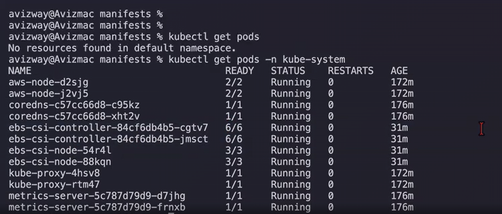
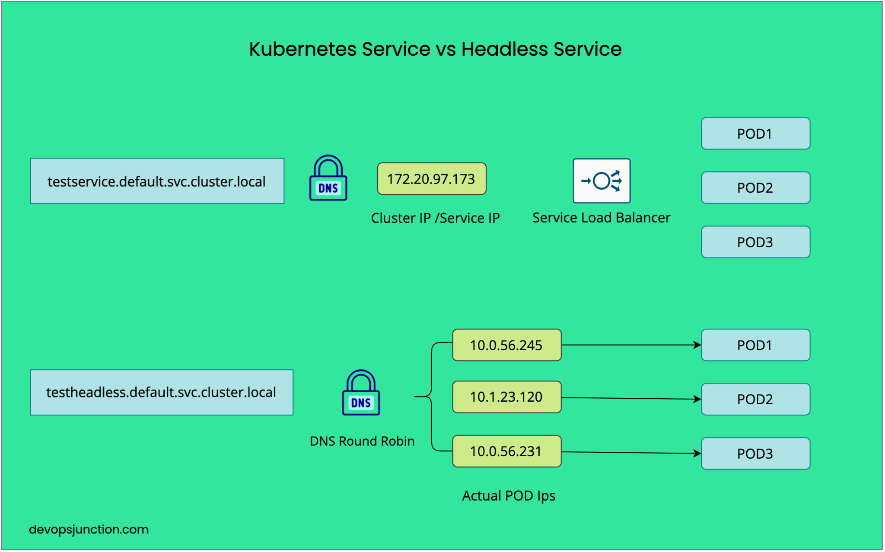

# Kubernetes Stateful set:
In the below picture you can see the 6/6 in Ready column for pods "ebs-csi-controller" means 6 containers are running that pod if we use describe pod command for "ebs-csi-controller" in kube-system namspace you will get detailed info of those 6 containers.
A pod can contain N number of containers.


## How to attach EBS volume to a Pod?
**Answer:**  
Step 1 : First we will create a service account this name 'ebs-csi-controller-sa' if we are using EBS volume we can use other name also but we need to override the name using the "controller.serviceAccount.name" parameter in the official aws-ebs-csi-driver Helm chart, but you will then have to manually rewrite your AWS IAM Trust Policy to match the new string exactly.
--> Using below command we will create service account in eks cluster and attaches ebs driver policy to service role automatically created by EKS service.

eksctl create iamserviceaccount --name ebs-csi-controller-sa --namespace kube-system --cluster ekswithavinash --attach-policy-arn arn:aws:iam::aws:policy/service-role/AmazonEBSCSIDriverPolicy --approve

Step 2 : Using this command we will add ebs-csi-driver to our EKS cluster we con do it through console as well.

eksctl create addon --name aws-ebs-csi-driver --cluster ekswithavinash --force


Step 3 : Create a storageclass that can be provisoned dynamically.

```yaml
apiVersion: storage.k8s.io/v1
kind: StorageClass
metadata:
  name: fast-ssd
provisioner: kubernetes.io/aws-ebs
volumeBindingMode: WaitForFirstConsumer
reclaimPolicy: Delete
allowVolumeExpansion: true
parameters:
  type: gp3
  iops: "3000"
```

Provisioner : which csi driver creates the volume   
parameters.type: EBS volume type (gp2, gp3, io1)  
volumeBindingMode : it has 2 types Create volume in same AZ as Pod  
1. Immediate: Provisioning happens as soon as the PVC is created.
2. WaitForFirstConsumer: Postpones provisioning until a Pod using the PVC is created then Create volume in same AZ as Pod.
reclaimPolicy :   	
	Delete: Remove PV when PVC is deleted. 
	Retain : Keep PV when PVC is deleted. 

AccessModes: This access mode available in volumeClaimTemplates used in stateful set.  
RWO : ReadWriteOnce : One node can read/write. (gp2, gp3, io1) - EBS Supports  
RWX : ReadWriteMany : Multiple Nodes can read/write (EFS, NFS)  
ROX : ReadOnlyMany  : Multiple nodes can read only   

while using efs we will attach one storage to multile pods if we want to sync the storage data across the pods if we are taking mysql we will make one copy as primary and other as read operation we will config like this. (do serach in web for clearly understanding.)

Step 4 : StatefulSets required Headless service.

**Headless servcie:** We need to set ClusterIP as None to create a headless service. THis headless service gives each pod its own DNS name instead of a single service IP.  
** With headless service, each pod becomes individually addressable


```yaml
apiVersion: v1
kind: Service
metadata:
  name: my-headless-service
  namespace: default
spec:
  clusterIP: None
  selector:
    app: my-sql # using this identify the pods provide the statefu set name
  ports:
    - protocol: TCP
      port: 80
      targetPort: 8080

---
apiVersion: apps/v1
kind: StatefulSet
metadata:
  name: my-sql
spec:
  serviceName: "my-headless-service"  # we need to give the same name what we defined in the headless service
  replicas: 2                         # 2 replicas of my-sql pods with names my-sql-0 & my-sql-1 if 3 pods next one will be 3 it will give persistent names 
  selector:                           # if we delete one pod like delted mysql-0 it will create new pod with the same name.
    matchLabels:
      app: web-app
  template:
    metadata:
      labels:
        app: web-app
    spec:
      containers:
      - name: app-container
        image: nginx:latest
        volumeMounts:
        - name: app-data
          mountPath: /usr/share/nginx/html   # we are mounting the ebs volume this path inside the container
  volumeClaimTemplates:
  - metadata:
      name: app-data
    spec:
      accessModes: [ "ReadWriteOnce" ]
      storageClassName: "fast-ssd"      # provide the storage class name what we gave in the storage class yaml
      resources:
        requests:
          storage: 10Gi                 # we will get 2 different ebs volumes for 2 pods if it is 3 pods will get 3 different volumes.
```
sts = shrort form for statefulsets
kubectl get statefulsets
kubectl get sts
kubectl get sts
kubectl describe sts <name>

kubectl get pvc
kubectl get pv

## What is Headless service?
*Answer:** **Headless servcie:** We need to set ClusterIP as None to create a headless service. THis headless service gives each pod its own DNS name instead of a single service IP.  
```yaml
apiVersion: v1
kind: Service
metadata:
  name: my-headless-service
  namespace: default
spec:
  clusterIP: None
  selector:
    app: my-web-app  # using this identify the pods
  ports:
    - protocol: TCP
      port: 80
      targetPort: 8080
```
** With headless service, each pod becomes individually addressable
--> flow of normal service v/s headless service
Normal Service:
Client ──> [ClusterIP] ──> [kube-proxy (Load Balancer(Random or round robin ))] ──> Pod IP

Headless Service:
Client ──(Asks CoreDNS for IPs)──> Returns [Pod1 IP, Pod2 IP, Pod3 IP]
Client ──────────────────────(Direct Connection)──────────────────────> Pod1 IP



#Helm Charts
**Helm is a package manager for K8s like dnf/yum for linux and npm for node.js**

--> Instead of writing and managing multiple YAML file manually, you use a helm chart - a prep packaged collection of k8s resources.

**prerequisite:** We need to login to docker hub to install helm charts.
chart : A package of k8s resources template

Repository : A place where charts are stored (https://artifacthub.io/ / local)

release : A running instance of a chart in our k8s cluster (v1 v2)

Values : Configuration that customizes a chart at installation time.


windows: 
1. Install choco (https://chocolatey.org/)
2. Install helm (choco install kubernetes-helm)

Mac: brew install helm

Linux: curl https://raw.githubusercontent.com/helm/helm/main/scripts/get-helm-4 | bash

verify: helm version


helm repo add bitnami https://charts.bitnami.com/bitnami		--> Adding bitnami repo to local

helm repo list								--> shows installed repo list			

helm repo update							--> update the repos

helm search repo nginx						--> search for repo using cli


helm pull bitnami/nginx	--untar --> used to pull the nginx repo to check what is there in that repo

* chart.yaml		--> Chart metadata
* values.yaml		--> we will mention our values(like image names, versions and other values) to override the default values
* templates			--> K8s YAML templates


helm ls				--> List installed releases
helm ls -A			--> list from all namespaces
Make sure to login to docker "docker login"

helm install my-nginx bitnami/nginx						--> Install binami managed helm chart in our k8s environment, and helm name it as "my-nginx"

helm install my-nginx bitnami/nginx --version 23.0.0	--> Install with specific version

helm upgrade my-nginx bitnami/nginx --set replicaCount=4	--> Imperatively/explicitly pass the value

helm upgrade my-nginx bitnami/nginx -f values.yaml			--> Adjust the values file then deploy

helm history my-nginx					--> Shows my-nginx app history

helm rollback my-nginx 2				--> We can rollback to previous version

helm uninstall my-nginx					--> 


helm install my-nginx bitnami/nginx -f values.yaml --dry-run --debug

helm install mynodeapp ./mynodeapp  --> used to install our app 

helm upgrade mynodeapp ./mynodeapp --description "Adjusting pod count to 3"


helm show values mynodeapp 
helm get values mynodeapp --revision 3


## Horizontal Pod Autoscaler(HPA):
It is used increase the pod replicas according load on CPU
In the below manifest we have a deployment called 3 pod replicas(cpu 100m) and configured the HPA with 60% The HPA controller queries the Metrics Server and sees the 3 running pods CPU usage like Pod A: 70m (70% utilization) Pod B: 80m (80% utilization)
Pod C: 90m (90% utilization) so average usage is 80% and 
HPA Formula

```math
\text{desiredReplicas} = \left\lceil currentReplicas× \times \left(\frac{currentMetricValue\%}{desiredMetricValue\%}\right)\right\rceil
= \left\lceil 3 \times \left(\frac{80\%}{60\%}\right)\right\rceil
= \left\lceil 3 \times 1.333\right\rceil
= \left\lceil 4.0\right\rceil
= 4
```
so HPA Scale to 4 pods.

```yaml
apiVersion: apps/v1
kind: Deployment
metadata:
  name: web-app
  namespace: default
spec:
  replicas: 3 # Initial starting pod count
  selector:
    matchLabels:
      app: web-app
  template:
    metadata:
      labels:
        app: web-app
    spec:
      containers:
      - name: application
        image: nginx:latest
        resources:
          requests:
            cpu: "100m"  # Required baseline for HPA calculation
          limits:
            cpu: "200m"
---
apiVersion: autoscaling/v2
kind: HorizontalPodAutoscaler
metadata:
  name: web-app-hpa
  namespace: default
spec:
  scaleTargetRef:
    apiVersion: apps/v1
    kind: Deployment    # if it is pod we will give pod here
    name: web-app
  minReplicas: 2
  maxReplicas: 10
  metrics:
  - type: Resource
    resource:
      name: cpu
      target:
        type: Utilization
        averageUtilization: 60
```