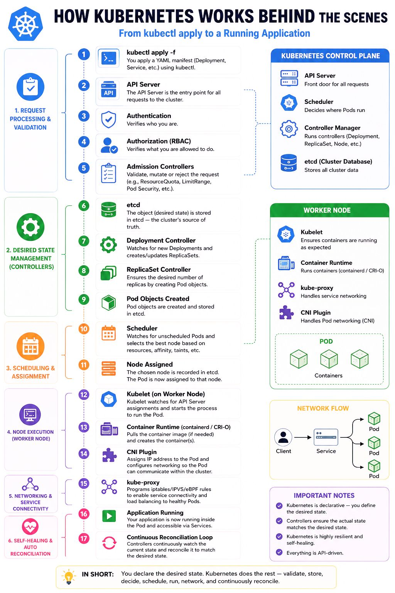

# Kubernetes

This directory contains Kubernetes-related DevOps interview questions and resources.

## 1. What happens in k8's when you run kubectl apply?


## 2. why do you prefer helm charts over Kubernetes YAML manifests?
A. Helm charts are preferred over plain Kubernetes YAML manifests because Helm provides templating, reusable charts, environment-specific configuration through values.yaml, and easier application upgrades and rollbacks, which simplifies managing deployments across environments like Dev, UAT, and Production.

## 3.How do you handle environment-specific configuration in Helm charts?
A. In Helm, different environments such as Dev, UAT, and Production are usually differentiated using separate values files like values-dev.yaml, values-uat.yaml, and values-prod.yaml, Each file contains environment-specific configurations such as replica count, resource limits, and environment variables. During deployment, the CI/CD pipeline selects the appropriate values file and deploys the application using the Helm command with that file.

## 4. How do you handle failure in deployment?
1. i deployment fails i immediaetly rollback to the previous stable app version and inform the dev teams and client about the issue.
2. after that i wll check the logs and monitioring dashboards to identify the issue.
3. then i will investigate the rootcause issue by reviewing recent code changes, Merge requests and deployment scripts to identify issues like it is code related issue or config issue or network issue or infra related issue.
4. after identifying the issue i will solve that like if it is code realted communicate with dev teams or if it is network issue i will resolve that network issue.
5. then i will test it dev or locally and redeploy it into prod.
6. then i will document this issue like cause of issue, what actions taken to resolve this.
7. i will improve the CI/CD pipeline to catch issues eariler and implements health checks and automatic rollbacks.
8. i will configure alerts in montioring toools to detect and give alert when issues occur.

## what is p50, p95 and p99?
A. P95, p50 and P99 latencies are percentiles used to measure the performance of a system from the perspective of your worst-experienced user requests.

EX: If you collect 100 user requests and sort them in a line from the fastest response time to the slowest:

P50 = 0.50 × 100 = 50th request.
P95 = 0.95 × 100 = 95th request.
P99 = 0.99 × 100 = 99th request.

P50 (Median): This is the exact middle request (the 50th request). If your P50 is 100ms, it means 50% of your users experienced a speed of 100ms or faster.

P95 (95th Percentile): This is the 95th request in line. If your P95 is 500ms, it means 95% of users experienced speeds under 500ms(means 95th request taking 500 ms to complete), while the remaining 5% experienced speeds worse than 500ms.

P99 (99th Percentile): This is the 99th request in line—the absolute worst-case scenario. If your P99 is 2 seconds (means 99th request taking 2 sec to complete), it means 99% of your users had speeds under 2 seconds, but 1% of your users waited longer than 2 full seconds.

If you only reported the average latency (for example 200ms), you’d think your system is blazing fast.

But in reality, 1% users every minute are waiting 2+ seconds — and they’re the ones filing support tickets or abandoning your app.

that's where P95 and P99 are comes into picture to identify those 1% requests. 

**Resolution:**

Thread pools, connection limits, caches, retries, and circuit breakers all exist because of P95/P99 realities.

## Kubernetes / EKS Q&A from ADP


## 26. Monolith to EKS Migration
1. Assess application
2. Containerize
3. Push image to ECR
4. Create EKS cluster
5. Configure networking
6. Deploy application
7. Configure monitoring

## 27. Kubernetes Cluster Upgrade
- Upgrade control plane
- Upgrade node groups
- Validate workloads

## 28. EKS Downgrade
Not supported. Create a new cluster and migrate workloads.

## 29. Production Scenarios

### CPU Spike
- Check metrics
- Analyze logs
- Scale resources
- Rollback if required

### Application Inaccessible
Check:
DNS → Load Balancer → Ingress → Service → Pods → Database


## Interview Questions form DigiCert

### 1. what is Static pod?
A. Static Pods are managed directly by the kubelet on a specific node, not by the Kubernetes API server or a Deployment.
we put the pod yaml file in **/etc/kubernetes/manifests** directory kubelet watches this directory and automatically creates or restarts the Pods if they stop.

Because static pods do not depend on the API server to run, they are perfect for running the software needed to start the API server. 

Static Pods are commonly used for control plane components like the API server, etcd, controller manager, and scheduler in self-managed Kubernetes clusters.

### 2. What is PDB(Pod Disruption Budget)?
A. A Pod Disruption Budget (PDB) is a Kubernetes resource that ensures a minimum number of application pods remain available during voluntary disruptions, such as node maintenance, cluster upgrades, or node draining.

in the below yaml minAvailabel is 2 it will maintain 2 pods availabe if we want remove that pods Pod Disruption Budget blocks the eviction until replacement pods(new pods) become available.

```yaml
apiVersion: policy/v1
kind: PodDisruptionBudget
metadata:
  name: frontend-pdb
spec:
  minAvailable: 2
  selector:
    matchLabels:
      app: web-frontend
```
### 3. Server looks healthy and application showing healthy in Argocd but client getting 500 error?
1. first check the logs(kubectl pod logs or kubectl describe podA) 
2. verify connectivity to dependencies
3. validate secrets/configmaps
4. check ingress configurations like ingress controller is installed,ingress is watching by ingress controller, ingress class name is defined in ingress.

it might be issue with database connectivity database is not ready to serve traffic by adding readiness probe(it will restart the app it is not ready to serve the traffic) we can solve this issue.

ArgoCD tells you that your 𝗞𝘂𝗯𝗲𝗿𝗻𝗲𝘁𝗲𝘀 𝗿𝗲𝘀𝗼𝘂𝗿𝗰𝗲𝘀 𝗮𝗿𝗲 𝗶𝗻 𝘁𝗵𝗲 𝗱𝗲𝘀𝗶𝗿𝗲𝗱 𝘀𝘁𝗮𝘁𝗲(like pods running). It does NOT check:
- Application logic
- External dependencies
- Database connectivity
- Third-party services

ArgoCD can be green while but your app is broken.

### 4. Think of that customer reports your application is slow. No alerts are firing. So, where do we begin?
1. First, I isolate the scope by checking CDN and Load Balancer metrics to see if the latency is global or isolated to a specific region or feature.
2. then i will verify entire app is slow or is it a specific high-overhead action, like generating a report from app or proccessing a checkout.
3. i will look at P95 and P99 latency metrics in cloudwatch or grafana dashboards(we can als see in new relic) if any issue with this metrics i will use tracing tools like jaeger to identify the where the slowness like connectivity with database, an un-indexed database query, or a slow third-party API call.
4. then i will check the load in server like apllication is consuming more memory using uptime, sar, top commands, then will check file descriptor limits if app hits the heavy traffic file descriptor limits reaches and it causes to network packets to stall(paused, dropped).

