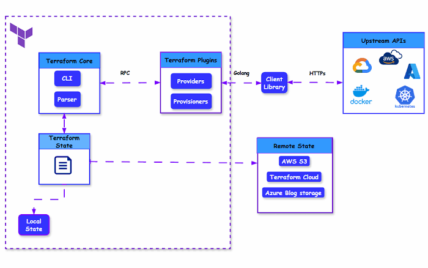

# Terraform

Day-1
IaC : Infrastructure as Code

Terraform, pulumiu, OpenTofu, Cloudforamtion : IaC  
Docker / Vagrant / Golden AMI : Server Templating
Ansible, Puppet , saltstack : Configuration Management

Cloudforamtion : Supports Only AWS 
Terraform : Support All cloud platforms and onpremise i.e; k8s / git : Cloud Agnostic Platform

2014 --> Mitchell Hashimoto
IBM acquired it and made it as a close source.
terraform developed using Go language.

HCL : HashiCorp Configuration Language

Terraform works in 3 simple steps.

step 1 : Write : WE can write what we want to create (.tf files)
Step 2 : Plan  : Terraform shows what it will do. Wont create, just displays.
Step 3 : Apply : Terraform automatically create/change/delete the resources.

**Note:**

Terraform Core : The main orchestartion engine that performs above steps i.e; scan, plan, apply.. and does not know anything about specific cloud provider APIs (like AWS or Azure). 

When we run terraform init we are downloading AWS and Azure providers these are standalone program files (plugins) lives inside separatly.

terrform core can't talk directly with AWS/Azure providers directly that's why it uses RPC it is a network pipe between terraform core and AWS providers.

Terraform RPC : Remote Procedure Calls : Terraform RPC is the network pipe that lets these Terraform core and AWS/Azure providers(plugins) talk to each other.

graph TD
    %% Define Styles and Colors
    classDef core fill:#5C4EE5,stroke:#333,stroke-width:2px,color:#fff;
    classDef rpc fill:#E6E6FA,stroke:#5C4EE5,stroke-width:2px,stroke-dasharray: 5 5,color:#000;
    classDef plugin fill:#FFF2CC,stroke:#D6B656,stroke-width:2px,color:#000;
    classDef cloud fill:#D5E8D4,stroke:#82B366,stroke-width:2px,color:#000;

    %% Main Architecture Elements
    subgraph Engine [Management Layer]
        A[Terraform Core]:::core
    end

    subgraph Transport [Network Layer]
        B[Local gRPC Interface / Port]:::rpc
    end

    subgraph Extensions [Translation Layer]
        C[Provider Plugin Binary]:::plugin
    end

    subgraph Infrastructure [Target Layer]
        D[Cloud Provider API]:::cloud
    end

    %% Execution and Communication Flow
    A -->|1. Spawns process & establishes handshake| C
    A -->|2. Sends abstract 'ApplyResourceChange'| B
    B --> C
    C -->|3. Translates to Vendor SDK / HTTPS Call| D
    D -->|4. Returns Raw JSON/XML Response| C
    C -->|5. Sends structured 'ApplyResourceChange' Response| B
    B --> A
    A -->|6. Writes output data| E[(terraform.tfstate)]:::core

    %% Layout hints
    style Engine fill:none,stroke:none;
    style Transport fill:none,stroke:none;
    style Extensions fill:none,stroke:none;
    style Infrastructure fill:none,stroke:none;

---

Windows terraform installation:

https://developer.hashicorp.com/terraform/install

unzip and place all the files into a folder in c drive (c:\terraform) -->  copy terraform.exe file.

Add c:\terraform --> Add it to the system PATH 
system properties --> Environment varibale --> system varibales --> path --> edit --> c:\terraform

open a new command prompt and enter "terraform version"

--

COmmand file formats we see in tf.

.tf
.tfvars
.tfstate
.tfplan

=================

Provider: Act as a plugin that helps tettaform to interact with the cloud environment. 

provider "aws" {
  region = "us-east-1"
}

----

Resources : Represents the real infra resources, you want to manage (delete/create/modify) ec2/s3/rds..

resource "aws_s3_bucket" "my_example_bucket" {
  bucket = "my-unique-bucket-name-12345" # Must be globally unique

  tags = {
    Name        = "My Practice Bucket"
    Environment = "Dev"
  }
}

------

terraform init : Initializes your working direcvtory. Downloads the required provider plugin based on the configuration file we have. 
--> One time for a project

"terraform init"

----

terraform validate : Checks our .tf files for syntx errors.

----

terraform fmt : Automatically formats our code with proper indentation and spacing.

---

terraform plan : This is like a "dry run", shows what we are creating/change/delete. 

terraform plan

To write the plan into a file:

terraform plan -out=ec2plan.tfplan
terraform show ec2plan.tfplan
terraform apply ec2plan.tfplan

---

terraform apply : This creates or updates the resources in AWS. terraform shows the plan again, and ask for confirmation.

terraform apply

skit the confirmation: 

terraform apply -auto-approve

---

terraform destroy : Destroys all the resources managed by current configuration. 

terraform destroy

terraform destroy -auto-approve

-----

terraform statefile : (terraform.tfstate) : 
--> stores the mappings between terraform configuration and aws infrastructure real resources.
--> Act as "source of truth" for tracking the current state.

-----

terraform target option : 

--> The target flag is used to apply or destroy specific resources of the configuration. 

terraform destroy -target=aws_instance.mydbserver
terraform destroy -target=aws_instance.mydbserver -target=aws_instance.mywebserver

This directory contains Terraform-related DevOps interview questions and resources.

## Terraform Q&A from ADP

## 5. Terraform Workspaces
Used to manage multiple environments (dev, stage, prod) with separate state files.

## 6. Terraform Variables
Variables can be defined in:
- variables.tf
- terraform.tfvars
- Environment variables
- CLI arguments

## 7. Variable Precedence
1. CLI (-var)
2. terraform.tfvars
3. auto.tfvars
4. Environment variables
5. Default values

## 8. Terraform Drift Detection
- terraform plan
- terraform plan -detailed-exitcode
- AWS Config
- Terraform Cloud

## 10. S3 Backend & DynamoDB
- S3 stores Terraform state.
- DynamoDB provides state locking.

## 23. Terraform S3 Backend
Used inside backend configuration and initialized during `terraform init`.

## 24. Terraform Modules
Reusable infrastructure components such as:
- VPC
- EC2
- Security Groups
