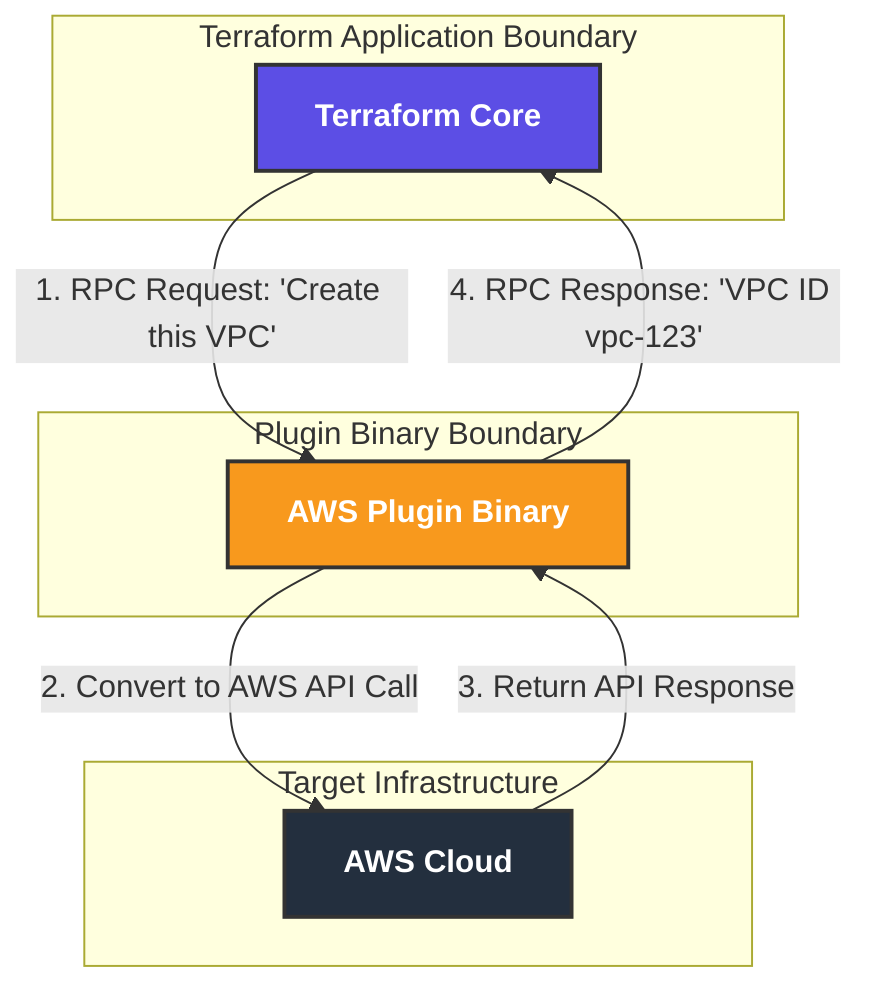

# Terraform


Day-1
IaC : Infrastructure as Code

Terraform, pulumiu, OpenTofu, Cloudforamtion : IaC  
Docker / Vagrant / Golden AMI : Server Templating
Ansible, Puppet , saltstack : Configuration Management


Cloudforamtion : Supports Only AWS 
Terraform : Support All cloud platforms and onpremise i.e; k8s / git : Cloud Agnostic Platform

2014 --> Mitchell Hashimoto
IBM acquired it and made it as a close source.
terraform developed using Go language.

HCL : HashiCorp Configuration Language


Terraform works in 3 simple steps.

step 1 : Write : WE can write what we want to create (.tf files)
Step 2 : Plan  : Terraform shows what it will do. Wont create, just displays.
Step 3 : Apply : Terraform automatically create/change/delete the resources.

**Note:**

Terraform Core : The main orchestartion engine that performs above steps i.e; scan, plan, apply.. and does not know anything about specific cloud provider APIs (like AWS or Azure). 

When we run terraform init we are downloading AWS and Azure providers these are standalone program files (plugins) lives inside separatly.

terrform core can't talk directly with AWS/Azure providers directly that's why it uses RPC it is a network pipe between terraform core and AWS providers.

Terraform RPC : Remote Procedure Calls : Terraform RPC is the network pipe that lets these Terraform core and AWS/Azure providers(plugins) talk to each other.



---

Windows terraform installation:

https://developer.hashicorp.com/terraform/install

unzip and place all the files into a folder in c drive (c:\terraform) -->  copy terraform.exe file.

Add c:\terraform --> Add it to the system PATH 
system properties --> Environment varibale --> system varibales --> path --> edit --> c:\terraform

open a new command prompt and enter "terraform version"

--

COmmand file formats we see in tf.

.tf
.tfvars
.tfstate
.tfplan

=================

Provider: Act as a plugin that helps tettaform to interact with the cloud environment. 

provider "aws" {
  region = "us-east-1"
}

----

Resources : Represents the real infra resources, you want to manage (delete/create/modify) ec2/s3/rds..

resource "aws_s3_bucket" "my_example_bucket" {
  bucket = "my-unique-bucket-name-12345" # Must be globally unique

  tags = {
    Name        = "My Practice Bucket"
    Environment = "Dev"
  }
}

------

terraform init : Initializes your working direcvtory. Downloads the required provider plugin based on the configuration file we have. 
--> One time for a project

"terraform init"

----

terraform validate : Checks our .tf files for syntx errors.

----

terraform fmt : Automatically formats our code with proper indentation and spacing.

---

terraform plan : This is like a "dry run", shows what we are creating/change/delete. 

terraform plan

To write the plan into a file:

terraform plan -out=ec2plan.tfplan
terraform show ec2plan.tfplan
terraform apply ec2plan.tfplan

---

terraform apply : This creates or updates the resources in AWS. terraform shows the plan again, and ask for confirmation.

terraform apply

skit the confirmation: 

terraform apply -auto-approve

---

terraform destroy : Destroys all the resources managed by current configuration. 

terraform destroy

terraform destroy -auto-approve

-----

terraform statefile : (terraform.tfstate) : 
--> stores the mappings between terraform configuration and aws infrastructure real resources.
--> Act as "source of truth" for tracking the current state.

-----

terraform target option : 

--> The target flag is used to apply or destroy specific resources of the configuration. 

terraform destroy -target=aws_instance.mydbserver
terraform destroy -target=aws_instance.mydbserver -target=aws_instance.mywebserver


## Meta Arguments in terraform : 

Count : Helps to create multiple copies of the same resources.

Instead of writing the same resources block mutliple times to create 2 instances/multiple instances, we can write once and get multiple instances. 

All resources creates with same name. We can use count.index to add unique name/id to the insatnces

count.index startes from 0

Web-Server-0
Web-Server-1
Web-Server-2

----

for_each: Similar to count, but creates instances based on a map or set of strings. This is often preferred over count because it uses stable keys instead of numeric indexes, making infrastructure more resilient to changes

---

depends_on: Manually specifies explicit dependencies between resources. While Terraform usually builds an implicit dependency graph, depends_on ensures a specific resource is created only after its dependency is ready.

---

lifecycle: A block that defines custom rules for resource management. Key rules include:

create_before_destroy: Creates a new replacement resource before destroying the old one.

prevent_destroy: Stops Terraform from destroying a critical resource.

ignore_changes: Prevents Terraform from reverting manual changes made to specific attributes.


----

provider: Specifies which provider configuration to use for a particular resource. This is essential when working with multiple regions or multiple accounts for the same service

---

replace : If you identify any resource is corrupted, you want to recreate the resource, then we can use "replace" option.

terraform plan -replace=aws_instance.web-server

terraform apply -replace=aws_instance.web-server

1. Destroys existing resource
2. Creates new resources
3. updates the state file

---

Detecting the drift : Identifying the changes hapened outside of the terraform. 

terraform plan -refresh-only

1. Terraform talks to aws and fetch actual current state
2. It comapres with thats in the statefile.
3. Shows you what drifted (It wont do any changes)

3 scenarios : 

1. Just detect the changes : terraform plan -refresh-only
2. Accept the drift : terraform apply -refresh-only (someone made a valid change manually - you decided to accept the changes into state file)
3. I dont accept the changes happened outside of tf : terraform apply

---

Enable Debugging with terraform logs. 

Log levels : 

ERROR : Errors Only 		: Looks for the errors
WARN : Warnings + Errors 	: potentioanl problems
INFO : General info + warnings + errors : Normal troubleshooting
DEBUG : api call + info + warning + error : Resources issues with debug logs
TRACE : Everything (Api call + call response + decision + warning + info + error) : Deep debug

```sh
export TF_LOG=DEBUG
export TF_LOG=WARN
export TF_LOG=ERROR

unset TF_LOG 
```


---

Store all the logs into a file.

```sh 
export TF_LOG_PATH="tflogs.log"

cat tflogs.log | grep -i "error"
```

---


What is statefile. : Act as "Source of Truth".

Thumb rule : DONT EDIT STATEFILE MANUALLY.
```sh
terraform state list

terraform state show aws_instance.web-server

terraform state show aws_s3_bucket.mys3demo
```
--

terraform init -migrate-state 

above command is use to migrate the state from locally to remote backend or other locations.

```hcl

terraform {
  backend "local" {
    path = "/Users/avizway/Desktop/keypairs/mystatelocation/terraform.tfstate"
  }
}

---
tf state s3 as backend
---

terraform {
  backend "s3" {
    bucket = "aviz-tfstate-bucket"
    key = "project1/terraform.tfstate"
    region = "ap-south-1"
    use_lockfile = true
  }
}
```

---

--> Only works for us --> what about teammates.?
--> when two people applying at the same time -> file corrupts.
--> accidental detetion = disaster

---

Remote backend : S3


```sh terraform force-unlock ec967ad1-e3b0-a93c-19a7-15d9592921f3 ```

using above command we can remove the state file lock that id will see in console when we get statefile locked message.
=============

terraform output

terraform output -json

Outputs:
instance_private_ip = "172.31.39.46"
instance_public_ip = "13.201.116.160"
mys3arn = <sensitive>
mys3name = "my-aviz-demo-bucket-13052026"

--

## variables

We can declare variables at multiple levels

1. cli flag --> terraform apply -var="instance_type=t3.micro". (HIGHEST)
2. .tfvars	--> dev / uat / prd
3. Environemnt vars --> In our terminal "export TF_VAR_Instance_Tyepe="t3.small"
4. Default value --> defined inside the variable block (LOWEST)

terraform apply -var="api_termination=false"		(example 1)


terraform apply -var-file="dev.tfvars" --auto-approve

terraform apply -var-file="uat.tfvars" --auto-approve

terraform apply -var-file="prd.tfvars" --auto-approve

### Variable precednce

CLI falgs(cmd vars) > *.auto.tfvars > terraform.tfvars.json > .tfvars > ENV vars


----

Above one has a problem, as all the environment is applying/creating and using only one .tfstate file as everything inside a default workspace. 

---

terraform workspace list
* default

terraform workspace new dev

terraform workspace new uat

terraform workspace new prd


-----
terraform workspace new dev
terraform workspace select dev
terraform workspace show
terraform apply -var-file="dev.tfvars" --auto-approve

---

terraform workspace new uat
terraform workspace select uat
terraform workspace show
terraform apply -var-file="uat.tfvars" --auto-approve

---
terraform workspace new prd
terraform workspace select prd
terraform workspace show
terraform apply -var-file="prd.tfvars" --auto-approve

terraform workspace select prd
terraform destroy -var-file="prd.tfvars" --auto-approve

---
terraform workspace select default
terraform workspace delete prd
terraform workspace delete uat
terraform workspace delete dev

## profile
if we want to deploy our servers in different account we can use profile directive in provider block before that we can configure profile using below command

```sh 
aws configure --profile profile_name
# we can list profiles using below command
aws configure list-profiles
# to check which profile we are using below commad will give details of current profile
aws sts get-caller-identity
# we cahange profiles using below cmd it safe because it only affects your current terminal window.
set AWS_PROFILE=your-profile-name # for windows
export AWS_PROFILE="your-profile-name" # for linux
```

```hcl
provider "aws" {
  region = var.region_id
  profile = profile_name
}
```


This directory contains Terraform-related DevOps interview questions and resources.

## Terraform Q&A from ADP

## 5. Terraform Workspaces
Used to manage multiple environments (dev, stage, prod) with separate state files.

## 6. Terraform Variables
Variables can be defined in:
- variables.tf
- terraform.tfvars
- Environment variables
- CLI arguments

## 7. Variable Precedence
1. CLI (-var)
2. terraform.tfvars
3. auto.tfvars
4. Environment variables
5. Default values

## 8. Terraform Drift Detection
- terraform plan
- terraform plan -detailed-exitcode
- AWS Config
- Terraform Cloud

## 10. S3 Backend & DynamoDB
- S3 stores Terraform state.
- DynamoDB provides state locking.

## 23. Terraform S3 Backend
Used inside backend configuration and initialized during `terraform init`.

## 24. Terraform Modules
Reusable infrastructure components such as:
- VPC
- EC2
- Security Groups

